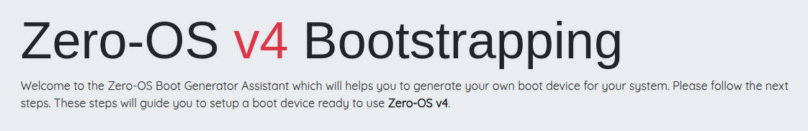
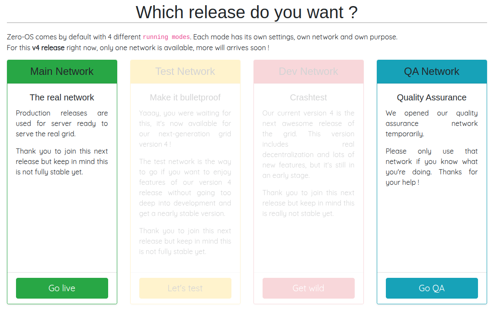
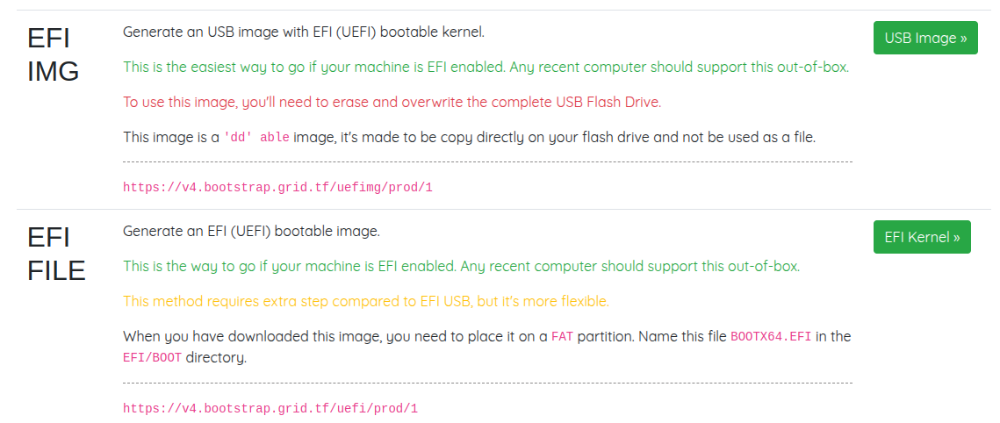
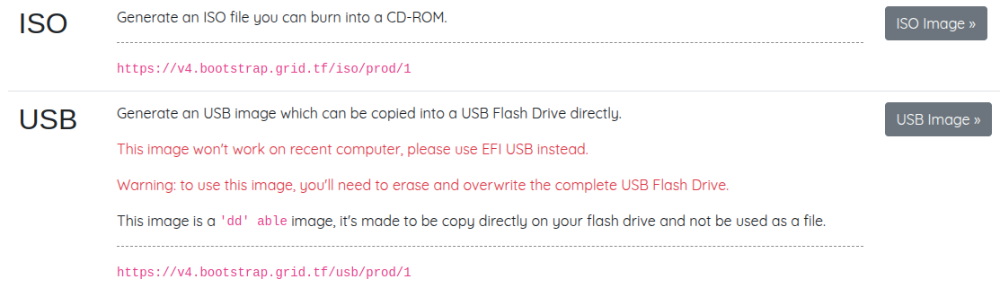

We will now learn how to create a Zero-OS bootstrap image in order to boot a DIY 3Node.

## Download the Zero-OS Bootstrap Image

Let's download the Zero-OS bootstrap image via the Zero-OS Boot Generator for Grid V4: [https://v4.bootstrap.grid.tf](https://v4.bootstrap.grid.tf)

 

On the Boot Generator page, write your farm ID and choose `Production` mode to deploy on mainnet.

  

Choose a bootstrap image format to download.

If your system is new, choose an image format for a `UEFI` bootable kernel. You can use either `EFI IMG` or `EFI FILE`.

- `EFI IMG`
  - Burn this image with BalenaEtcher. [See below for more info.](#balenaetcher-mac-linux-windows)
- `EFI FILE`
  - Format the USB to one `FAT` partition and save the bootstrap image as `/EFI/BOOT/BOOTX64.EFI`.

  

For older systems, choose an image format for a `BIOS` bootable kernel. 

- For BIOS CD/DVD, choose **ISO**.
- For BIOS USB, choose **USB**.

 

Next, we cover in details how to burn the bootstrap image.

## Burn the Zero-OS Bootstrap Image

We show how to burn the Zero-OS bootstrap image. A quick and modern way is to burn the bootstrap image on a USB key.


### USB Key BIOS+UEFI

There are many ways to burn the bootstrap image on a USB key. The easiest way that works for all operating systems is to use BalenaEtcher. We also provide other methods.

#### BalenaEtcher (MAC, Linux, Windows)

For **MAC**, **Linux** and **Windows**, you can use [BalenaEtcher](https://www.balena.io/etcher/) to flash the image on a USB key. This program also formats the USB in the process. This will work for the option **EFI IMG** for UEFI boot, and with the option **USB** for BIOS boot. Simply follow the steps presented to you and make sure you select the bootstrap image file you downloaded previously.

> Note: There are alternatives to BalenaEtcher (e.g. [usbimager](https://gitlab.com/bztsrc/usbimager/) for Windows, MAC and Linux, and [Rufus](https://sourceforge.net/projects/rufus.mirror/) for Windows).

**General Steps with BalenaEtcher:**

1. Download BalenaEtcher
2. Open BalenaEtcher
3. Select **Flash from file**
4. Find and select the bootstrap image (with your correct farm ID)
5. Select **Target** (your USB key)
6. Select **Flash**

That's it. Now you have a bootstrap image on Zero-OS as a bootable removable media device.


#### CLI (Linux)

For the BIOS **USB** and the UEFI **EFI IMG** images, you can do the following on Linux:

```
sudo dd status=progress if=FILELOCATION.ISO(or .IMG) of=/dev/sdX
```

Simply replace `X` by the proper disk for your USB key. To see your disks, write `lsblk` in the command line. Make sure you select the proper disk!

If you USB key is not new, make sure to format it before burning the Zero-OS image.

### CD/DVD BIOS 

For the BIOS **ISO** image, download the file and burn it on a DVD.
