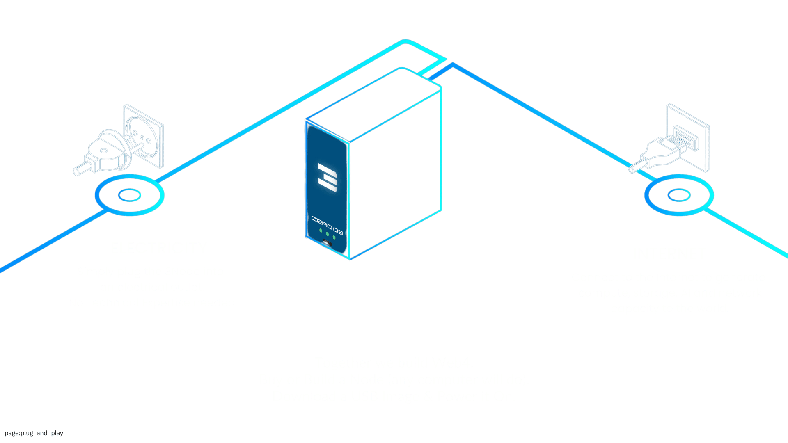

> Become a contributor of storage, compute & network capacity to the ThreeFold Grid.

ThreeFold Farming is a unique concept in the ThreeFold ecosystem where individuals, called farmers, can:

- Deploy nodes (3Nodes) that connect to the ThreeFold Grid
- Contribute computing resources (data, cloud and network) to the decentralized ThreeFold Grid
- Earn rewards for providing capacity on the grid
- Earn rewards when there is utilization on their nodes
- Support a peer-to-peer cloud infrastructure alternative to centralized providers

## A Farmer's Journey

ThreeFold farmers are individuals and organizations who operate nodes that provide capacity to the ThreeFold network. Since these nodes are standard computer hardware that runs ThreeFold's self-healing Zero-OS operating system, farmers simply need to provide electricity and network connectivity to the nodes. As the nodes operate mostly autonomously, little to no administration work is required by the farmers, though they may need to replace faulty hardware from time to time.

Farmers have been the backbone of the grid for years now. Thanks to every farmer out there!