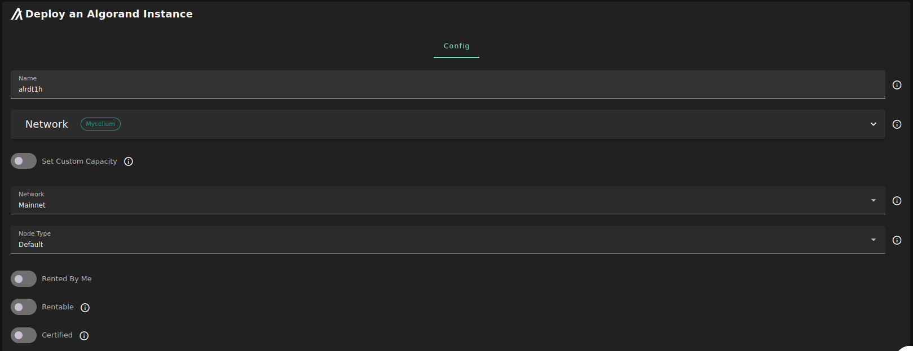
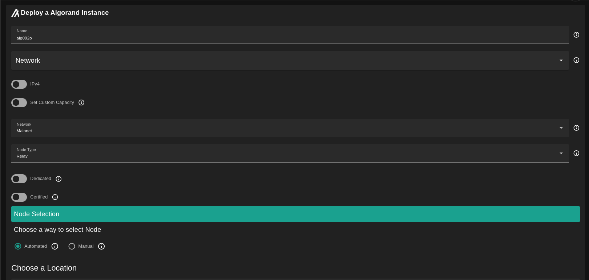
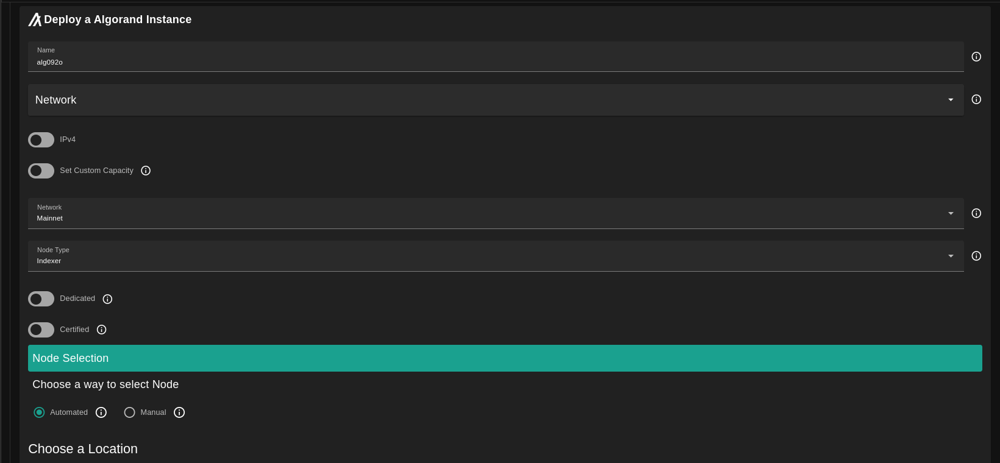

## Introduction

[Algorand](https://www.algorand.com/) builds technology that accelerates the convergence between decentralized and traditional finance by enabling the simple creation of next-generation financial products, protocols, and exchange of value.

## Prerequisites

- Make sure you have a [wallet](../wallet_connector.md)
- From the sidebar click on **Applications**
- Click on **Algorand**

## Algorand Structure

An Algorand node can be either a `Default`, `Relay` or `Indexer` node.
  
- Default:
  - This is a non-relay node.
  - It can run on Devnet, Testnet, Betanet and Mainnet.
- Relay:
  - It can run only on Testnet and Mainnet.
- Indexer:
  - It is a default node but with Archival Mode enabled which will make you able to query the data of the blockchain.

## Run Default Node

You can select any network you want and for the node type select Default. 

If you have more than one SSH keys set, you can click on `Manage SSH keys` to select which one to use for this deployment.

After the deployment is done, SSH into the node and run `goal node status`.

Here you see your node runs on mainnet.

## Run Relay Node

Relay nodes are where other nodes connect. Therefore, a relay node must be able to support a large number of connections and handle the processing load associated with all the data flowing to and from these connections. Thus, relay nodes require significantly more power than non-relay nodes. Relay nodes are always configured in archival mode.

The relay node must be publicaly accessable, so it must have a public ip.

Once the deployment is done, SSH into the node and run `goal node status` to see the status of the node. You can also check if the right port is listening (:4161 for testnet, and :4160 for mainnet).

The next step accourding to the [docs](https://developer.algorand.org/docs/run-a-node/setup/types/#relay-node) is to register your `ip:port` on Algorand Public SRV.

## Run Indexer Node

The primary purpose of this Indexer is to provide a REST API interface of API calls to support searching the Algorand Blockchain. The Indexer REST APIs retrieve the blockchain data from a PostgreSQL compatible database that must be populated. This database is populated using the same indexer instance or a separate instance of the indexer which must connect to the algod process of a running Algorand node to read block data. This node must also be an Archival node to make searching the entire blockchain possible.

Once it's done, you can access the indexer API at port `8980` and here are the [endpoint](https://developer.algorand.org/docs/rest-apis/indexer/) you can access.

## Select Capacity

The default scenario capacity is computed based on the node (network/type) accourding to this [reference](https://howbigisalgorand.com/).
But you can still change this to higher values by selecting the option `Set Custom Capacity`.
  