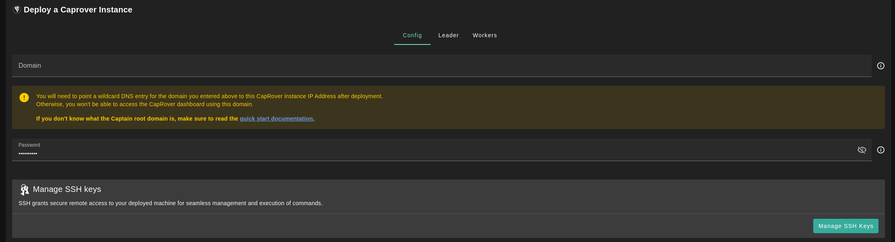
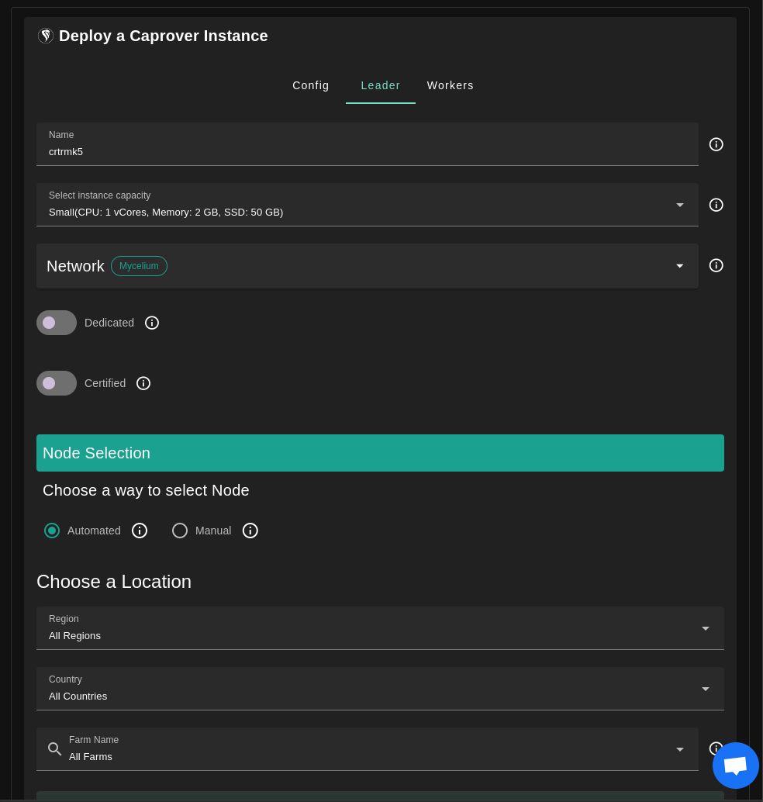
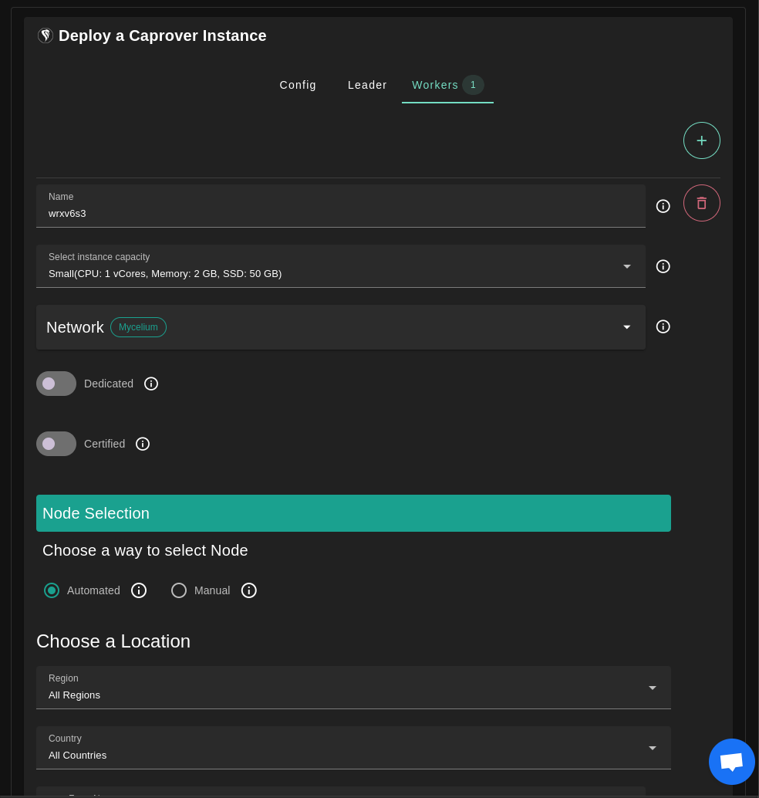
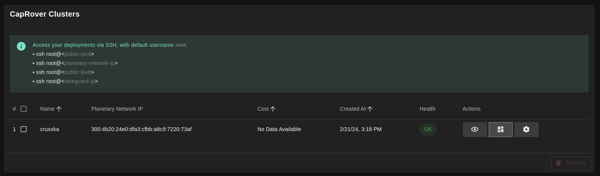
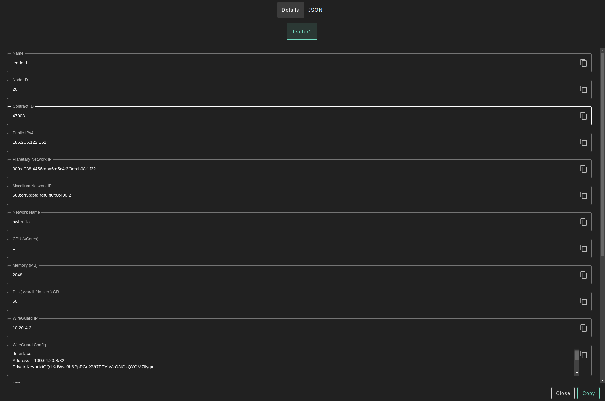
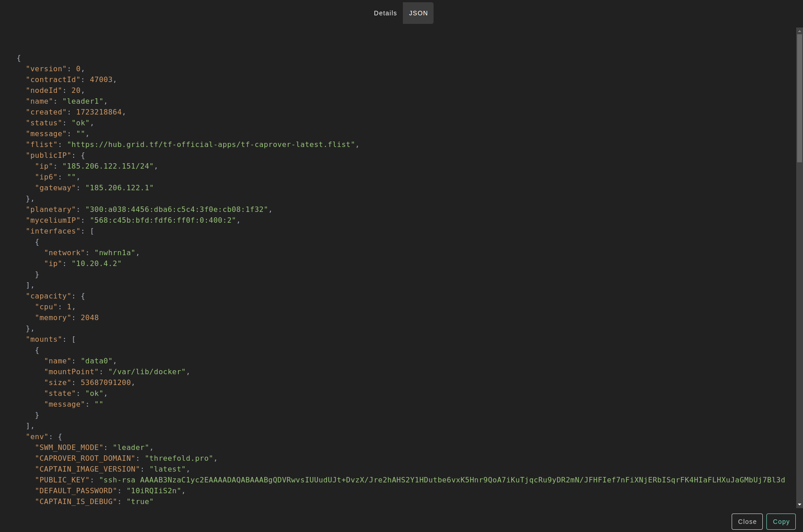
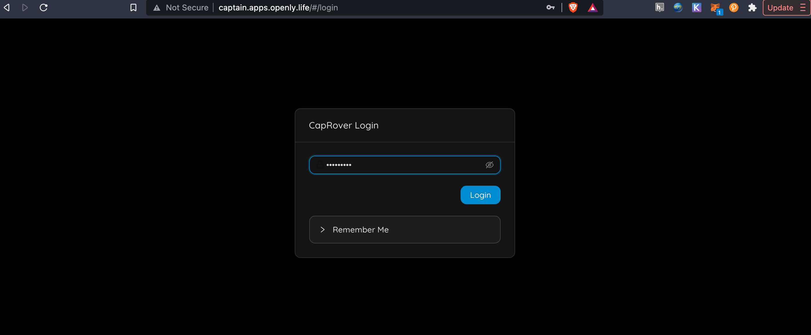

<h1> CapRover </h1>

## Introduction

CapRover is an extremely easy to use app/database deployment & web server manager for your NodeJS, Python, PHP, ASP.NET, Ruby, MySQL, MongoDB, Postgres, WordPress (and etc...) applications!

It's blazingly fast and very robust as it uses Docker, nginx, LetsEncrypt and NetData under the hood behind its simple-to-use interface.

- CLI for automation and scripting
- Web GUI for ease of access and convenience
- No lock-in! Remove CapRover and your apps keep working!
- Docker Swarm under the hood for containerization and clustering
- Nginx (fully customizable template) under the hood for load-balancing
- Let's Encrypt under the hood for free SSL (HTTPS)

Caprover is a very cool management app for containers based on Docker Swarm.

It has following benefits : 

- Easy to deploy apps (in seconds)
- Easy to create new apps
- Super good monitoring
- Can be extended over the TFGrid

## Requirements

- Make sure you have a [wallet](../wallet_connector.md)
- From the sidebar click on **Orchestrators**
- Click on **CapRover**

## Configs Tab



- Enter domain for you Caprover instance. 
  - Be very careful about the domain name: it needs to be a wildcard domain name you can configure in your chosen domain name system.
- Enter password for you Caprover instance.

If you have more than one SSH keys set, you can click on `Manage SSH keys` to select which one to use for this deployment.

## Leader and Workers Tabs

Each deployment will have one leader and there can be many workers. By default, CapRover is deployed on nodes with IPv4.





Use the Leader and Workers tabs to add nodes to your deployment.

- Enter a name for the deployment or keep the default name
- Select a capacity package:
    - **Small**: {cpu: 1, memory: 2, diskSize: 25 }
    - **Medium**: {cpu: 2, memory: 4, diskSize: 50 }
    - **Large**: {cpu: 4, memory: 16, diskSize: 100 }
    - Or choose a **Custom** plan
- Choose the network
   - `Mycelium` flag gives the virtual machine a Mycelium address
- `Rented By Me` flag to retrieve nodes currently reserved by you
- `Rentable` flag to retrieve nodes that can be reserved as [dedicated nodes](../deploy/node_finder.md#dedicated-nodes)
- `Certified` flag to retrieve only certified nodes 
- Choose the node 
  - Automated
    - Choose the location of the node
       - `Region`
       - `Country`
       - `Farm Name`
    - Click on `Load Nodes`
    - Click on the node you want to deploy on
  - Manual selection
    - Select a specific node ID
- Click `Deploy`

Note: Worker nodes only accept SSH keys of RSA format.

Deployment will take couple of minutes.

## The Domain Name

As per the [CapRover documentation](https://caprover.com/docs/get-started.html), you need to point a wildcard DNS entry to the VM IP address of your CapRover Leader instance. You have to do this after having deployed the CapRover instance, otherwise you won't have access to the VM IP address.

Let’s say your domain is **example.com** and your subdomain is **subdomain**. You can set **\*.subdomain.example.com** as an A record in your DNS settings to point to the VM IP address of the server hosting the CapRover instance, where **\*** acts as the wildcard. To do this, go to the DNS settings of your domain name registrar, and set a wild card A record entry.

On your domain name registrar, you can manage your DNS settings as such, with **subdomain** as an example:

| Record | Host          | Value         | TTL       |
| ------ | ------------- | ------------- | --------- |
| A      | @             | VM IP address | Automatic |
| A      | subdomain     | VM IP address | Automatic |
| A      | \*.subdomain  | VM IP address | Automatic |

We note here that **@** is the root domain (@ takes the value of your domain name, e.g. **example** in **example.com**), **subdomain** is the name of your subdomain (it can be anything you want), and **\*.subdomain** is the wildcard for **subdomain**. If you don't want to use a subdomain, but only the domain, you could use a wildcard linked to the domain instead of the subdomain (e.g. put **\*** instead of **\*.subdomain** in the column **Host**).

Once you've point a wildcard DNS entry to your CapRover IP address and that the DNS is properly propagated, you can click the **Admin Panel** button to access CapRover. This will lead you to the following URL (with **subdomain.example.com** as an example):

> captain.subdomain.example.com

Note that, to confirm the DNS propagation, you can use a [DNS lookup tool](https://mxtoolbox.com/DNSLookup.aspx). As an example, you can use the URL **captain.subdomain.example.com** to check if the IP address resolves to the VM IP address.

### Domain Name Example

In the following example, we pick ```apps.openly.life``` which is a domain name that will point to the IP address of the CapRover instance (which we only know after deployment).


> Note how the *.apps.openly.life points to the public IPv4 address that has been returned from the deployment. 

## How to Know the IP Address

Go back to your CapRover weblet and go to the deployment list. Click on `Show Details`.



- The public IPv4 address is visible in here



- Now you can configure the domain name (see above, don't forget to point the wildcard domain to the public IP address)

Go to the `JSON` tab to see the Json ouput:



## How to Access the Admin Interface

Make sure that you've point a wildcard DNS entry to your CapRover IP address (e.g. **185.206.122.136** in our example), as explained [here](#the-domain-name).

* To access the CapRover admin interface, you can click the **Admin Panel** button or you can use the following admin URL template: **https://captain.subdomain.example.com**. 
  * Note the prefix **captain** and the usage of our wildcard domain.

* The admin password is generated and visible behind the `Show Details` button of your CapRover deployment. 



* You should now see the following screen:


## How to Work with CapRover

* [CapRover Admin Tutorial](./caprover_admin.md)
* [CapRover Worker Tutorial](./caprover_worker.md)
