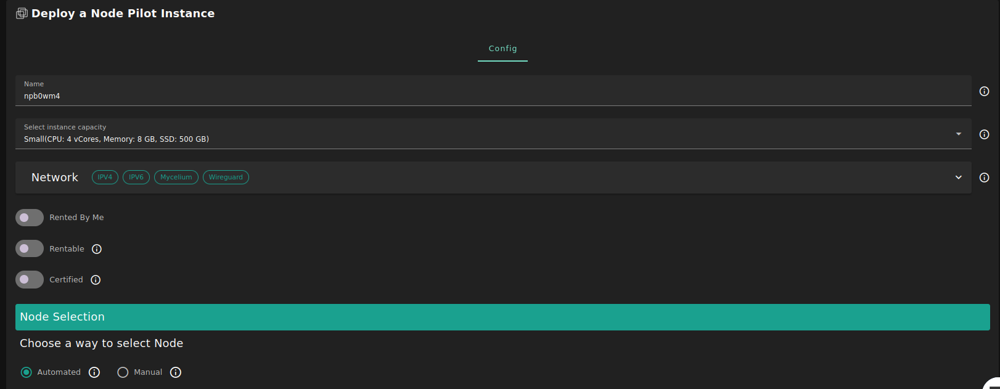
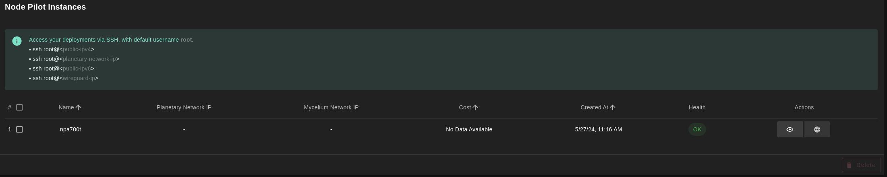
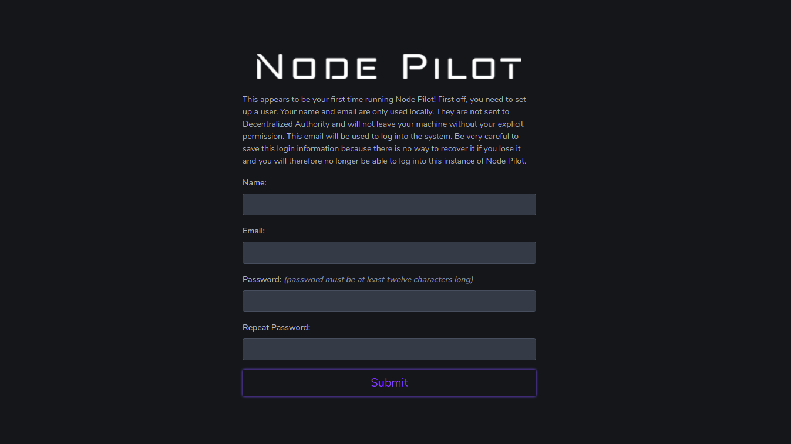

## Introduction

This is a simple instance of upstream [Node Pilot](https://nodepilot.tech).

## Prerequisites

- Make sure you have a [wallet](../../wallet_connector)
- From the sidebar click on **Applications**
- Click on **Node Pilot**

## Deployment

- Fill in the instance name: it's used to reference the node-pilot in the future.

- Minimum specs:
  - 1 vcore
  - 256 MB of memory
  - 15 GB of storage

- `Dedicated` flag to retrieve only [dedicated nodes](../node_finder#dedicated-nodes) (rentable or rented by you)
- `Certified` flag to retrieve only certified nodes 

- Choose the location of the node
   - `Region`
   - `Country`
   - `Farm Name`
- Select a node to deploy your node-pilot instance on.

> Or you can select a specific node with manual selection.

- When using the [flist](https://hub.grid.tf/tf-official-vms/node-pilot-zdbfs.flist) you get a node pilot instance ready out-of-box. You need to get a public IPv4 to get it to works.

After that is done you can see a list of all of your deployed instances

Click on ***Visit*** to go to the registration page of your Node Pilot instance!

You can go to `https://publicip` and configure your node-pilot. You can upload a backup to the VM via ssh as well if you have a backup of a previous instance.

What change compared to upstream node-pilot, we have out-of-box a transparent pre-filled blockchain database for some blochain (currently Fuse and Pokt as proof-of-concept). You can start one of theses blockchain in no-time and it will be automatically nearly sync already without the requirement of the full space locally nor downloading everything and killing bandwidth.
