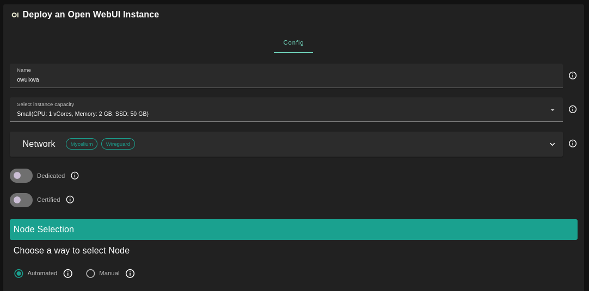
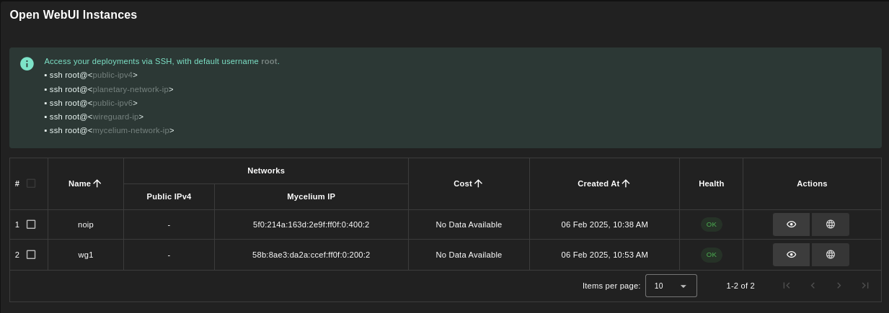
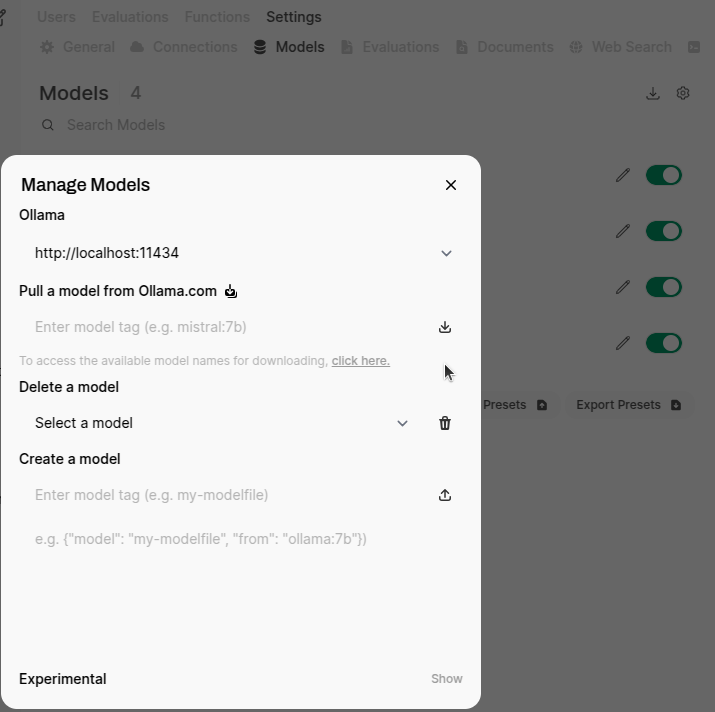
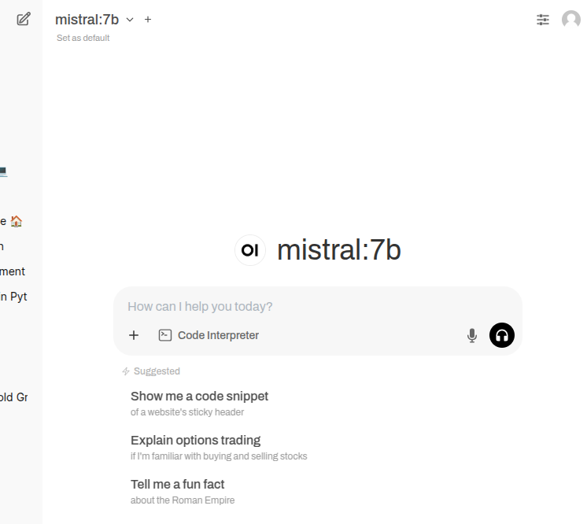

## Introduction

Open WebUI is an extensible, feature-rich, and user-friendly self-hosted AI platform designed to operate entirely offline. It supports various LLM runners like Ollama and OpenAI-compatible APIs, with built-in inference engine for RAG, making it a powerful AI deployment solution.

## Prerequisites

- Make sure you have a [wallet](../../wallet_connector)
- From the sidebar click on **Applications**
- Click on **Open WebUI**

## Hardware Considerations

Open WebUI's performance varies significantly based on your hardware configuration. The table below shows recommended specifications for different usage levels. Considerer the following before deploying your Open WebUI instance.

| Configuration | vCores | RAM (GB) | SSD (GB) | Rating with GPU | Rating CPU-Only |
|--------------|--------|----------|----------|-----------------|-----------------|
| **Small**    | 2      | 8        | 25       | Minimum         | Inadequate      |
| **Medium**   | 4      | 16        | 50       | Good            | Minimum         |
| **Large**    | 8      | 32       | 100      | Excellent       | Good            |

CPU-only deployments require at least the Medium configuration for acceptable performance. Deploying on nodes with high-end GPUs delivers faster inference and better handling of larger models.

## Deployment



- Enter an instance name

- Select a capacity package:

  - **Small**: \{cpu: 4, memory: 16 , diskSize: 125 \}
  - **Medium**: \{cpu: 8, memory: 32, diskSize: 250 \}
  - **Large**: \{cpu: 16, memory: 64, diskSize: 500 \}
  - Or choose a **Custom** plan
- Choose the network
   - `Mycelium` flag gives the virtual machine a Mycelium address
   - `WireGuard` flag gives the virtual machine a Mycelium address
- `Rented By Me` flag to retrieve nodes currently reserved by you
- `Rentable` flag to retrieve nodes that can be reserved as [dedicated nodes](../node_finder#dedicated-nodes)
- `Certified` flag to retrieve only certified nodes
- Choose the location of the node
  - `Region`
  - `Country`
  - `Farm Name`
- Choose the node to deploy on
  - Note: You can select a specific node with manual selection
- `Custom Domain` flag allows the user to use a custom domain (optional)
- Choose a gateway node to deploy your Open WebUI website

Once this is done, you can see a list of all of your deployed instances:



Click on the button **Visit** under **Actions** to go to your Open WebUI instance!

> Note: It will take a few minutes for the deployment to finalize. If you see `Bad Gateway`, simply wait some time and refresh the page.

## Use the App

This Open WebUI is deployed alongside with Ollama. To add Ollama models to Open WebUI, follow those steps:

- Click on the username icon
- Select `Admin Panel`
- Select `Settings` then `Models`
- Click on the button `Manage Models`
- Pull a model from Ollama.com, e.g. `mistral:7b`



Once this is done, you can use the model by creating a new chat.



For more information, consult the official [Open WebUI](https://docs.openwebui.com/).

## Troubleshooting

Models might require high resources. If you encounter the following error: `500: Ollama: 500, message='Internal Server Error', url='http://localhost:11434/api/chat'`, it might simply indicate that your need to provide higher resources (vcpu and GB of RAM). Check the logs for more information (using Mycelium or WireGuard).

```
ssh root@vm_ip
docker logs open-webui
```

## Check the GPU

You can verify that the GPU is working with the following.

> Note: Use `nvidia-smi` for Nvidia and `rocm-smi` for AMD.

- Check that the Docker container can access the GPU
  ```
  docker exec open-webui nvidia-smi
  ```
- Check the GPU resources live and run queries on Open WebUI. The resources allocated should vary:
  ```
  watch -n1 'docker exec open-webui nvidia-smi'
  ```