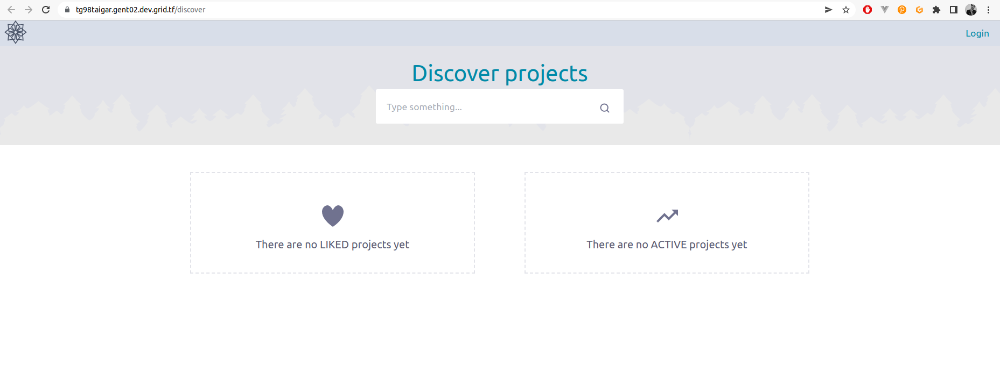

## Introduction

[Taiga](https://taiga.io/) is the project management tool for multi-functional agile teams. It has a rich feature set and at the same time it is very simple to start with through its intuitive user interface.

## Prerequisites

- Make sure you have a [wallet](../../wallet_connector)
- From the sidebar click on **Applications**
- Click on **Taiga**

## Deployment

- Enter an Application Name. It's used in generating a unique subdomain on one of the gateways on the network alongside your twin ID. Ex. ***tg98taigar*.gent02.dev.grid.tf**

- Enter administrator information including **Username**, **Email** and **Password**. This admin user will have full permission on the deployed instance.
- Select a capacity package:
    - **Small**: \{cpu: 2, memory: 4, diskSize: 100 \}
    - **Medium**: \{cpu: 4, memory: 8, diskSize: 150 \}
    - **Large**: \{cpu: 4, memory: 16, diskSize: 250 \}
    - Or choose a **Custom** plan
- Choose the network
   - `Public IPv4` flag gives the virtual machine a Public IPv4
   - `Mycelium` flag gives the virtual machine a Mycelium address
- `Rented By Me` flag to retrieve nodes currently reserved by you
- `Rentable` flag to retrieve nodes that can be reserved as [dedicated nodes](../node_finder#dedicated-nodes)
- `Certified` flag to retrieve only certified nodes 
- Choose the location of the node
   - `Region`
   - `Country`
   - `Farm Name`
- Choose the node to deploy the Taiga instance on
> Or you can select a specific node with manual selection.
- `Custom Domain` flag lets the user to use a custom domain
- Choose a gateway node to deploy your Funkwhale instance on.

There's also an optional **Mail Server** tab if you'd like to have your Taiga instance configured with an SMTP server. The SMTP configuration supports both `Admin Email` and `Username`.

After that is done you can see a list of all of your deployed instances

Click on ***Visit*** to go to the homepage of your Taiga instance!

## Troubleshooting

If you get a `Bad Gateway` while connecting to the website, you might simply need to wait for the deployment to complete.