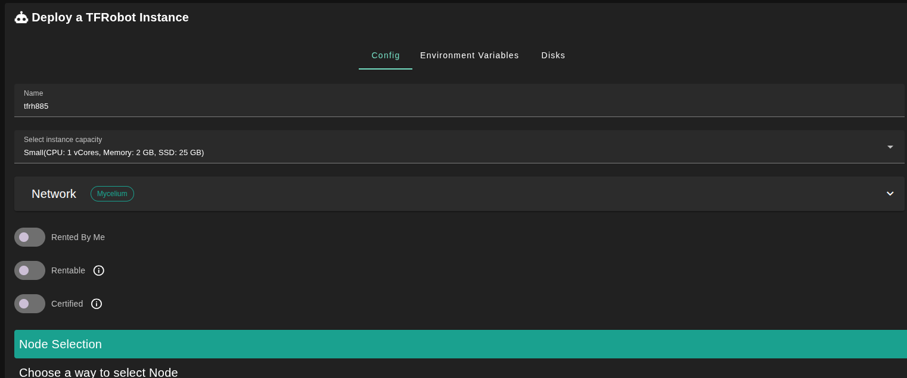
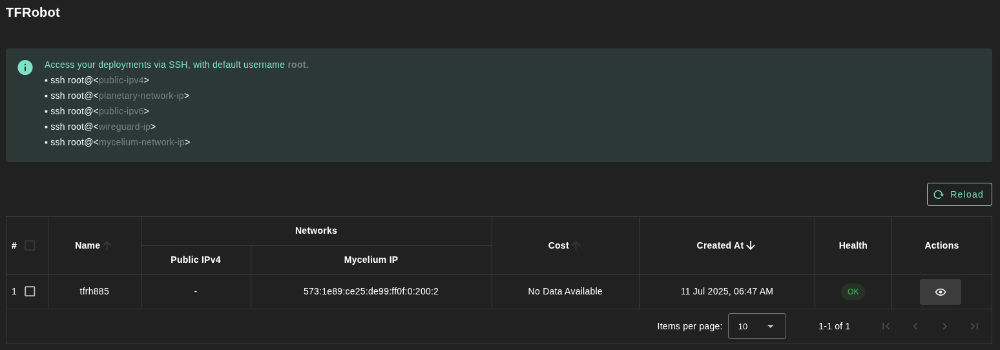

## Introduction

TFROBOT (`tfrobot`) is a command line interface tool that offers simultaneous mass deployment of groups of VMs on the ThreeFold Grid, with support of multiple retries for failed deployments, and customizable configurations, where you can define node groups, VMs groups and other configurations through a YAML or a JSON file.  

Consult the [ThreeFoldTech TFROBOT repository](https://github.com/threefoldtech/tfgrid-sdk-go/tree/development/tfrobot) for the latest updates and read the [basics](../../../system_administrators/tfgrid3_getstarted/tfgrid3_getstarted.md) to get up to speed if needed.

## Prerequisites

- Make sure you have a [wallet](../../wallet_connector)
- From the sidebar click on **Applications**
- Click on **TFRobot**

## Deployment

- Fill in the instance name: it's used to reference the TFRobot instance in the future.

- Minimum specs:
  - 1 vcore
  - 2 GB of memory
  - 25 GB of storage

- `Dedicated` flag to retrieve only [dedicated nodes](../node_finder#dedicated-nodes) (rentable or rented by you)
- `Certified` flag to retrieve only certified nodes 

- Choose the location of the node
   - `Region`
   - `Country`
   - `Farm Name`
- Select a node to deploy your TFRobot instance on.

> Or you can select a specific node with manual selection.

After that is done, you can see a list of your deployed TFRobot instances:

## Using TFRobot

Once you've deployed the TFRobot app from the Dashboard, you can read the docs to learn how to use it:

- [Configuration File](../../../developers/tfrobot/tfrobot_config)
- [Deployment](../../../developers/tfrobot/tfrobot_deploy)
- [Commands and Flags](../../../developers/tfrobot/tfrobot_commands_flags)
- [Supported Configurations](../../../developers/tfrobot/tfrobot_configurations)