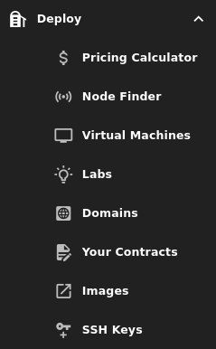

# Deploy

Here you will find everything related to deployments on the ThreeFold grid. This includes:

- Checking the cost of a deployment using [Pricing Calculator](./pricing_calculator.md)
- Finding a node to deploy on using the [Node Finder](./node_finder.md)
- Deploying a workload: [Virtual Machines](vm_intro/vm_intro.md), [Labs Applications](./applications/applications.md) or [Domains](domains.md)
- Consulting [Your Contracts](./your_contracts.md) on the TFGrid
- Finding or publishing Flists from [Images](./images.md)
- Updating or generating your SSH key from [SSH Keys](./ssh_keys.md)

***

**TABLE OF CONTENTS**

- [Pricing Calculator](./pricing_calculator.md)
- [Node Finder](./node_finder.md)
- [Virtual Machines](vm_intro/vm_intro.md)
- [Labs](./applications/applications.md)
- [Domains](domains.md)
- [Your Contracts](./your_contracts.md)
- [Images](./images.md)
- [SSH Keys](./ssh_keys.md)