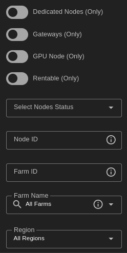

## Overview

The Node Finder page provides a more detailed view for the nodes available on the ThreeFold grid with detailed information and statistics about nodes.

## Filters

You can use the filters to narrow your search and find a node with the desired specifications.

You can use the toggle buttons to filter your search.

- Dedicated nodes
- Gateways nodes
- GPU nodes
- Rentable nodes

You can choose a location for your node, with filters such as region and country. This can be highly useful for edge cloud projects. 

Filtering nodes by their status (up, down, standby) can also improve your search.

If your deployment has some minimum requirements, you can easily filter relevant nodes with the different resource filters.

## Node Details

You can see all of the node details when you click on its row:

> Note: The network speed test displayed in the Node Finder is updated every 6 hours.

To access the public Grafana page displaying additional information, click on `Check Node Health`:

## Gateway Nodes

To see only gateway nodes, enable **Gateways** in the filters.

## Dedicated Nodes

Dedicated machines are 3Nodes that can be reserved and rented entirely by one user. The user can thus reserve an entire node and use it exclusively to deploy solutions. This feature is ideal for users who want to host heavy deployments with the benefits of high reliability and cost effectiveness.

To see only dedicated nodes, that are either rented by you or rentable, enable **Dedicated Nodes** in the filters.

### Reservation

When you have decided which node to reserve, you can easily rent it from the `Node Finder` page. You can also rent a dedicated node directly on a deployment page available from the main sections `Virtual Machines`, `Orchestrators` or `Applications`.

To reserve a node, simply click on `Reserve` on the node row.

To unreserve a node, simply click on `Unreserve` on the node row.

Note that once you've rented a dedicated node that has a GPU, you can deploy GPU workloads.

### Billing & Pricing

- Once a node is rented, there is a fixed charge billed to the tenant regardless of deployed workloads.
- Any subsequent NodeContract deployed on a node where a rentContract is active (and the same user is creating the nodeContracts) can be excluded from billing (apart from public ip and network usage).
- Billing rates are calculated hourly on the TFGrid. 
  - While some of the documentation mentions a monthly price, the chain expresses pricing per hour. The monthly price shown within the manual is offered as a convenience to users, as it provides a simple way to estimate costs.

### Discounts

- Received Discounts for renting a node on TFGrid internet capacity
  - 50% for dedicated node (TF Pricing policies)
  - A second level discount up to 60% for balance level see [Discount Levels](../../../knowledge_base/cloud_toc/pricing_toc/staking_discount_levels)
- Discounts are calculated every time the grid bills by checking the available TFT balance on the user wallet and seeing if it is sufficient to receive a discount. As a result, if the user balance drops below the treshold of a given discount, the deployment price increases.

## GPU Nodes

To see only nodes with GPU, enable **GPU Node** in the filters.

This will filter nodes and only show nodes with GPU. You can see several information such as the model of the GPU and a GPU score. 

You can click on a given GPU node and see the GPU details.

The ID that’s needed to be used during deployments is easily accessible and has a button to copy to the clipboard.

### GPU Support

To use a GPU on the TFGrid, users need to rent a dedicated node. Once they have rented a dedicated node equipped with a GPU, users can deploy workloads on their dedicated GPU node.

### GPU Support Links

The ThreeFold Manual covers many ways to use a GPU node on the TFGrid. Read [this section](../../system_administrators/gpu_toc/gpu_toc) to learn more.