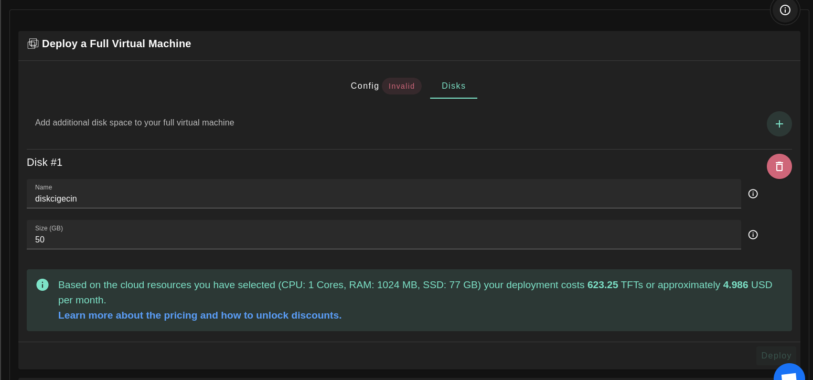

<h1> Full Virtual Machine </h1>

## Introduction

We present the steps to deploy a full VM on the TFGrid.

## Deployment

Deploy a new full virtual machine on the Threefold Grid

- Make sure you have a [wallet](../wallet_connector.md)
- From the sidebar click on **Applications**
- Click on **Full Virtual Machine**

**Process:**


- Fill in the instance name: it's used to reference the Full VM in the future.
- Choose the image from the drop down (e.g Alpine, Ubuntu) or you can click on `Other` and manually specify the flist URL and the entrypoint.
- Select a capacity package:
  - **Small**: {cpu: 1, memory: 2, diskSize: 25 }
  - **Medium**: {cpu: 2, memory: 4, diskSize: 50 }
  - **Large**: {cpu: 4, memory: 16, diskSize: 100}
  - Or choose a **Custom** plan
- Choose the network
  - `Public IPv4` flag gives the virtual machine a Public IPv4
  - `Public IPv6` flag gives the virtual machine a Public IPv6
  - `Planetary Network` to connect the Virtual Machine to Planetary network
  - `Mycelium` to enable Mycelium on the virtual machine
  - `Wireguard Access` to add a wireguard access to the Virtual Machine
- `GPU` flag to add GPU to the Virtual machine
  - To deploy a Full VM with GPU, you first need to [rent a dedicated node](../deploy/node_finder.md#dedicated-nodes)
- `Rented By Me` flag to retrieve nodes currently reserved by you
- `Rentable` flag to retrieve nodes that can be reserved as [dedicated nodes](../deploy/node_finder.md#dedicated-nodes)
- `Certified` flag to retrieve only certified nodes 
- Choose the location of the node
  - `Country`
  - `Farm Name`
- Choose the node to deploy the Full Virtual Machine on


  

- If you have more than one SSH keys set, you can click on `Manage SSH keys` to select which one to use for this deployment.

You can attach one or more disks to the Virtual Machine by clicking on the Disks tab and the plus `+` sign and specify the following parameters



- Disk name
- Disk size

At the bottom of the page, you can see a list of all of the virtual machines you deployed. You can click on `Show details` for more details:


You can also go to JSON tab for full details:


## Difference Between Full VM and Micro VM

- Full VM contains a default disk attached to it which is not the case in the Micro VM where you needed to make sure to attach a disk to it or the VM will fail
- The default disk is mounted on / so if you want to attach any additional disks, you have to choose a different mounting point
- Only cloud init flists can be deployed on Full VM. You can check official Threefold flists [here](https://hub.grid.tf/tf-official-vms)
- In Full VM, you need to mount the additional disks manually after the VM is deployed

## Manually Mounting Additional Disk

- You can follow the following commands to add your disk manually:

### Check All Disks Attached to the VM

```bash
fdisk -l
```

The additional disk won't be mounted and you won't find it listed

```bash
df -h
```

### Create a Mount Directory

```bash
sudo mkdir /hdd6T
```

### New file system

```bash
sudo mkfs.ext4 /dev/vdb
```

### Mount drive

```bash
sudo mount /dev/vdb /hdd6T/
```


