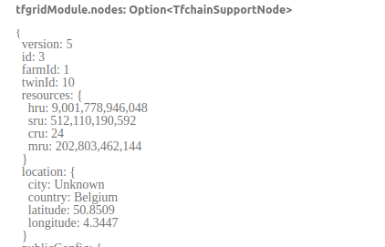

## Introduction

As we've seen in the previous section, voting weights for the TF DAO are tracked per farm to keep it easy and traceable.

Let's see an example of how the weight of a farm is calculated.

## Example

For this example, we will take a node from QANet:

```
node_id = 3
farm_id = 1
```

The node information is the following:



The Rust code that calculates node weight extracted from TFChain can be found [here](https://github.com/threefoldtech/tfchain/blob/eb36aa90df2d60cb1a534997903821fc68a096f1/substrate-node/support/src/resources.rs#L57-L91). 

When we apply this code to the current node, we get the following:

```
const GIGABYTE: u128 = 1024 * 1024 * 1024;
const ONE_THOUSAND: u128 = 1000;
const CRU: u64 = 24;
const MRU: u64 = 202803462144;
const SRU: u64 = 512110190592;
const HRU: u64 = 9001778946048;

fn calc_cu() -> u64 {
    let cru_min = CRU as u128 * 2 * GIGABYTE * ONE_THOUSAND;
    let mru_min =
        ((MRU as u128).checked_sub(1).unwrap_or(0) * GIGABYTE) * ONE_THOUSAND / 4;
    let sru_min = SRU as u128 * ONE_THOUSAND / 50;

    if cru_min < mru_min && cru_min < sru_min {
        cru_min as u64
    } else if mru_min < cru_min && mru_min < sru_min {
        mru_min as u64
    } else if sru_min < cru_min && sru_min < mru_min {
        sru_min as u64
    } else {
        0
    }
}
    
fn get_cu() -> u64 {
    let cu = calc_cu();
    let calculated_cu = 2 * (cu as u128 / GIGABYTE / ONE_THOUSAND);
    calculated_cu as u64
}
    
fn get_su() -> u64 {
    let su = HRU as u128 * ONE_THOUSAND / 1200 + SRU as u128 * ONE_THOUSAND / 250;
    let calculated_su = su / GIGABYTE;
    let result = calculated_su as u128 / ONE_THOUSAND;
    result as u64
}

fn main() {
    println!("CU: {}", get_cu());
    println!("SU: {}", get_su());
}
```  

We can then simply paste this code in the [Rust playground](https://play.rust-lang.org/) to obtain the `CU` and `SU` values of this node:
 
``` 
CU: 18
SU: 8
```

We can then simply put these numbers in the [equation shown in the last section](./tf_dao) to obtain the farm weight. Note that in this case, the farm has 2 different nodes with the same `CU` and `SU` values.

``` 
Weight = 2 * (sum of CU of all nodes) + (sum of SU of all nodes)
Weight = 2 * (18+18) + (8+8)
Weight = 2 * 36 + 16
Weight = 88
```

We can see that the farm has the weight `88`.