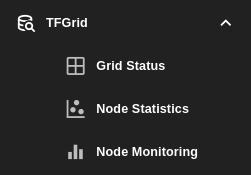

# TFGrid

Check and use all things related to the threefold grid. Including:

- The status of ThreeFold services from the [Grid Status](./grid_status) website.
- The statistics of all nodes that are available on the ThreeFold grid from [Node Statistics](./node_statistics).
- The health and status of Zero-OS nodes that are available on the ThreeFold grid from [Node Monitoring](./node_monitoring).

   

***

**TABLE OF CONTENTS**

- [Grid Status](./grid_status)
- [Node Statistics](./node_statistics)
- [Node Monitoring](./node_monitoring)