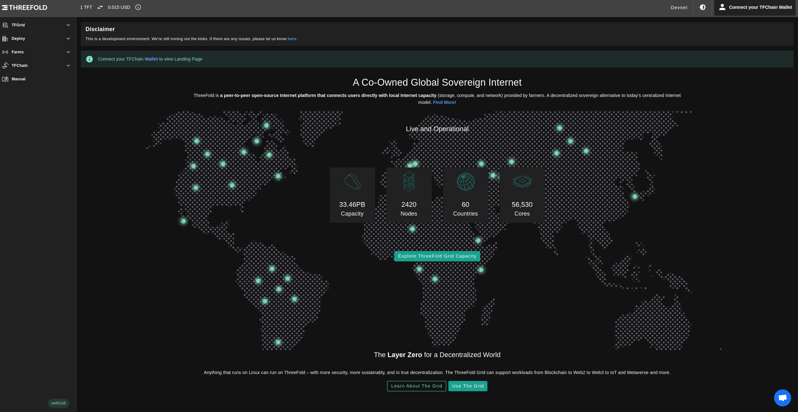

<h1> Wallet Connector </h1>

## Introduction

To interact with TFChain, users can connect their TFChain wallet to the wallet connector available on the ThreeFold Dashboard.

You can create a new wallet or import an existing wallet.

## Supported Networks

Currently, we're supporting four different networks:

- Dev net, for development purposes
  - [https://dashboard.dev.grid.tf](https://dashboard.dev.grid.tf)
- QA net, for internal testing and verifications
  - [https://dashboard.qa.grid.tf](https://dashboard.qa.grid.tf)
- Test net, for testing purposes
  - [https://dashboard.test.grid.tf](https://dashboard.test.grid.tf)
- Main net, for production-ready purposes
  - [https://dashboard.grid.tf](https://dashboard.grid.tf)

## Create a Wallet

To create a new wallet, open the ThreeFold Dashboard on the desired network, click on `Create Account`, enter the following information and click `Connect`.

- `Mnemonics`: The secret words of your Polkadot account. Click on the **Create Account** button to generate yours.
- `Email`: Enter a valid email address.
- `Password`: Choose a password and confirm it. This will be used to access your account.

You will be asked to accept ThreeFold's Terms and Conditions:

Once you've set your credentials, clicked on **Connect** and accepted the terms and conditions, your profile will be activated. 

Upon activation, you will find your **Twin ID**, **Address** and wallet current **balance** generated under your **Mnemonics**. 

Your current and locked balances will also be available at the top right corner of the dashboard. Here's an example of the balances you can find for your wallet. Some TFT is locked during utilization as the TFGrid bills you for your workloads and traffic.

## Import a Wallet

You can import an existing wallet by entering in `Mnemonics` the associated seed phrase or HEX secret of the existing wallet.

- To import a wallet created with the TF Dashboard, use the seed phrase provided when you created the account.
- To import a wallet or a farm created on the TF Connect app, use the TFChain HEX secret.
  - From the menu, open **Wallet** -> **Wallet name** -> **Info symbol (i)**, and then reveal and copy the **TFChain Secret**.

When you import a new wallet, you can decide a new password and email address, i.e. you only need the mnemonics to import an existing wallet on the dashboard.