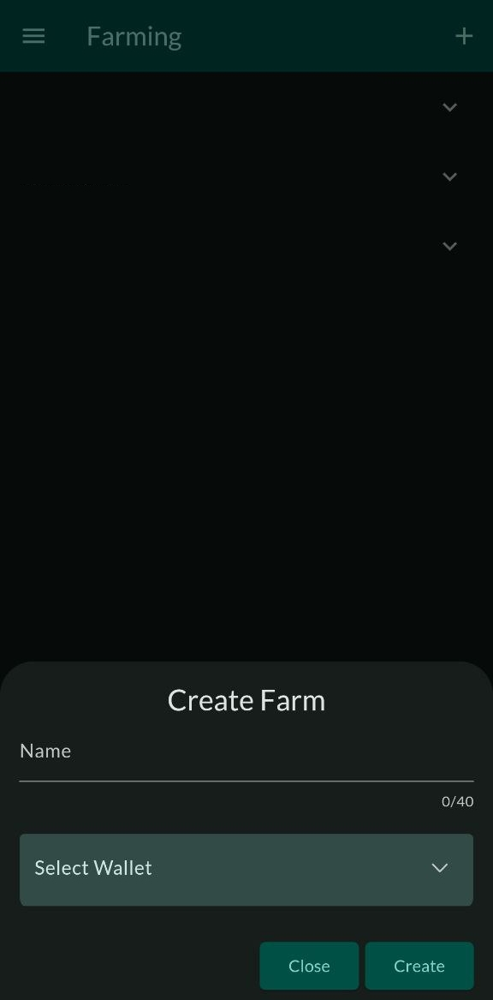
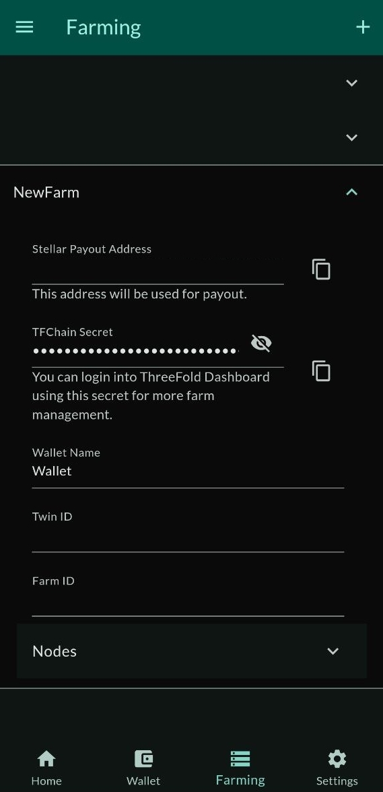

<h1> 1. Create a Farm </h1>

## Introduction

We cover the basic steps to create a farm with the ThreeFold Connect app. We also show how to connect the farm to the ThreeFold Dashboard. 

## Create a ThreeFold Connect App Account

Follow the steps in the [TF Connect App section](../../tfconnect_toc/tfconnect_installation.md) to create an account. 

## Create a Farm

Open the TF Connect app, go to Farming and click on the plus button `+` to create a farm.

Choose a farm name and select a wallet then click `Create`.

## Import the Farm on the Dashboard (Optional)

To import the farm on the Dashboard, go to the farming section of the TF Connect App, click on the farm then copy the `TFChain Secret`.

Use this secret to import a wallet on the [ThreeFold Dashboard](https://dashboard.grid.tf).

Consult the [ThreeFold Dashboard section](../../dashboard/dashboard.md) for more information on the dashboard.

### Farming Rewards Distribution

Farming rewards will be sent to your farming wallet around the 8th of each month. This can vary depending on the situation. The minting is done automatically by code and verified by humans as a double check.