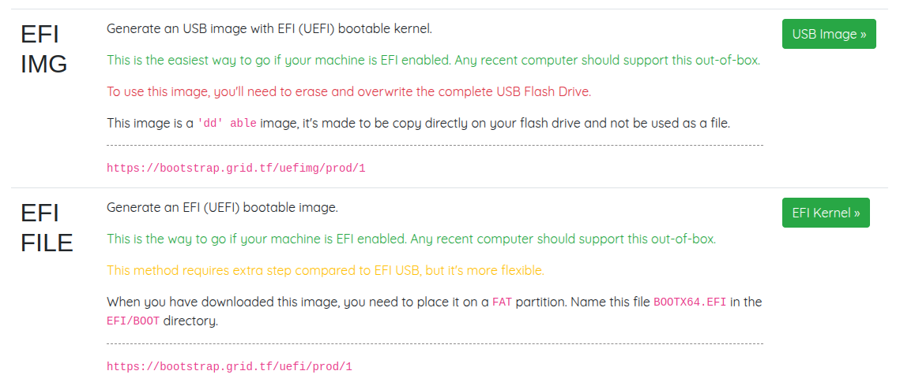
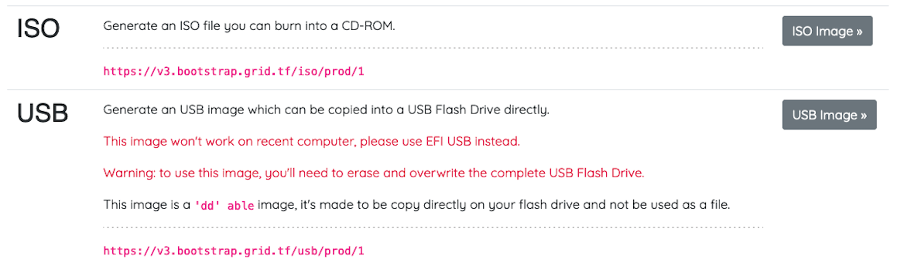
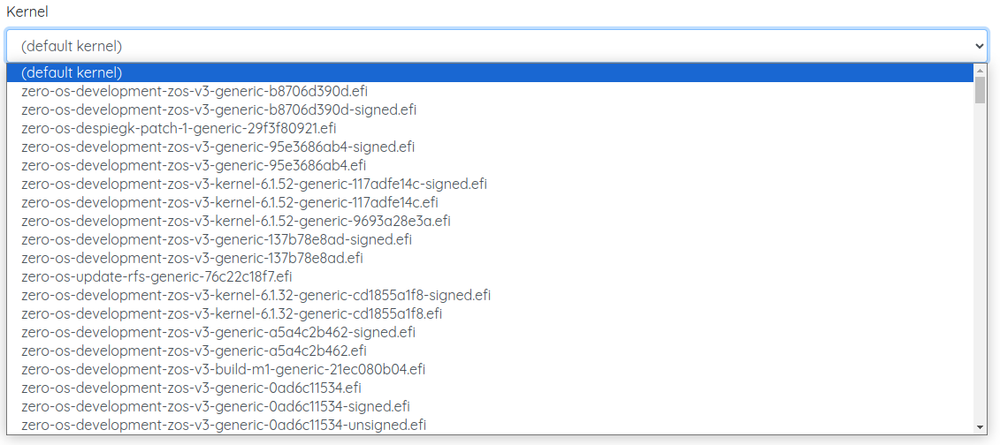
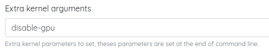

## Introduction

We will now learn how to create a Zero-OS bootstrap image in order to boot a DIY 3Node.

If you are building an HDD-only node, read [this section](../farming_optimization/hdd_only_nodes.md) too.

## Download the Zero-OS Bootstrap Image

Let's download the Zero-OS bootstrap image via the Zero-OS Boot Generator: [https://v3.bootstrap.grid.tf](https://v3.bootstrap.grid.tf)

 

On the Boot Generator page, write your farm ID and choose `Production` mode to deploy on mainnet.

  

Choose a bootstrap image format to download.

If your system is new, choose an image format for a `UEFI` bootable kernel. You can use either `EFI IMG` or `EFI FILE`.

- `EFI IMG`
  - Burn this image with BalenaEtcher. [See below for more info.](#balenaetcher-mac-linux-windows)
- `EFI FILE`
  - Format the USB to one `FAT` partition and save the bootstrap image as `/EFI/BOOT/BOOTX64.EFI`.

  

For older systems, choose an image format for a `BIOS` bootable kernel. 

- For BIOS CD/DVD, choose **ISO**.
- For BIOS USB, choose **USB**.

 

Next, we cover in details how to burn the bootstrap image.

## Burn the Zero-OS Bootstrap Image

We show how to burn the Zero-OS bootstrap image. A quick and modern way is to burn the bootstrap image on a USB key.

### CD/DVD BIOS 

For the BIOS **ISO** image, download the file and burn it on a DVD.

### USB Key BIOS+UEFI

There are many ways to burn the bootstrap image on a USB key. The easiest way that works for all operating systems is to use BalenaEtcher. We also provide other methods.

#### BalenaEtcher (MAC, Linux, Windows)

For **MAC**, **Linux** and **Windows**, you can use [BalenaEtcher](https://www.balena.io/etcher/) to flash the image on a USB key. This program also formats the USB in the process. This will work for the option **EFI IMG** for UEFI boot, and with the option **USB** for BIOS boot. Simply follow the steps presented to you and make sure you select the bootstrap image file you downloaded previously.

> Note: There are alternatives to BalenaEtcher (e.g. [usbimager](https://gitlab.com/bztsrc/usbimager/) for Windows, MAC and Linux, and [Rufus](https://sourceforge.net/projects/rufus.mirror/) for Windows).

**General Steps with BalenaEtcher:**

1. Download BalenaEtcher
2. Open BalenaEtcher
3. Select **Flash from file**
4. Find and select the bootstrap image (with your correct farm ID)
5. Select **Target** (your USB key)
6. Select **Flash**

That's it. Now you have a bootstrap image on Zero-OS as a bootable removable media device.


#### CLI (Linux)

For the BIOS **USB** and the UEFI **EFI IMG** images, you can do the following on Linux:

```
sudo dd status=progress if=FILELOCATION.ISO(or .IMG) of=/dev/sdX
```

Simply replace `X` by the proper disk for your USB key. To see your disks, write `lsblk` in the command line. Make sure you select the proper disk!

If you USB key is not new, make sure to format it before burning the Zero-OS image.

## Additional Information (Optional)

We cover some additional information. Note that the following information is not needed for a basic farm setup.

### Expert Mode

You can use the [expert mode](https://v3.bootstrap.grid.tf/expert) to generate specific Zero-OS bootstrap images.

Along the basic options of the normal bootstrap mode, the expert mode allows farmers to add extra kernel arguments and decide which kernel to use from a vast list of Zero-OS kernels.

#### Use a Specific Kernel

You can use the expert mode to choose a specific kernel. Simply set the information you normally use and then select the proper kernel you need in the **Kernel** drop-down list.



#### Disable GPU

You can use the expert mode to disable GPU on your 3Node.



In the expert mode of the Zero-OS Bootstrap generator, fill in the following information:

- Farmer ID
  - Your current farm ID
- Network
  - The network of your farm
- Extra kernel arguments
  - ```
    disable-gpu
    ```
- Kernel
  - Leave the default kernel
- Format
  - Choose a bootstrap image format
- Click on **Generate**
- Click on **Download**

### Bootstrap Image URL

In both normal and expert mode, you can use the generated URL to quickly download a Zero-OS bootstrap image based on your farm specific setup. 

Using URLs can be a very quick and efficient way to create new bootstrap images once your familiar with the Zero-OS bootstrap URL template and some potential varations. 

```
https://<grid_version>.bootstrap.grid.tf/<image_format>/<network>/<farm_ID>/<arg1>/<arg2>/.../<kernel>
```

Note that the arguments and the kernel are optional.

The following content will provide some examples.

#### Zeros-OS Bootstrapping

On the [main page](https://v3.bootstrap.grid.tf/), once you've written your farm ID and selected a network, you can copy the generated URL of any given image format.

For example, the following URL is a download link to an **EFI IMG** of the Zero-OS bootstrap image of farm 1 on the main TFGrid v3 network:

```
https://v3.bootstrap.grid.tf/uefimg/prod/1
```

#### Zeros-OS Expert Bootstrap

You can use the generated sublink at the **Generate step** of the expert mode to get a quick URL to download your bootstrap image.

- After setting the parameters and arguments, click on **Generate**
- Add the **Target** content to the following URL `https://v3.bootstrap.grid.tf`
  - For example, the following URL sets an **ipxe** script of the Zero-OS bootstrap of farm 1 on the main TFGrid v3 network, with the **disable-gpu** function enabled as an extra kernel argument and a specific kernel:
    -  ```
       https://v3.bootstrap.grid.tf/ipxe/test/1/disable-gpu/zero-os-development-zos-v3-generic-b8706d390d.efi
       ```