# ThreeFold Web Gateway Architecture

## Introduction

ThreeFold's Web Gateway architecture represents a powerful bridge between the traditional IPv4 internet and the next-generation decentralized internet infrastructure built on Mycelium networking. Web gateways enable 3Nodes without public IPv4 addresses to provide publicly accessible services to internet users.

This guide explains the architectural concepts, use cases, and benefits of web gateways within the ThreeFold ecosystem.

## ThreeFold Grid Networking Architecture

ThreeFold Grid uses a multi-layer networking approach that enables secure, scalable communication between 3Nodes while providing public internet access through web gateways.

### Core Network Components

```mermaid
graph TB
    A["🌐 IPv4 Internet<br/>Public Internet Users"] 
    B["🌉 Web Gateway<br/>IPv4 ↔ IPv6 Bridge"]
    C["🍄 Mycelium Network<br/>IPv6 Overlay (400::/7)"]
    D["🔒 WireGuard Networks<br/>Private Workload Networks"]
    E["💻 3Node Workloads<br/>Applications & Services"]
    
    A <--> B
    B <--> C
    C <--> D
    D <--> E
    C <--> E
    
    classDef internetClass fill:#3b82f6,stroke:#1d4ed8,stroke-width:2px,color:#ffffff
    classDef gatewayClass fill:#8b5cf6,stroke:#7c3aed,stroke-width:2px,color:#ffffff
    classDef myceliumClass fill:#10b981,stroke:#059669,stroke-width:2px,color:#ffffff
    classDef wireguardClass fill:#f59e0b,stroke:#d97706,stroke-width:2px,color:#ffffff
    classDef nodeClass fill:#ef4444,stroke:#dc2626,stroke-width:2px,color:#ffffff
    
    class A internetClass
    class B gatewayClass
    class C myceliumClass
    class D wireguardClass
    class E nodeClass
```

### Network Layer Breakdown

1. **IPv4/IPv6 Protocols**: Standard internet protocols for connectivity
2. **Mycelium Network**: IPv6 overlay network connecting all 3Nodes
3. **WireGuard Networks**: Private encrypted networks for workload isolation
4. **Web Gateway**: Protocol bridge enabling IPv4 internet access to IPv6 workloads

### Mycelium: Universal IPv6 Overlay Network

Mycelium is an open-source IPv6 overlay network that anyone can use on Linux, Mac, Windows, Android, iOS, and more. In ThreeFold Grid, it enables secure communication between 3Nodes.

#### Network Architecture:
- **Public Nodes as Servers**: Public backbone nodes act as servers/relays
- **All Participants as Clients**: Every device (including 3Nodes) connects as clients to public nodes
- **Public Node Mesh**: Public nodes connect to each other in a P2P mesh
- **Multiple Protocols**: Supports QUIC, TCP, and other communication methods

#### Core Capabilities:
- **Universal Connectivity**: Any device can join the Mycelium network
- **IPv6 Addressing**: Uses the 400::/7 IPv6 range for consistent addressing
- **End-to-End Encryption**: All traffic is encrypted by default
- **Cross-Platform**: Available on all major operating systems and mobile platforms
- **NAT-Friendly**: Reaches devices behind NAT using public node relays
- **Self-Healing**: Network automatically adapts to failures and topology changes

#### Future Development:
- **QUIC Hole Punching**: Direct P2P connections without relay nodes for NAT'd networks
- **Reduced Relay Dependency**: Direct communication between NAT'd devices

> Learn more at [threefold.info/mycelium](https://threefold.info/mycelium)

### WireGuard: Private Workload Networks

WireGuard provides private, encrypted networks for workload isolation and secure communication between specific nodes.

#### Network Architecture:
- **Gateway as Server**: Web gateways act as WireGuard servers
- **Nodes as Clients**: NAT'd 3Nodes connect as clients to the gateway
- **User Machines as Clients**: Your machine also connects as a client to access VMs
- **No Reverse Connections**: Gateway doesn't try to connect back to client machines

#### Key Features:
- **Private Networks**: Create isolated networks for specific workloads
- **Cross-Node Communication**: Secure communication between workloads on different 3Nodes
- **Additional Encryption**: Extra security layer on top of Mycelium
- **Flexible Topology**: Support for various network configurations
- **High Performance**: Minimal overhead for encrypted communication

#### Benefits:
- **Security**: Workload isolation and encrypted communication
- **Privacy**: Private networks separate from public Mycelium traffic
- **Flexibility**: Custom network topologies for complex applications
- **Scalability**: Efficient multi-node application architectures

## The Web Gateway Solution

**Key Problem**: If you host a workload on a 3Node without public IPv4 access, it's not reachable from the public internet.

**Web Gateway Solution**: Provides public IPv4 internet access to workloads that don't have public IPv4 connectivity.

### Why Web Gateways Are Needed

1. **Public Access**: Makes workloads accessible from the regular internet
2. **Cost Efficiency**: Public IPv4 addresses are expensive - only gateways need them
3. **Flexibility**: Deploy workloads on any 3Node regardless of network setup
4. **Simplicity**: End users access services normally via standard web browsers

## How Web Gateways Work

### Network Flexibility

ThreeFold Grid supports flexible network combinations:

- **IPv4 only**: Traditional internet connectivity
- **IPv6 only**: Using Mycelium network
- **Mycelium only**: Secure peer-to-peer communication
- **WireGuard only**: Private encrypted networks
- **IPv4 + Mycelium**: Public internet + secure overlay
- **IPv4 + WireGuard**: Public internet + private networks
- **IPv4 + IPv6 + Mycelium + WireGuard**: Full stack networking

### When You Need a Web Gateway

**Simple rule**: If your workload doesn't have public IPv4 access, but you want it reachable from the public internet, use a web gateway.

### How It Works

A Web Gateway is a 3Node with:
- **Public IPv4 address**: Accessible from the regular internet
- **Internal connectivity**: Can reach your workload via available networks (Mycelium, WireGuard, etc.)

The gateway acts as a **reverse proxy**, forwarding internet requests to your workload and returning responses.

### Traffic Flow Example

```mermaid
sequenceDiagram
    participant User as 👤 Internet User
    participant GW as 🌉 Web Gateway
    participant My as 🍄 Mycelium Network
    participant WG as 🔒 WireGuard Network
    participant App as 💻 3Node Workload
    
    User->>GW: HTTP Request (IPv4)
    Note over GW: Protocol Translation
    GW->>My: Forward Request (IPv6)
    My->>WG: Route to Workload Network
    WG->>App: Deliver to Application
    App->>WG: Application Response
    WG->>My: Return via Mycelium
    My->>GW: Response (IPv6)
    Note over GW: Protocol Translation
    GW->>User: HTTP Response (IPv4)
```

### Key Advantages

1. **Universal Access**: Any 3Node workload becomes publicly accessible
2. **Cost Efficiency**: Only gateway nodes need expensive public IPv4 addresses
3. **Network Flexibility**: Workloads can be deployed on any 3Node regardless of network setup
4. **Security**: All internal communication encrypted via Mycelium and WireGuard
5. **Scalability**: Multiple gateways can serve the same workloads for redundancy

## Use Cases and Scenarios

### Scenario 1: Distributed Web Application

```mermaid
flowchart LR
    User["👤 End User<br/>web.example.com"]
    Gateway["🌉 Web Gateway<br/>Farmer A<br/>(Public IPv4)"]
    Frontend["🌐 Frontend 3Node<br/>Farmer B<br/>(React/Vue App)"]
    API["🔌 API 3Node<br/>Farmer C<br/>(Node.js/Python)"]
    DB["🗄️ Database 3Node<br/>Farmer D<br/>(PostgreSQL/MongoDB)"]
    
    User -->|"HTTPS Request"| Gateway
    Gateway <-->|"Mycelium Network"| Frontend
    Frontend <-->|"Mycelium Network"| API
    API <-->|"Mycelium Network"| DB
    
    classDef userClass fill:#3b82f6,stroke:#1d4ed8,stroke-width:2px,color:#ffffff
    classDef gatewayClass fill:#8b5cf6,stroke:#7c3aed,stroke-width:2px,color:#ffffff
    classDef nodeClass fill:#ef4444,stroke:#dc2626,stroke-width:2px,color:#ffffff
    
    class User userClass
    class Gateway gatewayClass
    class Frontend,API,DB nodeClass
```

**Setup**:
- Frontend: Hosted on 3Nodes without public IPv4 addresses
- Backend APIs: Running on different 3Nodes across the globe
- Database: Stored on 3Nodes in specific geographic regions
- Web Gateway: Provides public IPv4 access point

**Benefits**:
- **Cost Efficiency**: Only gateway needs expensive IPv4 addresses
- **Geographic Distribution**: Workloads can be placed optimally worldwide
- **Security**: Internal communication via encrypted Mycelium network
- **Scalability**: Easy to add more backend nodes without IPv4 requirements

### Scenario 2: Development and Testing

**Setup**:
- Development environments on 3Nodes without public IPs
- Web gateways provide temporary public access for testing
- Multiple developers can share gateway resources

**Benefits**:
- **Resource Sharing**: Multiple projects share gateway infrastructure
- **Flexibility**: Easy to expose/hide services during development
- **Cost Control**: Avoid IPv4 costs for temporary testing needs

### Scenario 3: Enterprise Hybrid Cloud

**Setup**:
- Critical workloads on private 3Nodes with Mycelium-only connectivity
- Web gateways in strategic locations for public access
- Internal services communicate via secure Mycelium network

**Benefits**:
- **Security**: Internal workloads isolated from direct internet exposure
- **Compliance**: Sensitive data stays on private infrastructure
- **Performance**: Mycelium's locality-aware routing optimizes internal traffic

## Gateway Types and Configurations

### Name-Based Gateways

- **Function**: Route traffic based on domain names/subdomains
- **Use Case**: Multiple services behind single IP address
- **Configuration**: DNS CNAME records point to gateway domain
- **Example**: `api.myapp.com` → Gateway → Internal API service

### FQDN Gateways

- **Function**: Fully Qualified Domain Name routing with TLS termination
- **Use Case**: Production web applications with SSL certificates
- **Configuration**: Let's Encrypt integration for automatic certificates
- **Example**: `https://myapp.com` → Gateway → Internal web server

### TCP/UDP Gateways

- **Function**: Raw TCP/UDP traffic forwarding
- **Use Case**: Non-HTTP services (databases, game servers, etc.)
- **Configuration**: Port-based routing to internal services
- **Example**: `gateway:5432` → Internal PostgreSQL database

## Farmer and User Perspectives

### For Farmers (Gateway Providers)

**Requirements**:
- 3Node with public IPv4 address
- Sufficient bandwidth for gateway traffic
- Reliable internet connection
- Optional: Custom domain for branded gateways

**Benefits**:
- **Revenue Stream**: Earn tokens from gateway usage
- **Network Contribution**: Provide valuable infrastructure service
- **Utilization**: Maximize return on IPv4 address investment

**Setup Process**:
1. Configure 3Node with public IPv4
2. Enable gateway functionality in node configuration
3. Optional: Set up custom domain with DNS records
4. Monitor and maintain gateway performance

### For Users (Gateway Consumers)

**Benefits**:
- **Public Internet Access**: Make any workload accessible from the regular internet
- **Network Flexibility**: Deploy workloads on any 3Node regardless of network setup
- **Global Reach**: Access to gateways worldwide
- **Cost Efficiency**: Pay only for gateway usage, not expensive public IPv4 addresses

**Usage Process**:
1. Deploy workloads on any 3Node (public IPv4 not required)
2. Select appropriate gateway from available options
3. Configure gateway routing to your workload
4. Access your application via gateway's public endpoint

## Technical Implementation

### Gateway Node Requirements

**Hardware**:
- Standard 3Node specifications
- Additional bandwidth capacity for gateway traffic
- Reliable network connectivity

**Network Configuration**:
- Public IPv4 address (static preferred)
- Mycelium network participation
- Proper firewall configuration for gateway ports

**Software Stack**:
- ZeroOS with gateway modules enabled
- Automatic certificate management (Let's Encrypt)
- Traffic routing and load balancing capabilities

### Security Considerations

**Traffic Isolation**:
- Gateway traffic isolated from node's internal operations
- Workload traffic encrypted via Mycelium network
- No direct access to internal node systems

**Certificate Management**:
- Automatic SSL certificate provisioning
- Wildcard certificate support for subdomains
- Certificate renewal and rotation

**Access Control**:
- Gateway access controlled by ThreeFold Grid smart contracts
- Usage tracking and billing integration
- Rate limiting and abuse prevention

## Future Developments

### Enhanced Gateway Features

- **Multi-Protocol Support**: Extended support for various network protocols beyond HTTP/HTTPS
- **Advanced Load Balancing**: Intelligent traffic distribution algorithms with health checking
- **Edge Computing**: Gateway-based compute capabilities for processing at the edge
- **CDN Integration**: Content delivery network functionality with caching

### Mycelium Network Evolution

#### QUIC Hole Punching (In Development)
- **Direct P2P Communication**: NAT'd devices can connect directly without relay nodes
- **QUIC Protocol Integration**: Hole punching capabilities for NAT traversal
- **Reduced Relay Dependency**: Less reliance on public backbone nodes as middlemen
- **Enhanced Performance**: Lower latency through direct peer-to-peer connections
- **Improved Scalability**: Reduced bandwidth load on public relay infrastructure

#### Additional Enhancements
- **Performance Improvements**: Continued optimization of routing algorithms
- **Mobile Support**: Enhanced support for mobile and IoT devices
- **Integration Expansion**: Broader ecosystem integration capabilities
- **Advanced Monitoring**: Better visibility into network performance and health

## Conclusion

ThreeFold Web Gateways solve a simple but important problem: **making workloads accessible from the public internet when they don't have public IPv4 access**.

Key advantages:
- **Public Internet Access**: Any workload becomes accessible from the regular internet
- **Cost Efficiency**: Only gateways need expensive public IPv4 addresses
- **Network Flexibility**: Deploy workloads anywhere, access them everywhere
- **Simple Setup**: No complex networking configuration required

For **farmers**, web gateways provide a revenue opportunity by offering gateway services using their public IPv4 addresses.

For **users**, web gateways enable deploying workloads on any 3Node while maintaining public accessibility - without the cost and complexity of managing public IPv4 addresses.

Web gateways make ThreeFold Grid practical for real-world applications by bridging the gap between decentralized infrastructure and public internet accessibility.
