# ThreeFold Web Gateway Architecture

## Introduction

ThreeFold's Web Gateway architecture represents a powerful bridge between the traditional IPv4 internet and the next-generation decentralized internet infrastructure built on Mycelium networking. Web gateways enable 3Nodes without public IPv4 addresses to provide publicly accessible services to internet users.

This guide explains the architectural concepts, use cases, and benefits of web gateways within the ThreeFold ecosystem.

## Network Architecture Overview

### The Three-Layer Network Stack

ThreeFold's networking architecture operates on three complementary layers:

```mermaid
graph TB
    A["🌐 IPv4 Internet Layer<br/>Traditional internet users"] 
    B["🌉 Web Gateway Layer<br/>Bridge & Protocol Translation"]
    C["🍄 Mycelium Network Layer<br/>Secure P2P IPv6 Overlay"]
    D["💻 3Node Workloads<br/>Applications & Services"]
    
    A <--> B
    B <--> C
    C <--> D
    
    style A fill:#2563eb,stroke:#1e40af,stroke-width:3px,color:#ffffff
    style B fill:#7c3aed,stroke:#5b21b6,stroke-width:3px,color:#ffffff
    style C fill:#059669,stroke:#047857,stroke-width:3px,color:#ffffff
    style D fill:#dc2626,stroke:#991b1b,stroke-width:3px,color:#ffffff
```

1. **IPv4 Layer**: Traditional internet connectivity for backward compatibility
2. **Mycelium Layer**: Advanced IPv6 overlay network for secure P2P communication
3. **Web Gateway Layer**: Bridge between IPv4 and Mycelium networks

### Mycelium: The Foundation Network

Mycelium is ThreeFold's revolutionary IPv6 overlay network that serves as the primary networking layer for 3Nodes:

#### Key Features:
- **IPv6 Addressing**: Uses the 400::/7 IPv6 range, providing virtually unlimited address space
- **End-to-End Encryption**: All traffic is encrypted by default between nodes
- **Identity-Based Networking**: Each node's IPv6 address is cryptographically linked to its private key
- **NAT Traversal**: Automatically establishes P2P connections without complex protocols
- **Locality-Aware Routing**: Intelligently finds the shortest path between nodes
- **Automatic Rerouting**: Self-healing network that adapts to failures and congestion
- **Decentralized Architecture**: No single points of failure or centralized control

#### Benefits Over Traditional Networks:
- **No NAT Issues**: Direct P2P communication without port forwarding
- **Built-in Security**: Encryption and authentication at the network layer
- **Global Scalability**: Can scale to billions of devices
- **Resilience**: Distributed routing with automatic failover
- **Privacy**: End-to-end encryption prevents traffic analysis

## Web Gateway Role and Function

### What is a Web Gateway?

A Web Gateway is a specialized 3Node that enables public internet access for workloads running on 3Nodes without public IPv4 addresses. It acts as a bridge between:
- **Internal**: 3Nodes without IPv4 addresses running workloads
- **External**: Public IPv4 internet users who need to access those workloads

### Gateway Architecture

```mermaid
flowchart TD
    Internet["🌍 Public IPv4 Internet<br/>Users & Applications"]
    Gateway["🌉 Web Gateway 3Node<br/>• Public IPv4 Address<br/>• Mycelium Connectivity<br/>• Protocol Translation"]
    Mycelium["🍄 Mycelium Network<br/>• Encrypted P2P Communication<br/>• IPv6 Overlay (400::/7)<br/>• NAT Traversal"]
    Node1["💻 3Node A<br/>Web Server<br/>(No IPv4)"]
    Node2["🗄️ 3Node B<br/>Database<br/>(No IPv4)"]
    Node3["⚙️ 3Node C<br/>API Service<br/>(No IPv4)"]
    
    Internet <--> Gateway
    Gateway <--> Mycelium
    Mycelium <--> Node1
    Mycelium <--> Node2
    Mycelium <--> Node3
    
    style Internet fill:#2563eb,stroke:#1e40af,stroke-width:3px,color:#ffffff
    style Gateway fill:#7c3aed,stroke:#5b21b6,stroke-width:3px,color:#ffffff
    style Mycelium fill:#059669,stroke:#047857,stroke-width:3px,color:#ffffff
    style Node1 fill:#dc2626,stroke:#991b1b,stroke-width:3px,color:#ffffff
    style Node2 fill:#dc2626,stroke:#991b1b,stroke-width:3px,color:#ffffff
    style Node3 fill:#dc2626,stroke:#991b1b,stroke-width:3px,color:#ffffff
```

### How Web Gateways Work

1. **Traffic Reception**: Gateway receives IPv4 requests from public internet users
2. **Protocol Translation**: Converts IPv4 requests to communicate with 3Nodes via Mycelium network
3. **Workload Routing**: Routes requests to target workloads on 3Nodes without public IPv4
4. **Response Handling**: Receives responses from workload 3Nodes and forwards back to internet users
5. **Load Balancing**: Can distribute traffic across multiple backend workloads on different 3Nodes

## Use Cases and Scenarios

### Scenario 1: Distributed Web Application

```mermaid
flowchart LR
    User["👤 Internet User<br/>Browser Request"]
    Gateway["🌉 Web Gateway<br/>New York<br/>(IPv4: Public)"]
    Frontend["🎨 Frontend 3Node<br/>London<br/>(Mycelium Only)"]
    API["🔌 API 3Node<br/>Singapore<br/>(Mycelium Only)"]
    DB["🗄️ Database 3Node<br/>Frankfurt<br/>(Mycelium Only)"]
    
    User --> Gateway
    Gateway <--> Frontend
    Frontend <--> API
    API <--> DB
    
    style User fill:#2563eb,stroke:#1e40af,stroke-width:3px,color:#ffffff
    style Gateway fill:#7c3aed,stroke:#5b21b6,stroke-width:3px,color:#ffffff
    style Frontend fill:#dc2626,stroke:#991b1b,stroke-width:3px,color:#ffffff
    style API fill:#dc2626,stroke:#991b1b,stroke-width:3px,color:#ffffff
    style DB fill:#dc2626,stroke:#991b1b,stroke-width:3px,color:#ffffff
```

**Setup**:
- Frontend: Hosted on 3Nodes without public IPv4 addresses
- Backend APIs: Running on different 3Nodes across the globe
- Database: Stored on 3Nodes in specific geographic regions
- Web Gateway: Provides public IPv4 access point

**Benefits**:
- **Cost Efficiency**: Only gateway needs expensive IPv4 addresses
- **Geographic Distribution**: Workloads can be placed optimally worldwide
- **Security**: Internal communication via encrypted Mycelium network
- **Scalability**: Easy to add more backend nodes without IPv4 requirements

### Scenario 2: Development and Testing

**Setup**:
- Development environments on 3Nodes without public IPs
- Web gateways provide temporary public access for testing
- Multiple developers can share gateway resources

**Benefits**:
- **Resource Sharing**: Multiple projects share gateway infrastructure
- **Flexibility**: Easy to expose/hide services during development
- **Cost Control**: Avoid IPv4 costs for temporary testing needs

### Scenario 3: Enterprise Hybrid Cloud

**Setup**:
- Critical workloads on private 3Nodes with Mycelium-only connectivity
- Web gateways in strategic locations for public access
- Internal services communicate via secure Mycelium network

**Benefits**:
- **Security**: Internal workloads isolated from direct internet exposure
- **Compliance**: Sensitive data stays on private infrastructure
- **Performance**: Mycelium's locality-aware routing optimizes internal traffic

## Gateway Types and Configurations

### Name-Based Gateways

- **Function**: Route traffic based on domain names/subdomains
- **Use Case**: Multiple services behind single IP address
- **Configuration**: DNS CNAME records point to gateway domain
- **Example**: `api.myapp.com` → Gateway → Internal API service

### FQDN Gateways

- **Function**: Fully Qualified Domain Name routing with TLS termination
- **Use Case**: Production web applications with SSL certificates
- **Configuration**: Let's Encrypt integration for automatic certificates
- **Example**: `https://myapp.com` → Gateway → Internal web server

### TCP/UDP Gateways

- **Function**: Raw TCP/UDP traffic forwarding
- **Use Case**: Non-HTTP services (databases, game servers, etc.)
- **Configuration**: Port-based routing to internal services
- **Example**: `gateway:5432` → Internal PostgreSQL database

## Farmer and User Perspectives

### For Farmers (Gateway Providers)

**Requirements**:
- 3Node with public IPv4 address
- Sufficient bandwidth for gateway traffic
- Reliable internet connection
- Optional: Custom domain for branded gateways

**Benefits**:
- **Revenue Stream**: Earn tokens from gateway usage
- **Network Contribution**: Provide valuable infrastructure service
- **Utilization**: Maximize return on IPv4 address investment

**Setup Process**:
1. Configure 3Node with public IPv4
2. Enable gateway functionality in node configuration
3. Optional: Set up custom domain with DNS records
4. Monitor and maintain gateway performance

### For Users (Gateway Consumers)

**Benefits**:
- **No IPv4 Required**: Deploy workloads without expensive public IPs
- **Global Reach**: Access to gateways worldwide
- **Automatic Scaling**: Use multiple gateways for load distribution
- **Cost Efficiency**: Pay only for gateway usage, not full IPv4 addresses

**Usage Process**:
1. Deploy workloads on any 3Nodes (IPv4 not required)
2. Select appropriate gateway from available options
3. Configure gateway routing to workload
4. Access application via gateway's public endpoint

## Technical Implementation

### Gateway Node Requirements

**Hardware**:
- Standard 3Node specifications
- Additional bandwidth capacity for gateway traffic
- Reliable network connectivity

**Network Configuration**:
- Public IPv4 address (static preferred)
- Mycelium network participation
- Proper firewall configuration for gateway ports

**Software Stack**:
- ZeroOS with gateway modules enabled
- Automatic certificate management (Let's Encrypt)
- Traffic routing and load balancing capabilities

### Security Considerations

**Traffic Isolation**:
- Gateway traffic isolated from node's internal operations
- Workload traffic encrypted via Mycelium network
- No direct access to internal node systems

**Certificate Management**:
- Automatic SSL certificate provisioning
- Wildcard certificate support for subdomains
- Certificate renewal and rotation

**Access Control**:
- Gateway access controlled by ThreeFold Grid smart contracts
- Usage tracking and billing integration
- Rate limiting and abuse prevention

## Future Developments

### Enhanced Gateway Features

- **Multi-Protocol Support**: Extended support for various network protocols
- **Advanced Load Balancing**: Intelligent traffic distribution algorithms
- **Edge Computing**: Gateway-based compute capabilities
- **CDN Integration**: Content delivery network functionality

### Mycelium Network Evolution

- **Performance Improvements**: Continued optimization of routing algorithms
- **Mobile Support**: Enhanced support for mobile and IoT devices
- **Integration Expansion**: Broader ecosystem integration capabilities

## Conclusion

ThreeFold's Web Gateway architecture represents a sophisticated solution to the challenge of bridging traditional IPv4 internet with next-generation decentralized networking. By combining the power of Mycelium's secure, efficient overlay network with strategic IPv4 gateway points, ThreeFold enables:

- **Cost-effective deployment** of internet-accessible applications
- **Enhanced security** through encrypted internal communications
- **Global scalability** without IPv4 address limitations
- **Flexible architecture** supporting diverse use cases

This architecture positions ThreeFold as a leader in the transition to a more decentralized, secure, and efficient internet infrastructure while maintaining compatibility with existing systems and user expectations.

For farmers, web gateways represent an opportunity to provide valuable infrastructure services and generate revenue from IPv4 investments. For users, they offer a path to deploy globally accessible applications without the complexity and cost of managing public IP addresses directly.

As the Mycelium network continues to mature and expand, web gateways will play an increasingly important role in making decentralized internet infrastructure accessible to mainstream users and applications.
