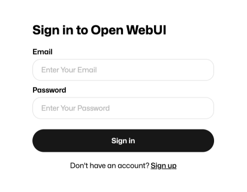
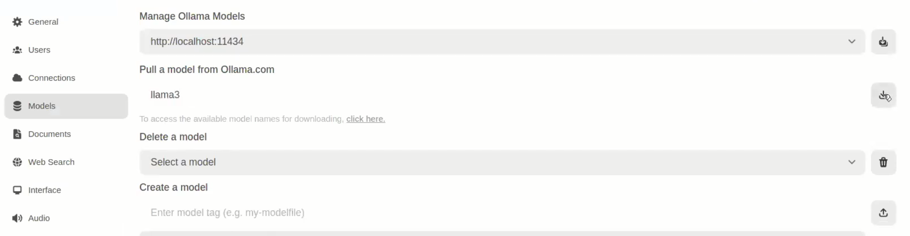
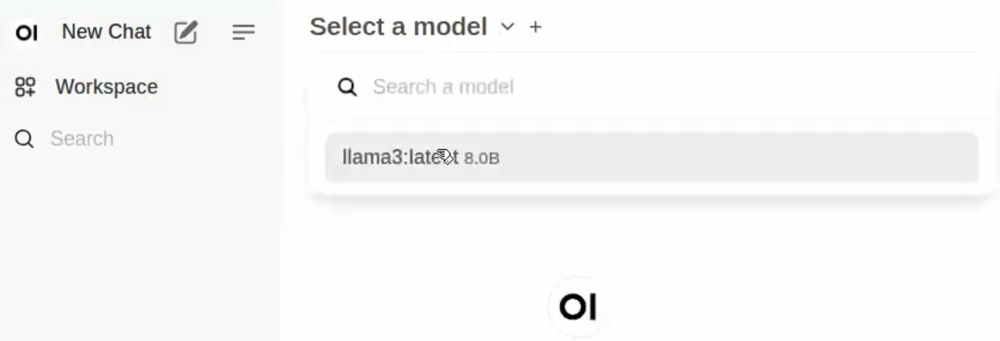

<h1> AI & ML Workloads: CPU and Llama </h1>


## Introduction

We present a simple guide on how to deploy large language models on the grid using CPU. For this guide, we will be deploying Llama on a full VM using OpenWebUI bundled with Ollama support.

Llama is a large language model trained by Meta AI. It is an open-source model, meaning that it is free to use and customize for various applications. This LLM is designed to be a more conversational AI allowing users to engage in natural-sounding conversations. Llama is trained on a massive dataset of text from the internet and can generate responses to a wide range of topics and questions.

Ollama is an open-source project that allows users to run large language models (LLMs) on their local machine.

OpenWebUI is one of many front ends for Ollama, providing a convenient and user friendly way to load weights and chat with the bot.

## Prerequisites

- [A TFChain account](../../../dashboard/wallet_connector.md)
- TFT in your TFChain account
  - [Buy TFT](../../../threefold_token/buy_sell_tft/buy_sell_tft.md)
  - [Send TFT to TFChain](../../../threefold_token/tft_bridges/tfchain_stellar_bridge.md)

## Deploy a Full VM

We start by deploying a full VM on the ThreeFold Dashboard. The more cores we set to the machine, the faster the model will be.

* On the [Threefold Dashboard](https://dashboard.grid.tf/#/), go to the [full virtual machine deployment page](https://dashboard.grid.tf/#/deploy/virtual-machines/full-virtual-machine/)
* Deploy a full VM (Ubuntu 22.04) with only `Wireguard` as the network
  * Vcores: 8 vcores
  * MB of RAM: 4096 GB
  * GB of storage: 100 GB
* After deployment, [set the Wireguard configurations](../../tfgrid3_getstarted/ssh_guide/advanced_methods/ssh_wireguard.md)
* Connect to the VM via SSH
  * ``` 
    ssh root@VM_Wireguard_Address
    ```

## Preparing the VM

We prepare the full VM to run Llama.

* Install Docker
  * ```
    wget -O docker.sh get.docker.com
    bash docker.sh
    ```

## Setting OpenWebUI

We now install OpenWebUI with bundled Ollama support. Note that you might need to use another port than `3000` if this port is already in use on your local machine.

* For CPU only
   ```
   docker run -d -p 3000:8080 -v ollama:/root/.ollama -v open-webui:/app/backend/data --name open-webui --restart always ghcr.io/open-webui/open-webui:ollama
   ```
* Once the container is fully loaded and running, go to your browser to access OpenWebUI using the Wireguard address:
  * ```
    10.20.4.2:3000
    ```

You should now see the OpenWebUI page. You can register by entering your email and setting a password. This information will stay on the machine running OpenWebUI.

<p align="center">
  
</p>

## Pull a Model

Once you've access OpenWebUI, you need to download a LLM model before using it.

- Click on the bottom left button displaying your username
- Click on `Settings`, then `Admin Settings` and `Models`
- Under `Pull a model from Ollama.com`, enter the LLM model you want to use
  - In our case we will use `llama3`
- Click on the button on the right to pull the image



## Using Llama

Let's now use Llama!

- Click on `New Chat` on the top left corner
- Click on `Select a model` and select the model you downloaded
  - You can click on `Set as default` for convenience



- You can now `Send a Message` to Llama and interact with it!

That's it. You now have a running LLM instance on the grid.

## References

For any advanced configurations, you may refer to the [OpenWebUI documentation](https://github.com/open-webui/open-webui).