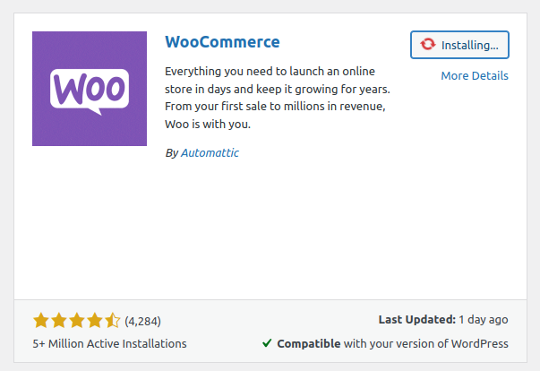
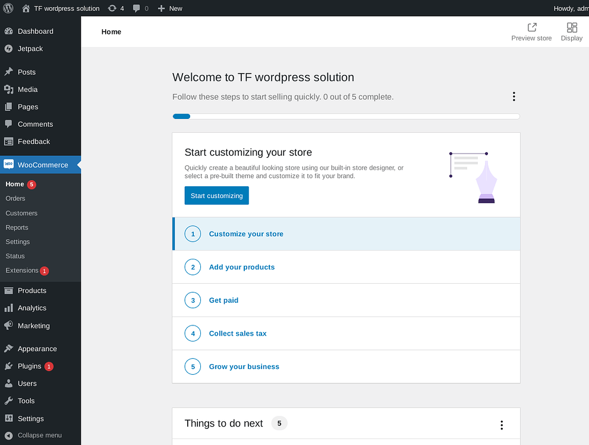

## Introduction

We show how to deploy a free and open-source ecommerce on the ThreeFold Grid. We will be deploying on a micro VM with an IPv4 address.

[WooCommerce](https://woocommerce.com/) is the open-source ecommerce platform for [WordPress](https://wordpress.com/). The platform is free, flexible, and amplified by a global community. The freedom of open-source means you retain full ownership of your store’s content and data forever.

## Prerequisites

- [A TFChain account](../../../dashboard/wallet_connector)
- TFT in your TFChain account
  - [Buy TFT](../../../threefold_token/buy_sell_tft/buy_sell_tft)
  - [Send TFT to TFChain](../../../threefold_token/tft_bridges/tfchain_stellar_bridge)

## Deploy Wordpress

We start by deploying Wordpress on the ThreeFold Dashboard.

* On the [Threefold Dashboard](https://dashboard.grid.tf/#/), go to the [Wordpress deloyment page](https://dashboard.test.grid.tf/#/deploy/applications/wordpress/)
* Deploy a Wordpress with an IPv4 address and sufficient resources to run Wordpress
  * IPv4 Address
  * Minimum vcores: 2vcore
  * Minimum MB of RAM: 4GB
  * Minimum storage: 50GB
* After deployment, note the VM IPv4 address

## Set a DNS Record

* Go to your domain name registrar
  * In the section **Advanced DNS**, add a **DNS A Record** to your domain and link it to the IP address of the VM you deployed on:
    * Type: A Record
    * Host: @
    * Value: "IPv4_Address"
    * TTL: Automatic
  * It might take up to 30 minutes to set the DNS properly.
  * To check if the A record has been registered, you can use a common DNS checker:
    * ```
      https://dnschecker.org/#A/example.com
      ```

## HTTPS with Caddy

We set HTTPS with Caddy.

- Install Caddy
    ```
    apt install -y debian-keyring debian-archive-keyring apt-transport-https curl
    curl -1sLf 'https://dl.cloudsmith.io/public/caddy/stable/gpg.key' | gpg --dearmor -o /usr/share/keyrings/caddy-stable-archive-keyring.gpg
    curl -1sLf 'https://dl.cloudsmith.io/public/caddy/stable/debian.deb.txt' > /etc/apt/sources.list.d/caddy-stable.list
    apt update
    apt install caddy
    ```
- Set a reverse proxy on port 80 with your own domain
    ```
    caddy reverse-proxy -r --from example.com --to :80
    ```

You should see in the logs that it successfully obtains an SSL certificate, and after that you can try navigating to your site's domain again to verify it's working. Using a private window or adding `https://` specifically might be necessary until your browser drops its cache.

When you're satisfied that everything looks good, hit `ctl-c` to exit Caddy and we'll proceed to making this persistent.

### Adjust the Firewall

By default, ufw is set on Wordpress application from the Dashboard. To use Caddy and set HTTPS, we want to allow port 443.

* Add the permissions
  * ```
    ufw allow 443
    ```

### Manage with zinit

We manage Caddy with zinit.

- Open the file for editing
    ```bash
    nano /etc/zinit/caddy.yaml
    ```
- Insert the following line with your own domain and save the file
    ```
    exec: caddy reverse-proxy -r --from example.com --to :80
    ```
- Add the new Caddy file to zinit
    ```bash
    zinit monitor caddy
    ```

Zinit will start up Caddy immediately, restart it if it ever crashes, and start it up automatically after any reboots. Assuming you tested the Caddy invocation above and used the same form here, that should be all there is to it. 

Here are some other Zinit commands that could be helpful to troubleshoot issues:

- See status of all services (same as "zinit list")
    ```
    zinit
    ```
- Get logs for a service
    ```
    zinit log caddy
    ```
- Restart a service (to test configuration changes, for example)
    ```
    zinit stop caddy
    zinit start caddy
    ```

## Access Admin Panel

You can access the admin panel by clicking on `Admin panel` under `Actions` on the Dashboard. You can also use the following template on a browser with your own domain:

```
example.com/wp-admin
```

If you've forgotten your credentials, just open the Wordpress info window on the Dashboard.

## Install WooCommerce

On the Wordpress admin panel, go to `Plugins` and search for WooCommerce.



Once this is done, you can open WooCommerce on the left-side menu.


You can then set your store and start your online business!



## Troubleshooting

You might need to deactivate some plugins that aren't compatible with WooCommerce, such as `MailPoet`.

## References

Make sure to read the [Wordpress and Woocommerce documentation](https://woocommerce.com/document/woocommerce-self-service-guide) to set your ecommerce.

## Questions and Feedback

If you have any questions or feedback, please let us know by either writing a post on the [ThreeFold Forum](https://forum.threefold.io/), or by chatting with us on the [TF Grid Tester Community](https://t.me/threefoldtesting) Telegram channel.