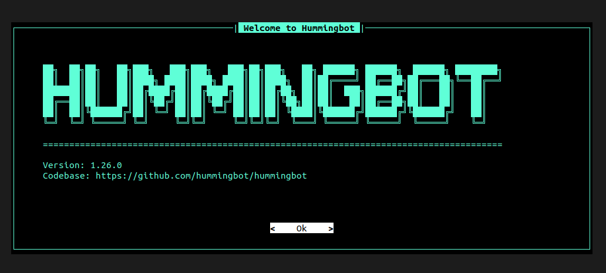

<h1> Hummingbot on a Full VM </h1>


## Introduction

Hummingbot is an open source platform that helps you design, backtest, and deploy fleets of automated crypto trading bots.

In this guide, we go through the basic steps to deploy a [Hummingbot](https://hummingbot.org/) instance on a full VM running on the TFGrid.


## Prerequisites

- [A TFChain account](../../dashboard/wallet_connector.md)
- TFT in your TFChain account
  - [Buy TFT](../../threefold_token/buy_sell_tft/buy_sell_tft.md)
  - [Send TFT to TFChain](../../threefold_token/tft_bridges/tfchain_stellar_bridge.md)

## Deploy a Full VM

We start by deploying a full VM on the ThreeFold Dashboard.

* On the [Threefold Dashboard](https://dashboard.grid.tf/#/), go to the [full virtual machine deployment page](https://dashboard.grid.tf/#/deploy/virtual-machines/full-virtual-machine/)
* Deploy a full VM (Ubuntu 22.04) with an IPv4 address and at least the minimum specs for Hummingbot
  * IPv4 Address
  * Minimum vcores: 1vcore
  * Minimum MB of RAM: 4096GB
  * Minimum storage: 15GB
* After deployment, note the VM IPv4 address
* Connect to the VM via SSH
  * ``` 
    ssh root@VM_IPv4_address
    ```

## Preparing the VM

We prepare the full VM to run Hummingbot.

* Update the VM
   ```
   apt update
   ```
* [Install Docker](../computer_it_basics/docker_basics.html#install-docker-desktop-and-docker-engine)

## Setting Hummingbot

We clone the Hummingbot repo and start it via Docker.

* Clone the Hummingbot repository
   ```
   git clone https://github.com/hummingbot/hummingbot.git
   cd hummingbot
   ```
* Start Hummingbot
   ```
   docker compose up -d
   ```
* Attach to instance
   ```
   docker attach hummingbot
   ```

You should now see the Hummingbot page.



## References

The information to install Hummingbot have been taken directly from their [documentation](https://hummingbot.org/installation/docker/).

For any advanced configurations, you may refer to the Hummingbot documentation.