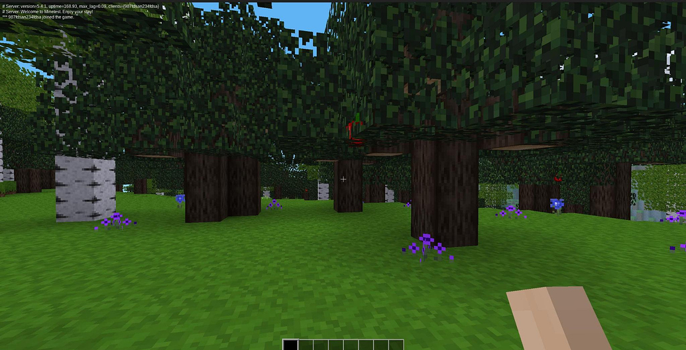

## Introduction

We show how to deploy a Minetest server on the TFGrid, install Minetest on a local machine and access the Minetest server from the local machine.



## Prerequisites

- [A TFChain account](../../dashboard/wallet_connector)
- TFT in your TFChain account
  - [Buy TFT](../../threefold_token/buy_sell_tft/buy_sell_tft)
  - [Send TFT to TFChain](../../threefold_token/tft_bridges/tft_bridges)

## Deploy a Full VM

We start by deploying a full VM on the ThreeFold Dashboard.

* On the [Threefold Dashboard](https://dashboard.grid.tf/#/), go to the [full virtual machine deployment page](https://dashboard.grid.tf/#/deploy/virtual-machines/full-virtual-machine/)
* Deploy a full VM (Ubuntu 22.04) with an IPv4 address and at least the minimum specs for a full VM
  * Network
    * Set IPv4 Address (required)
    * Set Wireguard (optional)
  * Minimum vcores: 1vcore
  * Minimum MB of RAM: 512MB
  * Minimum storage: 15GB
* After deployment, note the VM IPv4 address
* SSH into the VM
    ```
    ssh root@vm_ipv4_address
    ```


## DNS Settings

You need to set an A record for the IPv4 address.

The following table explicitly shows how to set the A record for your domain. Note that we set `minetest` as a subdomain.

| Type | Host | Value          |
| ---- | ---- | -------------- |
| A    | minetest   | ipv4_address |


You will then be able to access your server on Minetest with the URL `minetest.example.com:30033`. More on the port below.

### DNS Verification

You can use tools such as [DNSChecker](https://dnschecker.org/) or [dig](https://linux.die.net/man/1/dig) on a terminal to check if the DNS propagadation is complete.


- Check that the subdomain resolves to the IPv4 address of the full VM
    ```
    minetest.example.com
    ```

## Run a Minetest Server on the TFGrid


- Install the Minetest server
    ```
    apt update
    apt install minetest-server -y
    ```
- Set the Minetest server
    ```
    nano /etc/minetest/minetest.conf
    ```
- Update the following lines
    ```
    server_name = Server Name

    server_address = http://minetest.example.com

    server_announce = true

    port = 30033
    ```
- Run the Minetest server
    ```
    minetestserver --worldname world
    ```

## Run Minetest Locally

- Update the local machine
    ```
    apt update
    ```
- Install Minetest
    ```
    apt install flatpak -y
    apt install gnome-software-plugin-flatpak -y
    flatpak remote-add --if-not-exists flathub https://dl.flathub.org/repo/flathub.flatpakrepo
    ```
- Reboot the machine 
- Install Minetest
    ```
    flatpak install flathub net.minetest.Minetest
    ```
- Run Minetest
    ```
    flatpak run net.minetest.Minetest
    ```

## Access the Server from Minetest

- On Minetest, go to the server you previously set


- You can then access the Minetest world!


## Public Server Notes

Once you set the Minetest server publicly, you can see it displayed on https://servers.minetest.net/.

- Example of publicly available server


## References

For further information on Minetest, read the [Minetest documentation](https://wiki.minetest.net/Main_Page).