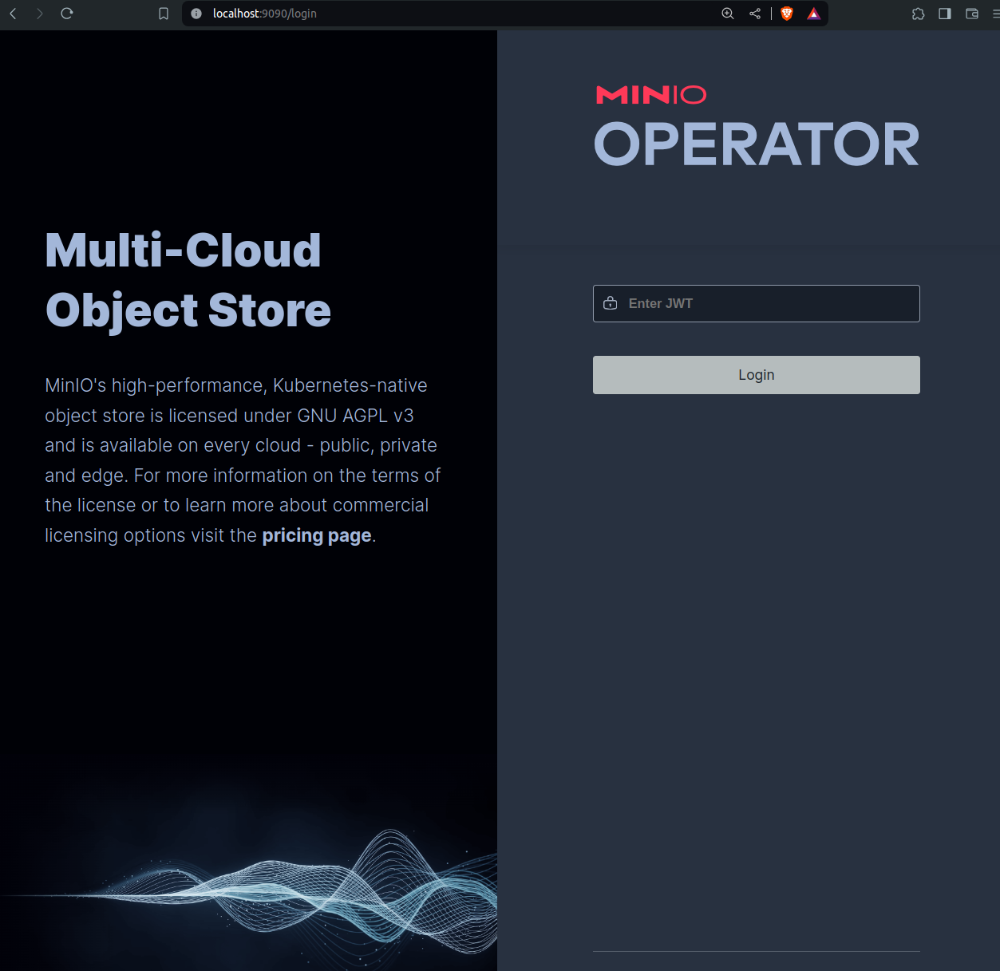
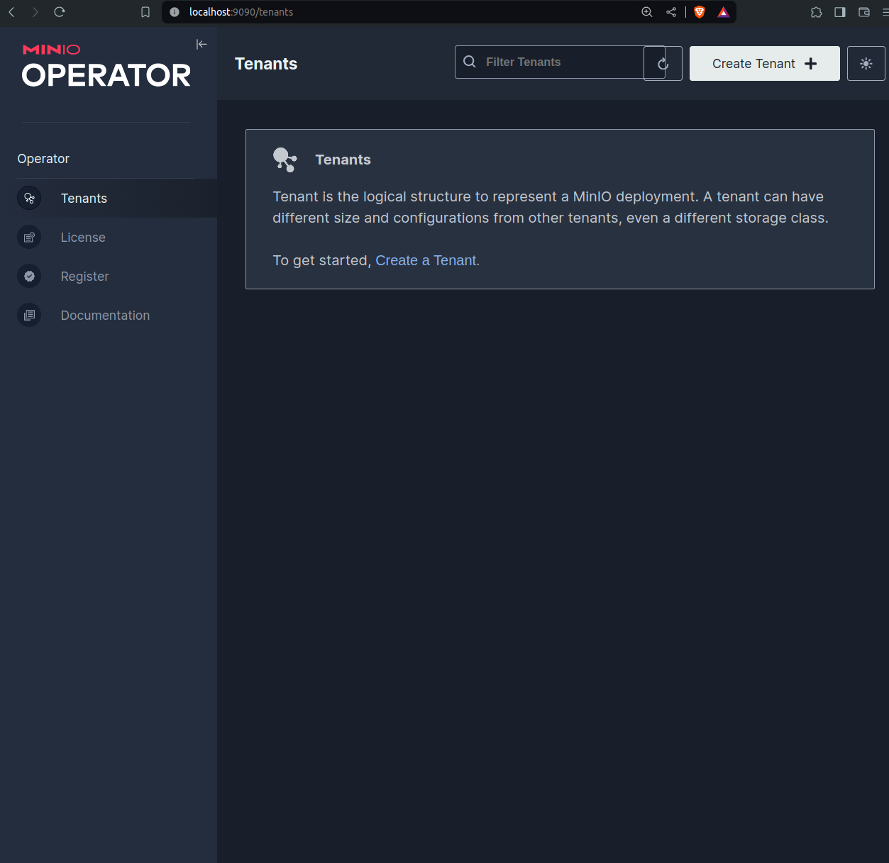

## Introduction

We show how to deploy a Kubernetes cluster and set a [MinIO](https://min.io/) Operator with [Helm 3](https://helm.sh/).

MinIO is a high-performance, S3 compatible object store. It is built for
large scale AI/ML, data lake and database workloads. Helm is a package manager for Kubernetes that allows developers and operators to more easily package, configure, and deploy applications and services onto Kubernetes clusters.

## Prerequisites

- TFChain account with TFT
- [Deploy Kubernetes cluster with one master and one worker (IPv4)](../../dashboard/deploy/applications/k8s)
- [Make sure you can connect via SSH on the terminal](../tfgrid3_getstarted/ssh_guide/ssh_openssh)
  
## Create an SSH Tunnel

To access the MinIO Operator, we need to create an SSH tunnel with the port 9090.

- Open a terminal and create an SSH tunnel
    ```
    ssh -4 -L 9090:127.0.0.1:9090 root@<VM_IP>
    ```

Simply leave this window open and follow the next steps.

## Set the VM

We set the Master VM to access the minIO Operator.

- Install the prerequisites:
    ```
    apt update
    apt install git -y
    apt install wget
    apt install jq -y
    ```
- Install Helm
    ```
    wget https://get.helm.sh/helm-v3.14.3-linux-amd64.tar.gz
    tar -xvf helm-v3.14.3-linux-amd64.tar.gz
    mv linux-amd64/helm /usr/local/bin/helm
    ```
- Install yq
    ```
    wget https://github.com/mikefarah/yq/releases/download/v4.43.1/yq_linux_amd64.tar.gz
    tar -xvf yq_linux_amd64.tar.gz
    mv yq_linux_amd64 /usr/bin/yq
    ```

## Set MinIO

We can then set the MinIO Operator. For this step, we mainly follow the MinIO documentation [here](https://min.io/docs/minio/kubernetes/upstream/operations/install-deploy-manage/deploy-operator-helm.html).

- Add the MinIO repo
    ```
    helm repo add minio-operator https://operator.min.io
    ```
- Validate the MinIO repo content
    ```
    helm search repo minio-operator
    ```
- Install the operator
    ```
    helm install \
    --namespace minio-operator \
    --create-namespace \
    operator minio-operator/operator
    ```
- Verify the operator installation
    ```
    kubectl get all -n minio-operator
    ```

## Access the MinIO Operator

You can then access the MinIO Operator on your local browser (port 9090)

```
localhost:9090
```

To log in the MinIO Operator, you will need to enter the token. To see the token, run the following line:

```
kubectl get secret/console-sa-secret -n minio-operator -o json | jq -r ".data.token" | base64 -d
```

Enter the token on the login page:



You then have access to the MinIO Operator:




## Questions and Feedback

If you have any questions, feel free to ask for help on the [ThreeFold Forum](https://forum.threefold.io/).