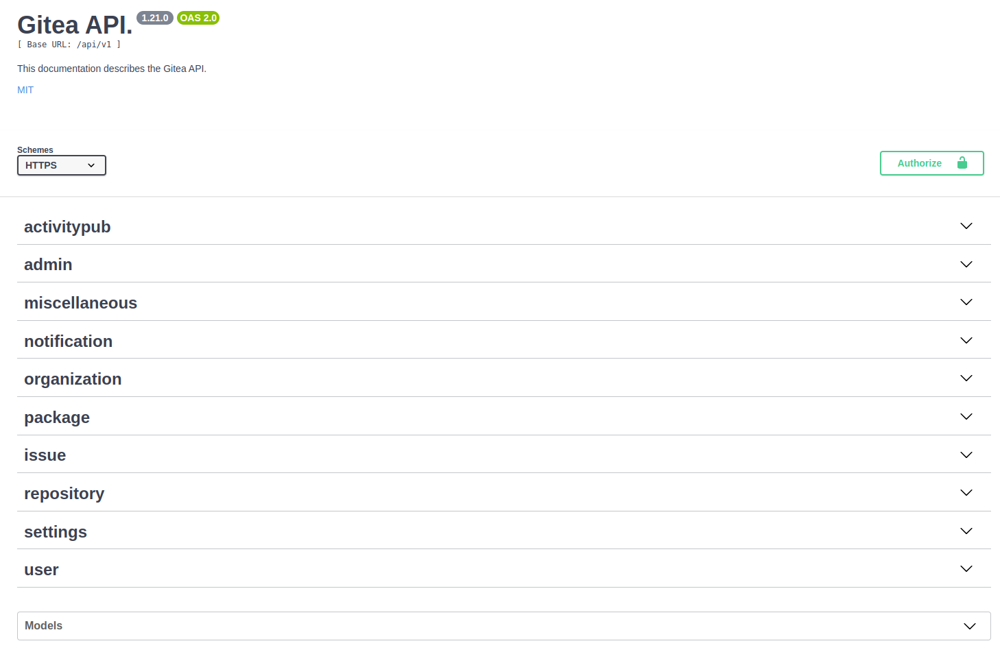
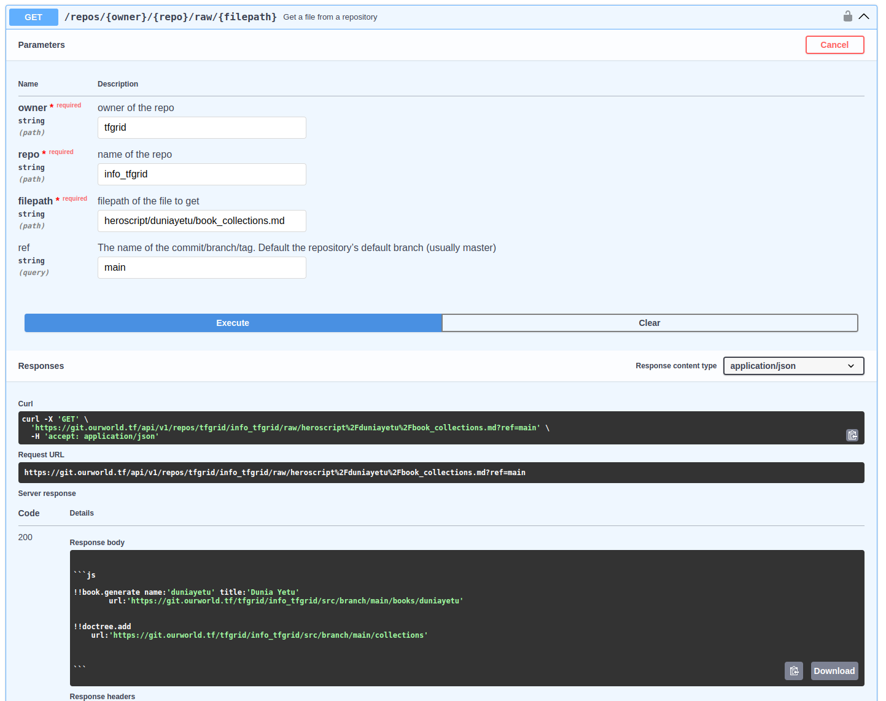
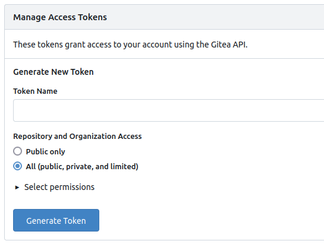
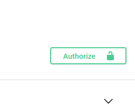

<h1>Gitea API</h1>


## Introduction

We show how to use the Gitea API with both Swagger and CLI.

## Swagger

The Gitea API is available with the slugs `/api/swagger#` after your Gitea domain URL.

- For ThreeFold, we use the following Gitea API:
```
https://git.ourworld.tf/api/swagger#/
```

You can access different levels of the Gitea instance:



You can use the Swagger for different queries. Parameters are expained for each example so it is a fairly intuitive use.

For example, to get the raw content of a file, you can use the following:

- Go to the section `Get a file from a repository`.

- In this example, we query the tfgrid organization and its repository `info_tfgrid` for the branch `main`. We write the path of the file.



Once you tried a query on the API, you can take the curl command example to query the same information from the CLI. We check this in the next section.

## CLI

To use the API with a command line interface, you can use curl.

For example, we take the raw content of a file:

```
curl -X 'GET' \
  'https://git.ourworld.tf/api/v1/repos/tfgrid/info_tfgrid/raw/heroscript%2Fduniayetu%2Fbook_collections.md?ref=main' \
  -H 'accept: application/json'
```

We can save this in a file by adding `> filename.txt` after the line above:

```
curl -X 'GET' \
  'https://git.ourworld.tf/api/v1/repos/tfgrid/info_tfgrid/raw/heroscript%2Fduniayetu%2Fbook_collections.md?ref=main' \
  -H 'accept: application/json' > filename.txt
```

## Swagger and CLI

A combination of the Swagger and the CLI can be very effective.

First, find the proper `curl` command by using the Gitea Swagger, then use the CLI to pass the `curl` commands.

## API Authorization

If you want to query information that is access-protected, such as a private repository, you first need to create a Gitea access token and then log into the Gitea API with the token.

Once this is done, every Swagger request you ask will be accompanied with the access token.

- Create an access token directly on Gitea
  - Go to the `Applications` section of the `User Settings` [on Gitea](https://git.ourworld.tf/user/settings/applications)
  - Under `Manage Access Tokens`, choose a `Token Name`
  - Select either ̀`Public only` or `All (public, private and limited)`. For private access, choose the latter
  - You must select at least one permission to create a token. Click on `Select permissions` and choose the permissions for your token
  - Click on `Generate token`
  - Copy the generate token and keep it somewhere safe



- Log in the Gitea API with your access token
  - On the top of the Gitea API page, click on `Authorize`

<p align="center">
  
</p>

  - In `AuthorizationHeaderToken (apiKey)` write `token` followed by a space and then paste your token, e.g.:
    - `token 1234567890`
- Once you're logged in with your token, you can make queries with the API

## References

You can learn more by reading the [Gitea API documentation](https://docs.gitea.com/development/api-usage).