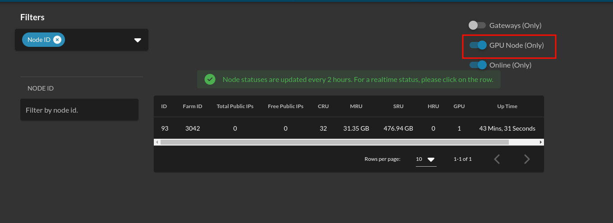
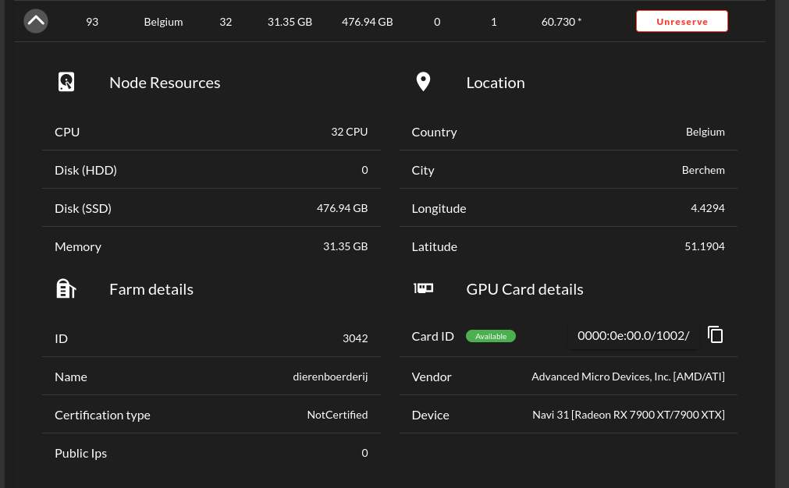
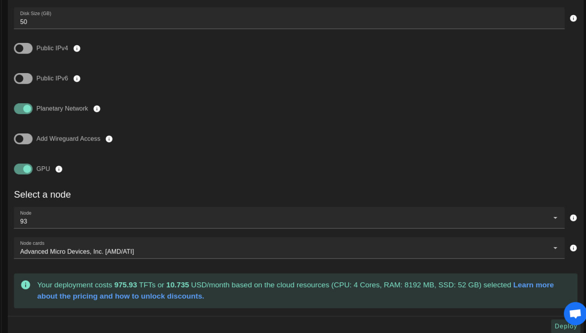
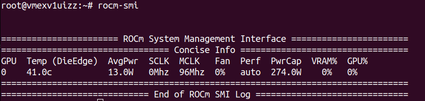
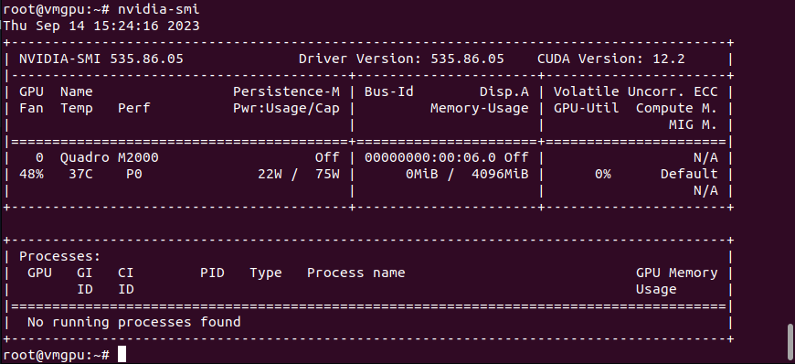

# How to Use GPU on the Grid

## Introduction

This guide provides step-by-step instructions for deploying and using GPU resources on the ThreeFold Grid. You'll learn how to rent a dedicated GPU node, deploy a virtual machine, and install the necessary GPU drivers.

## Prerequisites

- Access to the ThreeFold Dashboard
- Basic knowledge of SSH and Linux command line
- Understanding of your GPU requirements (AMD or NVIDIA)

## Step 1: Rent a GPU Node

### Find Available GPU Nodes

1. Navigate to the ThreeFold Dashboard explorer
2. Enable the **GPU Node (only)** option to filter nodes with GPU capabilities



### Reserve Your Node

1. Once you've identified a suitable GPU node, navigate to the **Dedicated Node** page
2. Complete the rental process for your selected node



## Step 2: Deploy a Virtual Machine with GPU

After successfully renting a GPU node, deploy a virtual machine on your dedicated node using one of the following methods:

- **ThreeFold Dashboard** (recommended for beginners)
- **TypeScript Client**
- **Terraform**
- **Other supported deployment tools**



## Step 3: Install GPU Drivers

### System Preparation

1. SSH into your deployed virtual machine
2. Update your system to ensure compatibility:

```bash
dpkg --add-architecture i386
sudo apt-get update
sudo apt-get dist-upgrade
sudo reboot
```

### Identify Your GPU Hardware

Before downloading drivers, identify your GPU specifications using either:

- **ThreeFold Dashboard**: Check node details in your dashboard
- **Command line tools**:

```bash
lspci | grep VGA
lshw -c video
```

### Download GPU Drivers

Download the appropriate driver for your GPU:

- **AMD GPUs**: Visit [AMD Support](https://www.amd.com/en/support)
- **NVIDIA GPUs**: Visit [NVIDIA Driver Downloads](https://www.nvidia.com/download/index.aspx)

Use `wget` to download the driver package to your VM.

### AMD GPU Installation

1. Install the downloaded AMD driver package (replace `<VERSION>` with your specific version):

```bash
sudo apt-get install ./amdgpu-install_<VERSION>.deb
amdgpu-install --usecase="dkms,graphics,opencl,hip,rocm,rocmdev,opencl,hiplibsdk,mllib,mlsdk" --opencl=rocr --vulkan=pro --opengl=mesa
```

2. Verify the installation:

```bash
rocm-smi
rocminfo
```

3. Expected output should resemble:




### NVIDIA GPU Installation

For NVIDIA GPUs, the installation process is more straightforward:

1. Follow the comprehensive guide: [NVIDIA Drivers on Ubuntu 20.04](https://linuxize.com/post/how-to-nvidia-drivers-on-ubuntu-20-04/#installing-the-nvidia-drivers-using-the-command-line)

2. Verify the installation using:

```bash
nvidia-smi
```

3. Expected output:



## Alternative: AI Model Installation

For users interested in AI workloads, consider trying [InvokeAI](https://github.com/invoke-ai/InvokeAI#getting-started-with-invokeai), which can help with driver installation and provide an AI-ready environment.

## Troubleshooting

### Recommended System Configuration

**Operating System**: Ubuntu 22.04.2 LTS (GNU/Linux 5.18.13-051813-generic x86_64)

### Useful Resources

- **AMD Driver Installation**: [Official AMD GPU Install Documentation](https://amdgpu-install.readthedocs.io/en/latest/index.html)
- **Kernel Version Management**:
  - [Ubuntu Kernel Management Guide](https://linux.how2shout.com/how-to-change-default-kernel-in-ubuntu-22-04-20-04-lts/)
  - [Alternative Kernel Configuration](https://gist.github.com/chaiyujin/c08e59752c3e238ff3b1a5098322b363)

## Next Steps

Once your GPU is successfully installed and verified, you can:

- Deploy AI/ML workloads
- Run GPU-accelerated applications
- Explore ThreeFold's GPU-specific documentation for advanced use cases

For additional GPU support resources, consult the [GPU Table of Contents](./gpu_toc.md).