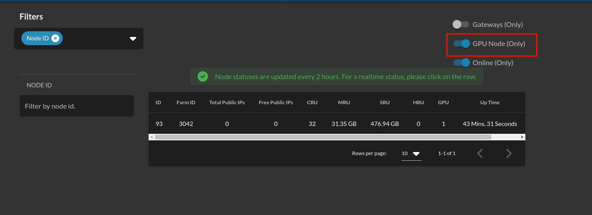
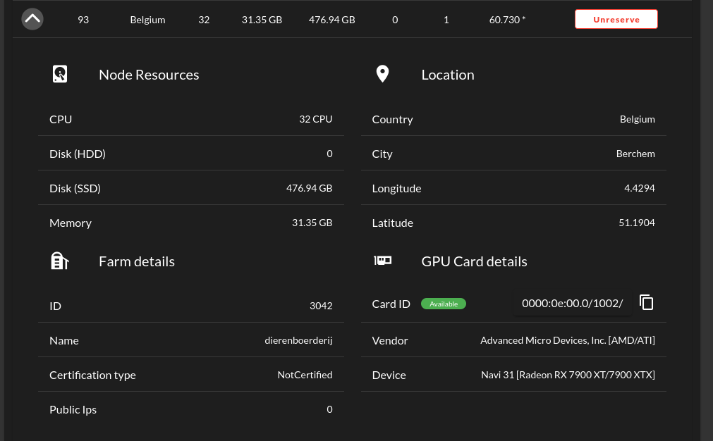
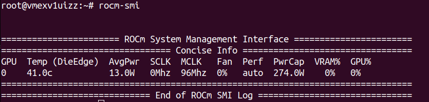

### First: Rent A GPU node from the dashboard.
- Find all the nodes containing GPUs using the explorer by enabling `GPU Node (only)` option.

- Then navigate to Dedicate Node page and rent the Node.

  
### Second: Deploy A VM with the GPU.
- Deploy a VM on the rented node using Playground, TS Client, terraform, etc.


### Third: Install the GPU Driver.
- SSH to the VM and Get your system updated.
 ```bash
 dpkg --add-architecture i386
 sudo apt-get update
 sudo apt-get dist-upgrade
 sudo reboot
 ```
- Find your Driver installer for AMD from https://www.amd.com/en/support, Or for Nvidia from https://www.nvidia.com/download/index.aspx , you can know the card details from the node on the dashboard or by using:
 ```bash
 lspci | grep VGA
 lshw -c video
 ```
- Download it using `wget`
- Install the driver (Update `<VERSION>`).
 ```bash
 sudo apt-get install ./amdgpu-install_<VERSION>.deb
 amdgpu-install --usecase="dkms,graphics,opencl,hip,rocm,rocmdev,opencl,hiplibsdk,mllib,mlsdk" --opencl=rocr --vulkan=pro --opengl=mesa
 ```
 - To verify that GPU is installed
 ```bash
 rocm-smi
 rocminfo
 ```
 - You should something like.
 
 
 
 -For Nvidia its more simpler just follow the steps in [here](https://linuxize.com/post/how-to-nvidia-drivers-on-ubuntu-20-04/#installing-the-nvidia-drivers-using-the-command-line).
 - To verify that GPU is installed, you should something like.
 

 
 - Also could try this AI model https://github.com/invoke-ai/InvokeAI#getting-started-with-invokeai 
 
 #### TroubleShoot useful links
 (Recommended --> Ubuntu 22.04.2 LTS (GNU/Linux 5.18.13-051813-generic x86_64))
- Installing Driver steps https://amdgpu-install.readthedocs.io/en/latest/index.html
- changing Kernel Version
  - https://linux.how2shout.com/how-to-change-default-kernel-in-ubuntu-22-04-20-04-lts/
  - https://gist.github.com/chaiyujin/c08e59752c3e238ff3b1a5098322b363