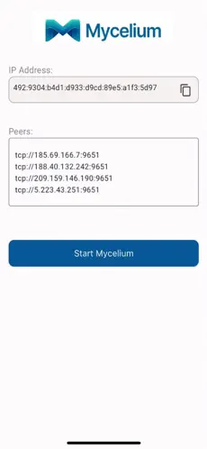

# Mycelium App

The Mycelium app is available for Android, Windows, macOS and iOS.

## Download Links

You can download the Mycelium app with the following links:

- [iOS and macOS](https://apps.apple.com/app/id6504277565)
  - Download the app from the App Store
- [Android](https://play.google.com/store/apps/details?id=tech.threefold.mycelium)
  - Download the app from the Google Play Store
- [Windows](https://github.com/threefoldtech/myceliumflut/releases)
  - Go to the official Mycelium release page and download the latest `.exe` file (e.g. `mycelium-network-x86_64_v0.8.3.exe`)

> Note: There is no app for Linux, but you can simply follow the installation guide [here](./installation.md).

## Start Mycelium

To start Mycelium, simply open the app and click on `Start`.



## Stop or Restart Mycelium

To stop or restart Mycelium, click on the appropriate button.


## Add Peers

You can add different Mycelium peers in the `Peers` window.

Simply add peers and then either start or restart the app.


You can consult the [Mycelium hosted public nodes](./information.md#hosted-public-nodes) to find more peers.

For example, if you want to add the node with the IPv4 address `5.78.122.16` with the tcp port `9651`, simply add the following line then start or restart the app.

```
tcp://5.78.122.16:9651
```

## Mycelium Address

When you use the Mycelium app, you are assigned a unique Mycelium address.

To copy the Mycelium address, click on the button on the right of the address.


## Deploy on the Grid with Mycelium

Once you've installed Mycelium, you can deploy on the grid and connect to your workload using Mycelium.

For more information, [read this guide](../tfgrid3_getstarted/ssh_guide/ssh_openssh.md).