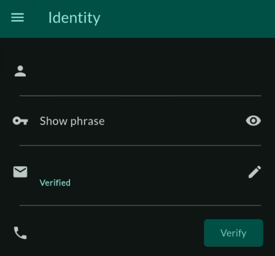

# ThreeFold Connect Identity

The verification process in ThreeFold Connect ensures the security and authenticity of user accounts through a comprehensive identity verification system integrated directly into the app. This includes email verification, phone verification, and Know Your Customer (KYC) procedures as part of the wallet onboarding process.

## Overview

ThreeFold Connect verification provides:
- **Email Verification**: Secure email address confirmation
- **Phone Verification**: SMS-based phone number verification
- **Identity Verification**: Integrated KYC process for wallet onboarding
- **Document Verification**: Government ID verification through secure systems
- **Biometric Verification**: Selfie matching for identity confirmation

## Email Verification

Email verification is the first step in securing your ThreeFold Connect account and enables important communications and recovery options.

### Setting Up Email Verification

1. **Enter Email Address**: During account setup or in verification settings, enter your email address
2. **Receive Verification Code**: Check your email for a verification code from ThreeFold
3. **Enter Verification Code**: Input the 6-digit code in the ThreeFold Connect app
4. **Confirm Verification**: Your email will be marked as verified with a green checkmark

### Email Verification Process

#### Initial Setup
- **Email Input**: Enter a valid email address you have access to
- **Format Validation**: App validates email format before sending code
- **Code Generation**: System generates a unique 6-digit verification code
- **Email Delivery**: Verification email sent to provided address

#### Code Entry
- **Time Limit**: Verification codes expire after 10 minutes
- **Attempt Limits**: Limited number of code entry attempts
- **Resend Option**: Request new code if original expires
- **Countdown Timer**: Visual countdown showing code validity period

### Email Verification Features

- **Security**: Ensures you have access to the provided email address
- **Recovery**: Enables account recovery options through email
- **Notifications**: Allows important security notifications via email
- **Communication**: Enables official communications from ThreeFold
- **Two-Factor Authentication**: Email can be used as 2FA method

## Phone Verification

Phone verification adds an additional layer of security through SMS verification and enables mobile-based authentication features.

### Setting Up Phone Verification

1. **Enter Phone Number**: Provide your mobile phone number with correct country code
2. **Number Validation**: App validates phone number format
3. **Receive SMS Code**: You'll receive an SMS with a 6-digit verification code
4. **Enter SMS Code**: Input the code in the app within the 2-minute time limit
5. **Confirm Verification**: Your phone number will be verified and marked as confirmed

### Phone Verification Process

#### Phone Number Entry
- **Country Code Selection**: Choose correct country code from dropdown
- **Number Format**: Enter phone number in local format
- **Validation**: System validates number format and carrier compatibility
- **SMS Capability Check**: Verifies number can receive SMS messages

#### SMS Code Delivery
- **Code Generation**: Unique 6-digit SMS verification code
- **Delivery Time**: SMS typically delivered within 30 seconds
- **Retry Logic**: Automatic retry for failed SMS delivery
- **Cooldown Period**: 2-minute wait between SMS requests to prevent spam

### Phone Verification Benefits

- **Two-Factor Authentication**: Enables SMS-based 2FA for enhanced security
- **Account Recovery**: Provides additional recovery method via SMS
- **Security Alerts**: Receive critical security notifications via SMS
- **Identity Confirmation**: Strengthens overall identity verification
- **Mobile Integration**: Enables mobile-specific features and notifications

## Identity Verification (KYC)

The integrated Identity Verification system is part of the wallet onboarding process and provides comprehensive Know Your Customer (KYC) verification directly within the ThreeFold Connect app.

### New Integrated KYC Process

Unlike previous external verification systems, the new KYC process is fully integrated into the ThreeFold Connect app:

- **In-App Experience**: Complete verification without leaving the app
- **Wallet Integration**: KYC is part of wallet setup and onboarding
- **Real-time Processing**: Immediate feedback and status updates
- **Enhanced Security**: Secure document handling and processing
- **User-Friendly Interface**: Streamlined verification workflow

### When KYC is Required

Identity verification is required for:
- **Wallet Onboarding**: Setting up your ThreeFold wallet
- **Higher Transaction Limits**: Accessing increased transaction limits
- **Advanced Features**: Using premium app features
- **Regulatory Compliance**: Meeting financial service requirements
- **Enhanced Security**: Maximum account protection

### KYC Verification Process

#### Step 1: Initiate Verification

1. **Access Verification**: Navigate to Identity Verification in app settings
2. **Review Requirements**: Read verification requirements and supported documents
3. **Prepare Documents**: Gather required identification documents
4. **Start Process**: Begin the verification workflow

#### Step 2: Document Selection

**Supported Documents**:
- **Passport**: International passport (preferred)
- **National ID Card**: Government-issued national identification
- **Driver's License**: Valid driver's license with photo
- **Residence Permit**: For non-citizens with valid permits

**Document Requirements**:
- Must be current and not expired
- Government-issued with official seals/stamps
- Clear, readable text and photos
- No damage, alterations, or tampering

#### Step 3: Document Photography

**Photo Capture Process**:
1. **Document Positioning**: Place document on flat, well-lit surface
2. **Camera Alignment**: Align document within camera frame guidelines
3. **Quality Check**: Ensure all text and details are clearly visible
4. **Multiple Angles**: Capture front and back (if applicable)
5. **Review Photos**: Check photo quality before proceeding

**Photography Best Practices**:
- **Lighting**: Use natural light or bright, even lighting
- **Stability**: Keep device steady to avoid motion blur
- **Distance**: Maintain proper distance for full document capture
- **Angle**: Capture document straight-on, not at angles
- **Background**: Use plain, contrasting background

#### Step 4: Biometric Verification

**Selfie Capture**:
1. **Face Positioning**: Center your face within the frame guidelines
2. **Lighting Check**: Ensure face is well-lit and clearly visible
3. **Expression**: Maintain neutral expression, eyes open
4. **Photo Capture**: Take clear, high-quality selfie
5. **Biometric Matching**: System compares selfie with document photo

**Liveness Detection**:
- **Movement Verification**: May require head movements or blinking
- **Real-time Capture**: Ensures live person, not photo or video
- **Anti-Spoofing**: Advanced detection of fake or manipulated images

#### Step 5: Information Verification

**Data Extraction**:
- **OCR Processing**: Optical Character Recognition extracts document data
- **Information Display**: Extracted information shown for review
- **Manual Correction**: Option to correct any misread information
- **Verification Confirmation**: Confirm all information is accurate

**Security Checks**:
- **Document Authenticity**: Verification of document security features
- **Cross-Reference**: Information cross-checked against databases
- **Fraud Detection**: Advanced algorithms detect fraudulent documents
- **Risk Assessment**: Overall risk evaluation of verification attempt

#### Step 6: Processing and Results

**Processing Timeline**:
- **Automated Review**: Initial automated processing (minutes)
- **Manual Review**: Human review if required (1-3 business days)
- **Status Updates**: Real-time updates on verification progress
- **Final Decision**: Approval or rejection notification

### Verification Results

#### Successful Verification

**Immediate Benefits**:
- **Verification Badge**: KYC verified status displayed in app
- **Enhanced Features**: Access to advanced app functionality
- **Higher Limits**: Increased transaction and wallet limits
- **Full Access**: Complete access to all ThreeFold Connect features

**Long-term Benefits**:
- **Regulatory Compliance**: Meets financial service requirements
- **Enhanced Trust**: Higher trust level for transactions and interactions
- **Priority Support**: Access to priority customer support
- **Future Features**: Early access to new features requiring verification

#### Verification Issues or Rejection

**Common Rejection Reasons**:
- **Poor Image Quality**: Blurry, dark, or unclear document photos
- **Expired Documents**: Using expired identification documents
- **Incomplete Capture**: Parts of document cut off or not visible
- **Mismatched Information**: Inconsistencies between document and selfie
- **Invalid Documents**: Unsupported or fraudulent document types
- **Technical Issues**: Problems with photo capture or processing

**Resolution Process**:
1. **Rejection Notification**: Detailed explanation of rejection reasons
2. **Retry Option**: Ability to restart verification with corrections
3. **Support Guidance**: Specific instructions for addressing issues
4. **Document Assistance**: Help with proper document photography
5. **Manual Review**: Option for human review in complex cases

## Verification Management

### Checking Verification Status

**Status Dashboard**:
- **Verification Overview**: Central view of all verification statuses
- **Progress Indicators**: Visual progress bars for ongoing verifications
- **Status Icons**: Clear icons showing completed, pending, or failed verifications
- **Last Updated**: Timestamps showing when status was last updated

**Detailed Status Information**:
- **Email Status**: Verified/unverified with verification date
- **Phone Status**: Verified/unverified with verification date
- **Identity Status**: KYC verification level and completion date
- **Document Status**: Individual document verification results

### Managing Verified Information

#### Updating Email Address

1. **Change Request**: Navigate to email settings and request change
2. **Security Verification**: Confirm identity through existing verification methods
3. **New Email Verification**: Complete verification process for new email
4. **Transition Period**: Grace period where both emails may be active
5. **Confirmation**: New email becomes primary after verification

#### Updating Phone Number

1. **Phone Change Request**: Request phone number update in settings
2. **Current Phone Verification**: Verify identity using current phone
3. **New Phone Verification**: Complete SMS verification for new number
4. **Cooldown Period**: Mandatory wait period between phone changes
5. **Security Review**: Additional security checks for frequent changes

#### Re-verification Requirements

**When Re-verification is Needed**:
- **Document Expiration**: When ID documents expire
- **Significant Account Changes**: Major changes to account information
- **Security Incidents**: After security-related issues
- **Regulatory Updates**: When regulations require updated verification
- **System Upgrades**: When verification systems are enhanced

## Advanced Verification Features

### Enhanced Security Options

**Multi-Factor Verification**:
- **Combined Methods**: Email + Phone + Biometric verification
- **Risk-Based Authentication**: Additional verification for high-risk activities
- **Device Binding**: Verification tied to specific trusted devices
- **Location Verification**: Geographic verification for enhanced security

**Continuous Verification**:
- **Behavioral Analysis**: Ongoing analysis of user behavior patterns
- **Device Fingerprinting**: Unique device identification for security
- **Session Monitoring**: Continuous monitoring of app usage sessions
- **Anomaly Detection**: Automatic detection of unusual activity patterns

### Integration with Wallet Features

**Wallet Onboarding**:
- **Seamless Integration**: KYC integrated into wallet setup process
- **Progressive Verification**: Gradual verification as wallet features are accessed
- **Limit Management**: Verification level determines wallet limits
- **Feature Unlocking**: Advanced wallet features unlocked with verification

**Transaction Verification**:
- **Transaction Limits**: Verification level affects transaction limits
- **High-Value Transactions**: Additional verification for large transactions
- **Cross-Border Transactions**: Enhanced verification for international transfers
- **Merchant Verification**: Special verification for merchant accounts

## Troubleshooting Verification

### Email Verification Issues

#### Email Not Received

**Troubleshooting Steps**:
1. **Check Spam/Junk Folders**: Verification emails may be filtered
2. **Verify Email Address**: Ensure email address is entered correctly
3. **Check Email Provider**: Some providers block automated emails
4. **Whitelist Sender**: Add ThreeFold email addresses to safe sender list
5. **Try Alternative Email**: Use different email provider if issues persist

**Technical Solutions**:
- **Resend Code**: Request new verification code
- **Email Provider Settings**: Check email provider security settings
- **Corporate Filters**: Check corporate email filters and firewalls
- **Email Client Issues**: Try accessing email through web interface

#### Email Code Issues

**Common Problems**:
- **Code Expiry**: Verification codes expire after 10 minutes
- **Incorrect Entry**: Ensure code is entered exactly as received
- **Case Sensitivity**: Some codes may be case-sensitive
- **Copy-Paste Errors**: Manually type code instead of copying

### Phone Verification Issues

#### SMS Not Received

**Troubleshooting Steps**:
1. **Check Network Coverage**: Ensure strong cellular signal
2. **Verify Phone Number**: Confirm number includes correct country code
3. **Check SMS Settings**: Ensure SMS is not blocked or filtered
4. **Carrier Issues**: Contact carrier about SMS delivery problems
5. **Try Different Time**: SMS delivery may be delayed during peak times

**Technical Solutions**:
- **Restart Device**: Restart phone to refresh network connection
- **Clear Messages App**: Clear SMS app cache and data
- **Check Storage**: Ensure sufficient storage for SMS messages
- **Network Reset**: Reset network settings if problems persist

#### SMS Code Problems

**Common Issues**:
- **Code Expiry**: SMS codes expire after 2 minutes
- **Multiple Attempts**: Limited number of verification attempts
- **Cooldown Period**: 2-minute wait between SMS requests
- **International SMS**: Delays possible for international numbers

### Identity Verification Issues

#### Document Photography Problems

**Image Quality Issues**:
- **Lighting Problems**: Use bright, even lighting without shadows
- **Blur Issues**: Keep device steady and ensure proper focus
- **Glare/Reflections**: Avoid reflective surfaces and direct light
- **Partial Capture**: Ensure entire document is within frame

**Technical Solutions**:
- **Camera Permissions**: Ensure app has camera access permissions
- **Storage Space**: Free up device storage for photo capture
- **Camera App Issues**: Close other camera apps before verification
- **Device Restart**: Restart device if camera issues persist

#### Document Rejection Issues

**Quality Improvements**:
- **Better Lighting**: Use natural daylight or bright indoor lighting
- **Stable Surface**: Place document on flat, stable surface
- **Clean Lens**: Clean device camera lens before photography
- **Multiple Attempts**: Take several photos and choose the best quality

**Document Issues**:
- **Document Validity**: Ensure documents are current and not expired
- **Document Condition**: Use undamaged, clean documents
- **Supported Types**: Verify document type is supported
- **Information Matching**: Ensure all information is consistent

#### Biometric Verification Problems

**Selfie Issues**:
- **Lighting**: Ensure face is well-lit and clearly visible
- **Positioning**: Center face within frame guidelines
- **Expression**: Maintain neutral expression with eyes open
- **Background**: Use plain background without distractions

**Matching Problems**:
- **Appearance Changes**: Significant appearance changes may cause issues
- **Photo Quality**: Ensure both document photo and selfie are high quality
- **Facial Hair**: Significant facial hair changes may affect matching
- **Accessories**: Remove glasses or accessories that obscure face

### Getting Help

If you encounter persistent verification issues:

1. **In-App Support**: Use built-in help and support features
2. **Documentation**: Review detailed verification guides and FAQs
3. **Community Support**: Ask questions in ThreeFold community forums
4. **Technical Support**: Contact ThreeFold technical support team
5. **Live Chat**: Use real-time support chat if available
6. **Email Support**: Send detailed issue description to support email

## Privacy and Security

### Data Protection

**Security Measures**:
- **Encryption**: All verification data encrypted in transit and at rest
- **Secure Storage**: Verification documents stored in secure, compliant systems
- **Access Controls**: Strict access controls for verification data
- **Audit Trails**: Complete audit trails for all verification activities

**Privacy Protection**:
- **Data Minimization**: Only collect necessary verification data
- **Purpose Limitation**: Verification data used only for intended purposes
- **Retention Limits**: Verification data retained only as legally required
- **User Rights**: Users can request data access, correction, or deletion

### Compliance and Standards

**Regulatory Compliance**:
- **KYC Regulations**: Compliance with international KYC requirements
- **AML Standards**: Anti-Money Laundering compliance
- **Data Protection**: GDPR and other privacy regulation compliance
- **Financial Services**: Compliance with financial service regulations

**Security Standards**:
- **ISO 27001**: Information security management standards
- **SOC 2**: Service organization control standards
- **PCI DSS**: Payment card industry security standards
- **Industry Best Practices**: Following cybersecurity best practices

### Third-Party Integration

**Verification Partners**:
- **Trusted Providers**: Integration with reputable verification services
- **Security Vetting**: Thorough security assessment of all partners
- **Data Agreements**: Strict data processing agreements with partners
- **Regular Audits**: Regular security audits of partner systems

**Data Sharing**:
- **Minimal Sharing**: Only necessary data shared with verification partners
- **Secure Transmission**: All data transmitted through secure channels
- **Purpose Limitation**: Partner data use limited to verification purposes
- **Deletion Requirements**: Partners required to delete data after processing

## Important Security Notes

> **Verification Requirement**: Some ThreeFold Connect features require completed verification. Complete verification early to avoid service interruptions and access all app features.

> **Document Security**: Never share your verification documents, codes, or personal information with others. ThreeFold will never ask for this information outside the official app or through unofficial channels.

> **Processing Time**: Identity verification can take from minutes to 3 business days depending on complexity. Plan accordingly if you need verified status for time-sensitive activities.

> **Accuracy Critical**: Ensure all information provided during verification is accurate and matches your official documents exactly. Inaccurate information will result in verification failure.

> **Privacy Protection**: Your verification data is protected by advanced security measures and privacy controls. Review our privacy policy for complete details on data handling and protection.