# ThreeFold Connect Installation

## Introduction

We show how to install the ThreeFold Connect app.

## Download Links

The ThreeFold Connect app is available for both iOS and Android devices.

- [Google Store Link](https://play.google.com/store/apps/details?id=org.jimber.threebotlogin)
- [Apple Store](https://itunes.apple.com/be/app/3bot-login/id1459845885?l=nl&mt=8)

## Installation

Either use the links above, or search for the ThreeFold Connect app on the Apple Store or the Google Play store. If you want to leave a 5 star review of the app, no one here will stop you!

- Click on `Install`.

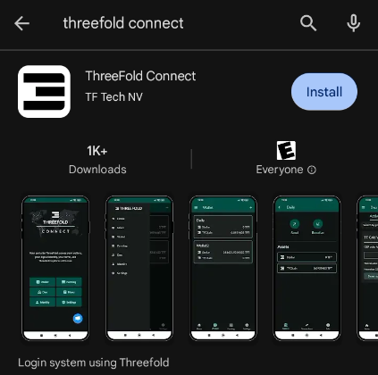

- Once the app is installed, click `Open`.

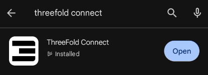

- Once you are in the application, you will see some introduction pages to help you familiarize yourself with the TF Connect app.

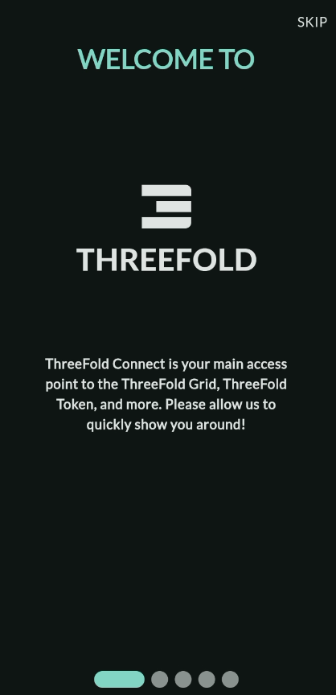

- You will then be asked to read and accept ThreeFold's Terms and Conditions.

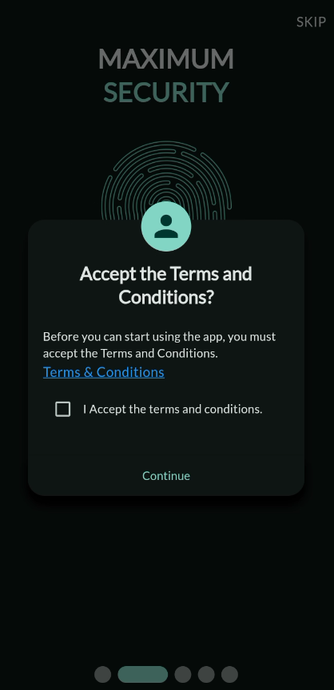

## Create Account

Once you've accepted the Terms and Conditions, you can either *Create Account* or *Log In*. For now, we will show how to create a new account. The login process is explained below.

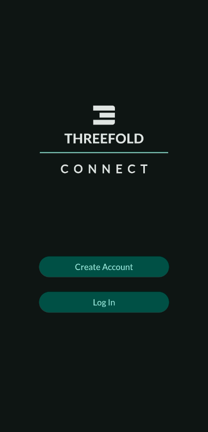

To create a new account, you will be asked to choose a `Threefold Connect Id`. This ID will be used, as well as the seed phrase, when you want to log in after having logged out of your account.

You will also need to add a valid email address. You will need to access your email and confirm the validation email from ThreeFold to use properly the TF Connect app wallet.

You will be shown your seed phrase. Keep this in a secure and offline place. You will need the 3bot ID, i.e. the account `Name`, and the `Seed phrase` to recover your account. This seed phrase is of utmost importance. Do not lose it nor give it to anyone.

Once you've hit `Next`, you will be asked to write down 3 random words of your seed phrase. This is a necessary step to ensure you have taken the time to write down your seed phrase.

Then, you'll be asked to confirm your TF 3bot name and the associated email.

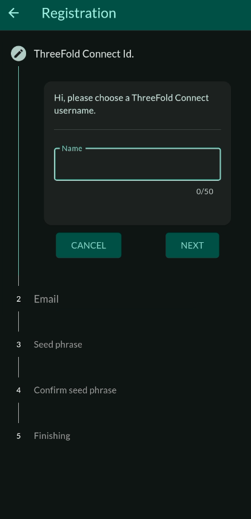

Finally, you will be asked to choose a 4-digit PIN. This will be needed to use the ThreeFold Connect app. If you ever forget this 4-digit PIN, you will need to recover your account using your account name and your seed phrase. You will need to confirm the new pin in the next step.

## Log Out

- To log out, click on `Log Out` in the `Settings` window.

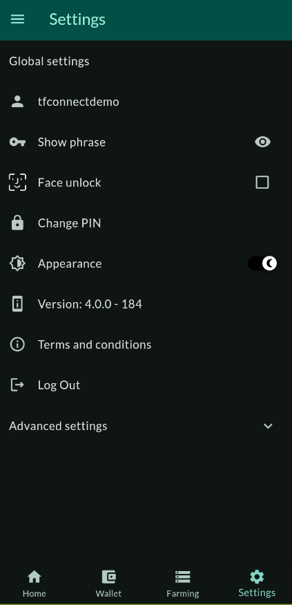

- You will be asked to confirm this decision.

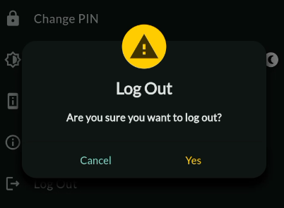

## Recover Account (Log In)

Once you're logged out of your account, if you want to log in, choose the option `Log In` on the opening screen of the app.

You will be asked to enter the `Name` of your account (the *3bot ID*) as well as the associated `Seed Phrase`.

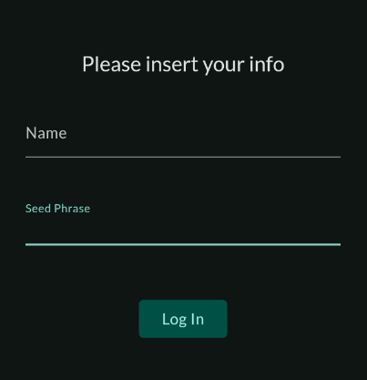

You will then be asked to choose and confirm a new 4-digit pin code.

Once this is done, you will have access to your account.

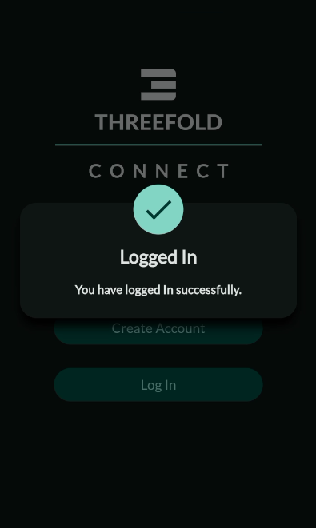

## Display Seed Phrase

To see your seed phrase, go to `Settings` and click on the eye button next to `Show phrase`.

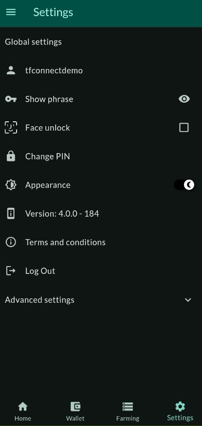