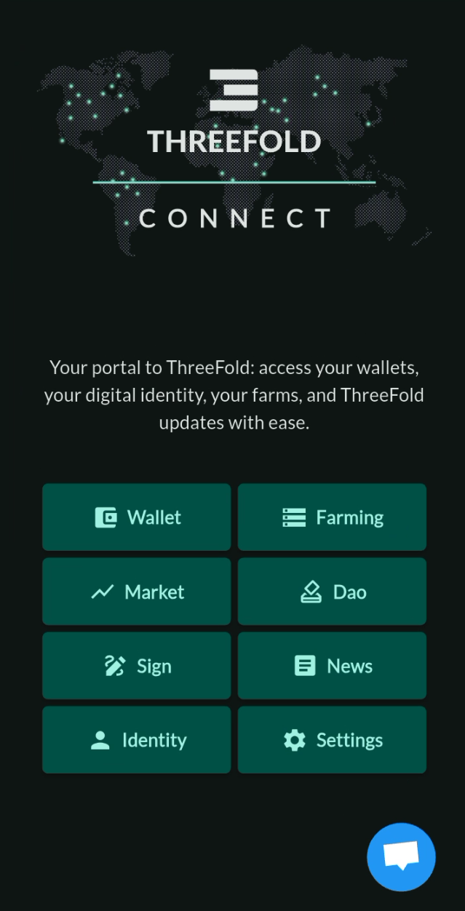

## Introduction

We present some of the ThreeFold Connect app benefits and provide links to install the app on your phone.

## Benefits 

Some key features and benefits of the ThreeFold Connect app are:

- 2FA Authenticator
  - ThreeFold Connect is a passwordless 2FA authenticator that ensures a user is who they claim to be.
- Decentralized
  - The app is decentralized, allowing users to access the ThreeFold Network platforms and their fully private digital wallet.
- Private Digital Wallet
  - Users can manage their ThreeFold Tokens (TFT) and view their transaction history on the TF chain.
- Support Chat
  - The app provides a support chat where users can get answers to their questions about ThreeFold-related topics.
- News Section
  - The app features a news section where users can find the latest ThreeFold news and updates.
- DAO Voting
  - The app featuers a DAO voting section where farmers can vote for grid enhancement proposals on the ThreeFold Grid.

## Home Page

