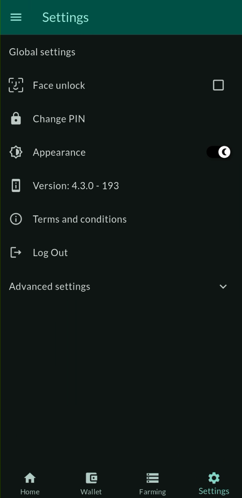

# ThreeFold Connect Settings

The Settings section in ThreeFold Connect allows you to customize your app experience, manage security preferences, and configure various aspects of your ThreeFold identity and account.

## Overview

ThreeFold Connect Settings provide control over:
- **Security Settings**: Biometric authentication, PIN management
- **App Preferences**: Theme, language, and display options
- **Account Management**: Profile settings and account information
- **Privacy Controls**: Data sharing and privacy preferences
- **Backup & Recovery**: Seed phrase and account backup options
- **Advanced Options**: Developer settings and advanced configurations

## Accessing Settings

1. Open the ThreeFold Connect app
2. Navigate to the main menu
3. Select **Settings** or **Preferences** from the menu
4. Browse through different settings categories

## Security Settings

### Biometric Authentication

Biometric authentication adds an extra layer of security to your ThreeFold Connect app.

#### Supported Biometric Methods
- **Fingerprint Recognition**: Use your fingerprint to unlock the app
- **Face Recognition**: Use facial recognition for authentication
- **Voice Recognition**: Use voice patterns for verification (if supported)

#### Enabling Biometric Authentication

1. **Navigate to Security Settings**:
   - Open Settings → Security → Biometric Authentication

2. **Check Device Compatibility**:
   - Ensure your device supports biometric authentication
   - Verify biometric sensors are properly configured

3. **Enable Biometric Login**:
   - Toggle "Enable Biometric Authentication"
   - Follow the setup prompts
   - Test the biometric authentication

4. **Configure Biometric Options**:
   - Set fallback authentication methods
   - Configure biometric timeout settings
   - Choose which actions require biometric verification

#### Biometric Security Features

**Enhanced Security**:
- Biometric data is stored locally on your device
- No biometric information is transmitted to ThreeFold servers
- Fallback to PIN/password if biometric fails

**Convenience Features**:
- Quick app unlock without typing passwords
- Secure transaction approval with biometric confirmation
- Automatic re-authentication after app timeout

### PIN Management

PIN (Personal Identification Number) provides secure access to your ThreeFold Connect app.

#### Setting Up Your PIN

1. **Initial PIN Setup**:
   - Choose a 4-6 digit PIN during app setup
   - Confirm your PIN by entering it twice
   - Store your PIN securely

2. **PIN Requirements**:
   - Minimum 4 digits, maximum 6 digits
   - Avoid easily guessable patterns (1234, 0000)
   - Use a unique PIN not used elsewhere

#### Changing Your PIN

1. **Access PIN Settings**:
   - Settings → Security → Change PIN

2. **Verification Process**:
   - Enter your current PIN
   - Enter your new PIN twice
   - Confirm the PIN change

3. **PIN Change Confirmation**:
   - Receive confirmation of successful PIN change
   - Test the new PIN immediately

#### PIN Security Features

**Security Measures**:
- PIN attempts are limited (typically 3-5 attempts)
- Account lockout after multiple failed attempts
- PIN is encrypted and stored securely
- Option to require PIN for specific actions

**Recovery Options**:
- PIN recovery through seed phrase
- Account recovery through backup methods
- Support contact for PIN reset assistance

## App Preferences

### Theme Settings

Customize the visual appearance of your ThreeFold Connect app.

#### Available Themes

**Light Theme**:
- Bright background with dark text
- Optimal for daytime use
- Better battery life on LCD screens
- High contrast for readability

**Dark Theme**:
- Dark background with light text
- Reduced eye strain in low light
- Better battery life on OLED screens
- Modern, sleek appearance

**System Theme**:
- Automatically matches your device's system theme
- Changes between light and dark based on system settings
- Adapts to system-wide dark mode schedules

#### Changing Theme Settings

1. **Access Theme Settings**:
   - Settings → Appearance → Theme

2. **Select Theme**:
   - Choose from Light, Dark, or System
   - Preview theme changes in real-time
   - Apply the selected theme

3. **Additional Appearance Options**:
   - Accent color selection
   - Font size adjustments
   - Icon style preferences

### Language and Localization

Configure language and regional settings for your app.

#### Language Selection

1. **Available Languages**:
   - English (default)
   - Additional languages based on app localization
   - Regional language variants

2. **Changing Language**:
   - Settings → Language & Region → Language
   - Select your preferred language
   - Restart app if required for changes to take effect

#### Regional Settings

- **Date Format**: Choose date display format (MM/DD/YYYY, DD/MM/YYYY, etc.)
- **Time Format**: Select 12-hour or 24-hour time display
- **Number Format**: Configure decimal separators and number formatting
- **Currency Display**: Set preferred currency for market prices

### Notification Settings

Manage how and when you receive notifications from ThreeFold Connect.

#### Notification Categories

**Security Notifications**:
- Login attempts and security alerts
- Account changes and updates
- Suspicious activity warnings

**Transaction Notifications**:
- Wallet transaction confirmations
- Market order updates
- Payment receipts and confirmations

**System Notifications**:
- App updates and maintenance
- Feature announcements
- System status updates

#### Notification Configuration

1. **Enable/Disable Notifications**:
   - Settings → Notifications
   - Toggle notification categories on/off
   - Set notification priorities

2. **Notification Delivery**:
   - Push notifications
   - In-app notifications
   - Email notifications (if configured)

3. **Quiet Hours**:
   - Set do-not-disturb periods
   - Configure notification scheduling
   - Emergency notification overrides

## Account Management

### Profile Information

Manage your ThreeFold identity and profile details.

#### Profile Settings

**Basic Information**:
- Display name and username
- Profile picture or avatar
- Contact information (if provided)
- Account creation date

**Identity Verification Status**:
- KYC (Know Your Customer) verification level
- Document verification status
- Identity verification badges

#### Updating Profile Information

1. **Access Profile Settings**:
   - Settings → Account → Profile

2. **Edit Profile Details**:
   - Update display name
   - Change profile picture
   - Modify contact information

3. **Save Changes**:
   - Confirm profile updates
   - Verify changes are reflected in the app

### Account Security

#### Two-Factor Authentication (2FA)

Add an extra layer of security to your account.

**2FA Methods**:
- SMS-based verification codes
- Authenticator app integration (Google Authenticator, Authy)
- Email-based verification codes

**Setting Up 2FA**:
1. Settings → Security → Two-Factor Authentication
2. Choose your preferred 2FA method
3. Follow setup instructions for your chosen method
4. Test 2FA with a verification attempt
5. Save backup codes for account recovery

#### Account Recovery

**Seed Phrase Management**:
- View your account seed phrase (with security verification)
- Backup seed phrase securely
- Verify seed phrase backup

**Recovery Options**:
- Seed phrase recovery
- Email recovery (if configured)
- Support-assisted recovery

### Account Deletion

Permanently delete your ThreeFold Connect account if needed.

#### Before Deleting Your Account

**Important Considerations**:
- Account deletion is permanent and irreversible
- All data associated with your account will be deleted
- Wallet funds should be transferred before deletion
- Active farms or services should be properly closed

**Backup Important Data**:
- Export wallet seed phrases
- Save important transaction records
- Download any necessary documents or certificates

#### Account Deletion Process

1. **Access Account Deletion**:
   - Settings → Account → Delete Account

2. **Security Verification**:
   - Enter your PIN or use biometric authentication
   - Confirm your identity through additional verification

3. **Deletion Confirmation**:
   - Read and understand the deletion consequences
   - Type confirmation phrase (e.g., "DELETE MY ACCOUNT")
   - Confirm final deletion

4. **Account Removal**:
   - Account is marked for deletion
   - Data removal process begins
   - Confirmation of successful deletion

## Privacy and Data Settings

### Data Sharing Preferences

Control how your data is used and shared.

#### Analytics and Usage Data

**Anonymous Usage Statistics**:
- App usage patterns and feature usage
- Performance metrics and crash reports
- General demographic information

**Controlling Data Sharing**:
- Settings → Privacy → Data Sharing
- Toggle analytics data sharing on/off
- Review data sharing policies

#### Third-Party Integrations

**Connected Services**:
- View apps and services connected to your account
- Manage permissions for third-party access
- Revoke access for unused or untrusted services

**API Access**:
- Review API keys and access tokens
- Manage developer access to your account
- Monitor third-party application usage

### Privacy Controls

**Profile Visibility**:
- Control who can see your profile information
- Manage public/private profile settings
- Configure contact information visibility

**Activity Privacy**:
- Control visibility of your farming activities
- Manage transaction history privacy
- Configure social features and sharing

## Advanced Settings

### Developer Options

Advanced settings for developers and power users.

#### Debug and Testing Features

**Debug Mode**:
- Enable detailed logging
- Access developer tools
- Test network configurations

**Network Settings**:
- Configure custom RPC endpoints
- Test different network environments
- Monitor network performance

#### Experimental Features

**Beta Features**:
- Enable experimental functionality
- Test new features before general release
- Provide feedback on beta features

**Advanced Configurations**:
- Custom API endpoints
- Advanced wallet configurations
- Expert-level security settings

### Backup and Restore

#### App Data Backup

**What Gets Backed Up**:
- App preferences and settings
- Account configuration (not private keys)
- Custom configurations and preferences

**Backup Methods**:
- Cloud backup (Google Drive, iCloud)
- Local device backup
- Manual export of settings

#### Restore Process

1. **Install ThreeFold Connect** on new device
2. **Choose Restore Option** during setup
3. **Select Backup Source** (cloud or local)
4. **Authenticate Access** to backup data
5. **Restore Settings** and preferences
6. **Verify Restoration** and test functionality

## Troubleshooting Settings

### Common Settings Issues

#### Biometric Authentication Problems

**Fingerprint Not Recognized**:
- Clean fingerprint sensor
- Re-register fingerprints in device settings
- Check for software updates
- Restart the app

**Face Recognition Issues**:
- Ensure adequate lighting
- Clean front-facing camera
- Re-register face in device settings
- Check app permissions for camera access

#### PIN and Security Issues

**Forgotten PIN**:
- Use biometric authentication if enabled
- Attempt account recovery through seed phrase
- Contact support for assistance
- Consider account recovery options

**Account Lockout**:
- Wait for lockout period to expire
- Use alternative authentication methods
- Contact support if lockout persists

#### Theme and Display Issues

**Theme Not Applying**:
- Restart the app
- Check system theme settings
- Clear app cache
- Update app to latest version

**Display Problems**:
- Adjust font size settings
- Check device display settings
- Verify app compatibility with device

### Getting Help

If you need assistance with settings:

1. **Check Documentation**: Review ThreeFold Connect guides
2. **Community Support**: Ask questions in community forums
3. **Technical Support**: Contact ThreeFold support team
4. **App Feedback**: Report issues through app feedback system

## Security Best Practices

### Protecting Your Settings

1. **Use Strong Authentication**: Enable both PIN and biometric authentication
2. **Regular Updates**: Keep your app and device updated
3. **Secure Backup**: Safely backup your settings and recovery information
4. **Monitor Access**: Regularly review connected services and permissions
5. **Privacy Awareness**: Understand what data you're sharing and with whom

### Recommended Configuration

For optimal security and usability:

- **Enable biometric authentication** with PIN fallback
- **Set up two-factor authentication** for account access
- **Use dark theme** to reduce eye strain and save battery
- **Enable security notifications** for account monitoring
- **Regularly backup** your settings and recovery information
- **Review privacy settings** periodically
- **Keep app updated** to latest version

