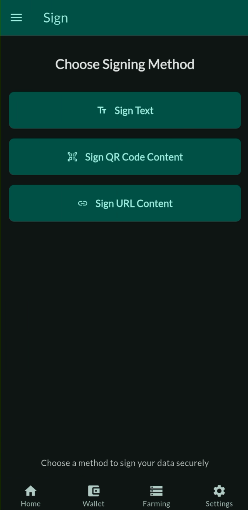
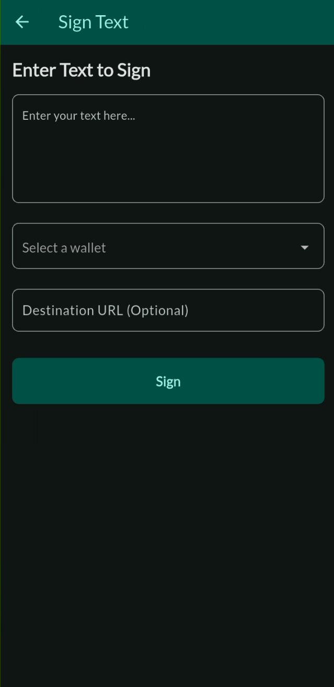
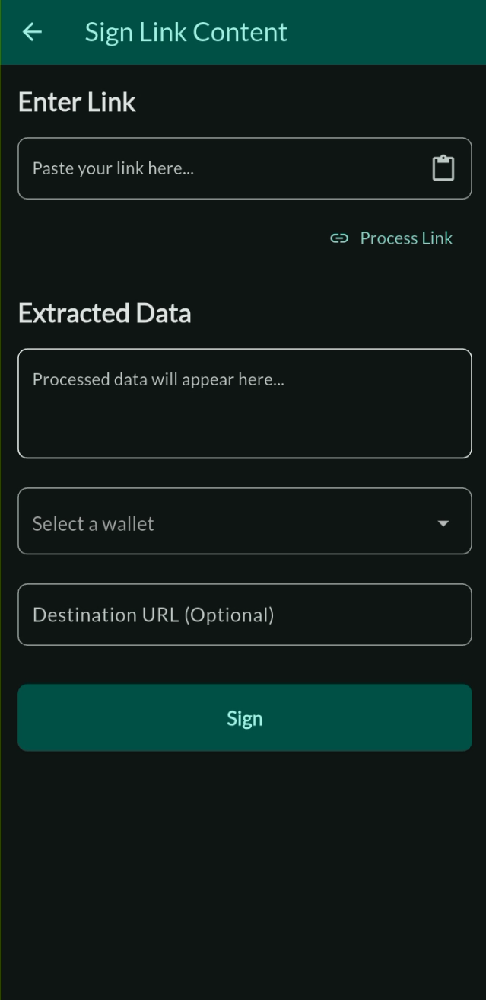
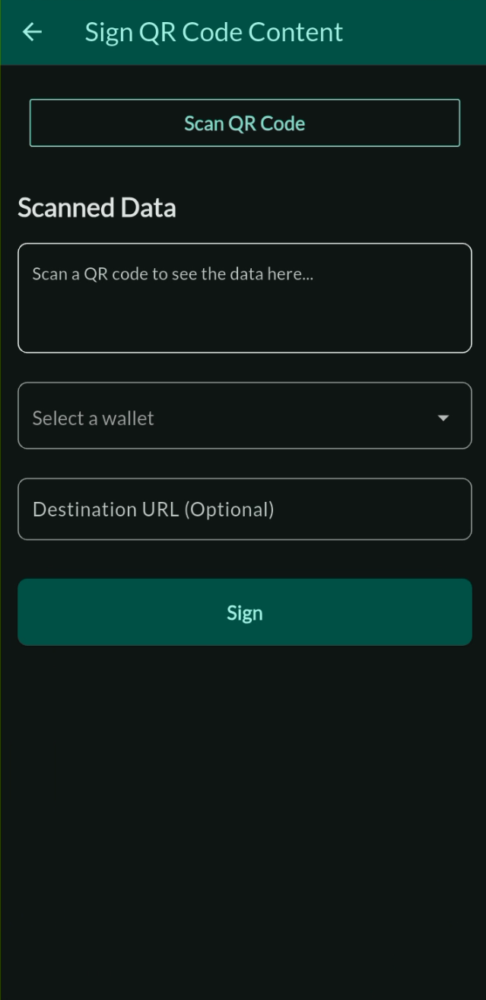

# ThreeFold Connect Sign

The Sign feature in ThreeFold Connect allows you to cryptographically sign messages, documents, and data using your ThreeFold identity. This provides a secure way to verify authenticity and integrity of digital content.

## Overview

Digital signing in ThreeFold Connect enables:
- **Message Signing**: Sign text messages and data
- **Link Verification**: Sign and verify URLs and links
- **QR Code Signing**: Sign data embedded in QR codes
- **Identity Verification**: Prove ownership of your ThreeFold identity
- **Data Integrity**: Ensure data hasn't been tampered with

## What is Digital Signing?

Digital signing is a cryptographic process that:
- **Authenticates Identity**: Proves the signer's identity
- **Ensures Integrity**: Confirms data hasn't been modified
- **Provides Non-repudiation**: Prevents denial of signing action
- **Creates Trust**: Establishes trust in digital communications

## When to Use Sign

Use the Sign feature when you need to:
- **Verify Identity**: Prove you are the owner of a ThreeFold account
- **Authenticate Documents**: Sign important documents or contracts
- **Secure Communications**: Add cryptographic proof to messages
- **Validate Transactions**: Sign transaction data or agreements
- **Establish Trust**: Provide verifiable proof of authenticity

## Accessing the Sign Feature

The Sign feature can be accessed in several ways:

### Through the App Menu
1. Open ThreeFold Connect app
2. Navigate to the main menu
3. Select **Sign** from the menu options



### Via External Requests
1. **QR Code Scanning**: Scan QR codes containing sign requests
2. **Deep Links**: Click on ThreeFold sign links
3. **Third-party Apps**: Respond to sign requests from other applications

## Types of Signing

### Text Message Signing

**Purpose**: Sign plain text messages or data strings

**Process**:
1. **Receive Request**: Get a text signing request
2. **Review Content**: Examine the text to be signed
3. **Verify Source**: Confirm the request source is trusted
4. **Sign Message**: Approve the signing operation
5. **Share Signature**: Provide the cryptographic signature

**Use Cases**:
- Identity verification messages
- Authentication challenges
- Simple data validation
- Proof of ownership statements



### Link Signing

**Purpose**: Sign URLs and web links for verification

**Process**:
1. **Link Request**: Receive a URL signing request
2. **URL Validation**: Verify the link format and destination
3. **Content Preview**: Review link information if available
4. **Sign URL**: Approve signing of the link
5. **Signature Generation**: Create cryptographic proof

**Applications**:
- Website authentication
- Link verification systems
- Secure URL sharing
- Anti-phishing measures
 


### QR Code Signing

**Purpose**: Sign data embedded in QR codes

**Process**:
1. **QR Scan**: Scan QR code containing sign request
2. **Data Extraction**: Extract signing data from QR code
3. **Content Display**: Show data to be signed
4. **User Approval**: Confirm signing operation
5. **Signature Creation**: Generate cryptographic signature

**Benefits**:
- **Offline Capability**: Works without internet connection
- **Mobile Friendly**: Easy scanning with phone camera
- **Quick Verification**: Fast authentication process
- **Secure Transfer**: Encrypted data in QR format



## Sign Interface and Workflow

### Sign Request Screen

When you receive a sign request, the interface displays:

#### Request Information
- **Source Application**: Which app or service is requesting the signature
- **Request Type**: Text, link, or QR code signing
- **Content Preview**: Display of data to be signed
- **Security Status**: Verification of request authenticity

#### Content Display

**For Text Signing**:
- Plain text display of message content
- Character count and data size
- Formatting preservation

**For JSON Data**:
- Structured JSON viewer with syntax highlighting
- Expandable/collapsible data sections
- Search and navigation within JSON structure

#### Action Buttons

**Sign Button**:
- Confirms and executes the signing operation
- Generates cryptographic signature
- Sends signature back to requesting application

**Cancel/"It wasn't me" Button**:
- Rejects the signing request
- Cancels the operation safely
- Notifies requesting application of rejection

### Security Confirmations

#### Identity Confirmation
- **Account Verification**: Confirms your ThreeFold identity
- **Key Usage**: Shows which cryptographic key will be used
- **Signature Preview**: Preview of signature format

## Security Features

### Cryptographic Security
- **Private Key Protection**: Your private key never leaves the device
- **Secure Signing**: Industry-standard cryptographic algorithms
- **Hash Verification**: Ensures data integrity before signing
- **Signature Validation**: Verifiable cryptographic proofs

### User Protection
- **Request Validation**: Verifies authenticity of sign requests
- **Content Review**: Always shows what you're signing
- **Cancellation Options**: Easy way to reject suspicious requests
- **Security Warnings**: Alerts for potential security issues

### Data Protection
- **No Data Retention**: Signed content is not permanently stored
- **Encrypted Communication**: Secure data transfer protocols
- **Privacy Preservation**: Minimal data exposure during signing

## Best Practices

### Before Signing
1. **Verify Source**: Ensure the request comes from a trusted source
2. **Review Content**: Carefully read what you're signing
3. **Check Context**: Understand why the signature is needed


### Security Guidelines
1. **Never Sign Blindly**: Always review content before signing
2. **Verify Requests**: Confirm requests are legitimate
3. **Protect Your Device**: Keep your device secure and updated
4. **Report Suspicious Activity**: Report unusual or suspicious sign requests

### When to Decline
- **Unknown Sources**: Requests from unrecognized applications
- **Suspicious Content**: Unusual or potentially malicious data
- **Unclear Purpose**: Requests without clear legitimate purpose

## Troubleshooting

### Common Issues

#### Sign Request Not Appearing
- **Check Network**: Ensure stable internet connection
- **App Updates**: Update ThreeFold Connect to latest version
- **Restart App**: Close and reopen the application
- **Clear Cache**: Clear app cache if issues persist

#### Hash Verification Failures
- **Network Issues**: Download interruption may cause corruption
- **Security Alert**: Do not sign if hash verification fails

#### Signature Generation Errors
- **Key Access**: Ensure your private key is accessible
- **Device Security**: Check device security settings
- **App Permissions**: Verify app has necessary permissions
- **System Resources**: Ensure sufficient system resources

### Getting Help

If you encounter issues with signing:

1. **Check Documentation**: Review ThreeFold signing guides
2. **Community Support**: Ask questions in ThreeFold community forums
3. **Technical Support**: Contact ThreeFold technical support
4. **Security Concerns**: Report security issues immediately

## Integration Examples

### Developer Integration

For developers wanting to integrate with TFConnect signing:

```javascript
// Example sign request structure
{
  "type": "sign",
  "data": "Message to be signed",
  "format": "text", // or "json", "url"
  "callback": "https://yourapp.com/signature-callback",
  "metadata": {
    "purpose": "Identity verification",
    "application": "Your App Name"
  }
}
```

### QR Code Format

```json
{
  "action": "sign",
  "payload": {
    "data": "Data to sign",
    "type": "text",
    "callback": "callback-url"
  }
}
```

## Important Security Notes

> **Security Warning**: Only sign content you understand and trust. Digital signatures are legally binding in many jurisdictions.

> **Privacy Notice**: Signing operations may reveal your ThreeFold identity to the requesting party. Only sign for trusted applications and services.

> **Verification Responsibility**: Always verify that hash checks pass for signing. Never sign data that fail integrity verification.

