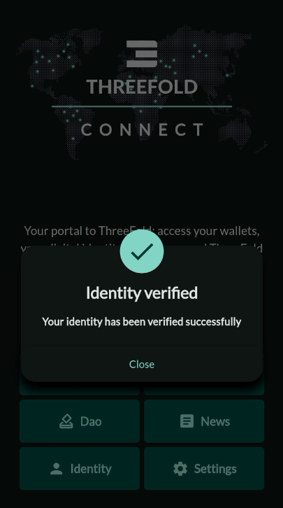

# ThreeFold Connect Verification

Within the TFConnect app, you can verify your email and your phone number as well as go through a KYC process.

## Email Verification

Once you've created your account, an email will be sent to the email address you've chosen in the account creation process. 

To verify your email, go to your email account and open the email sent by `tfconnect@threefold.io` with the subject `Verify your email address`. 

In this email, click on the link `Verify my email address`. This will lead you to a `login.threefold.me` link. The process should be automatic. Once this is done, you will receive a confirmation on screen, as well as on your phone.

If for some reason, you did not receive the verification email, go to the home menu and click on `Identify`. Then click on `Verify`. Another verification email will be sent.

### Change Email

To change the email associated with your account, go to the home menu and click on `Identify`. Then click on your email address. A window named `Change email` will appear. Write another email address then click `Ok`. Then follow the same procedure explained above at the section [Email Verification](#email-verification).

## Phone Verification

Once you've verified your email, you can verify your phone.

- Click on `Verify` next to the phone icon.
- Add your phone number.

- A message window will appear stating that an SMS has been sent to your phone.

- An SMS will be sent.
  - Click on the provided link.
- This will open a confirmation window.
  - You will see the message `Phone Validated` on the browser page.
- Back on the TFConnect app, you will see a confirmation message.

## KYC

Once your email and phone are verified, you can pass the KYC process. Note that you will need at least 100 TFT in your TFChain wallet to complete the KYC process.

- Next to your account name, click on `Verify`.

- This will open an iDenfy window.
  - Simply follow the steps provided by iDenfy.

- Once you're done, you will see a confirmation window on the app.

- The `Identify` section will now show all three steps as verified.

