<h1> Get TFT: Lobstr Wallet (Stellar)</h1>

## Introduction

In this guide, you'll learn how to buy ThreeFold Tokens with [Lobstr](https://lobstr.co/) using a credit or a debit card and a TF Connect wallet. This is a simple method that works well for small to medium purchases.

Lobstr is an app for managing digital assets like TFT on the Stellar blockchain. In this case, we'll first obtain Stellar's native currency, Lumens (XLM) and swap them for TFT.

> Note that it is possible to do these steps without connecting the Lobstr wallet to the TF Connect App wallet (read [docs](./tft_lobstr_short_guide.md)). But doing this has a clear advantage: when we buy and swap on Lobstr, the TFT is directly accessible on the TF Connect app wallet.

## Download the App and Create an Account

Go on [www.lobstr.co](https://www.lobstr.co) and download the Lobstr app.
You can download it for Android or iOS.

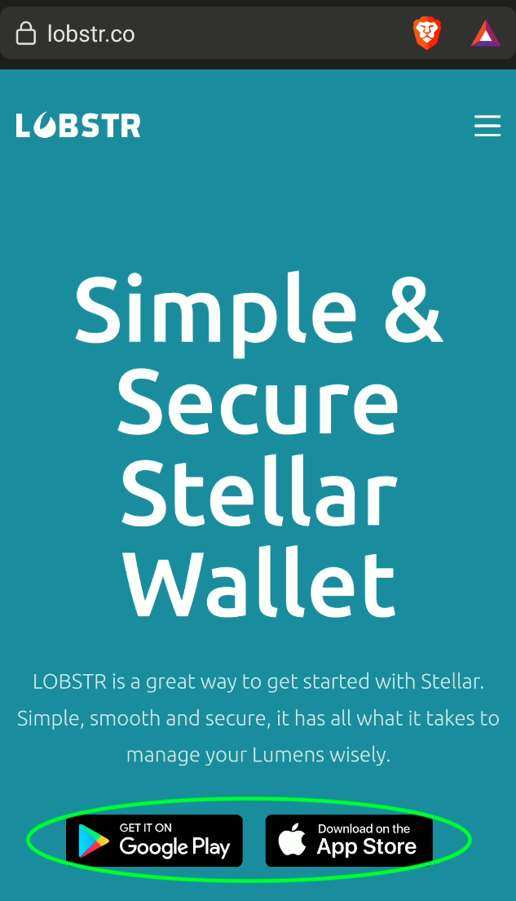

We will show here the steps for Android, but it is very similar with iOS.
Once you've clicked on the Android button, you can click install on the Google Store page:

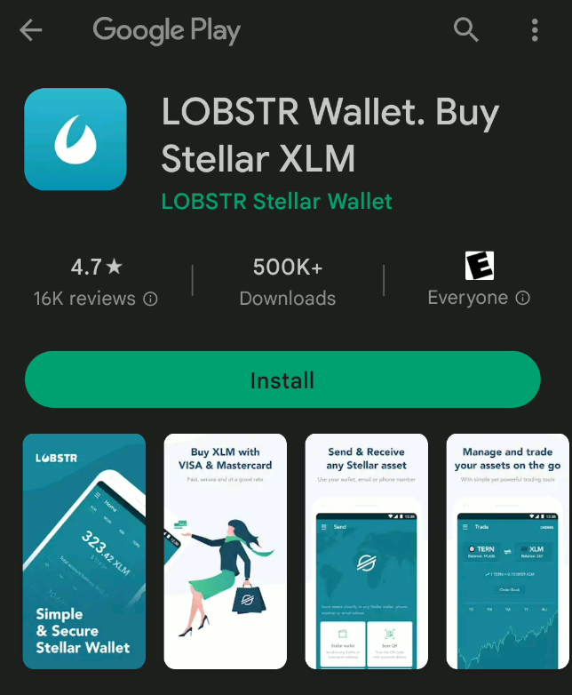

Once the app is downloaded, open it:

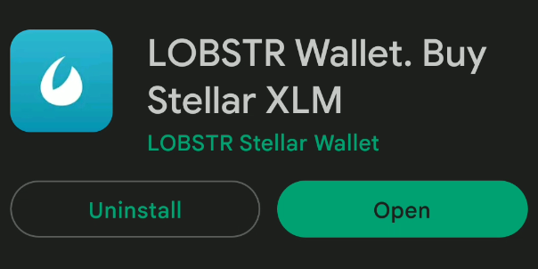

On the Lobstr app, click on **Create Account**:

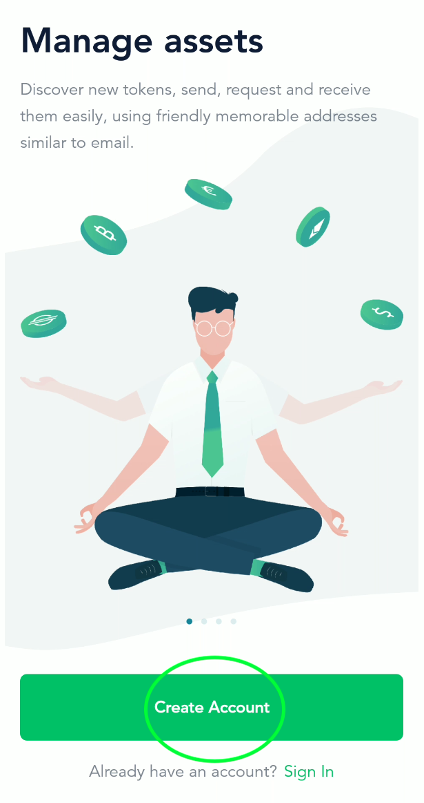

You will then need to enter your email address:

Then, choose a safe password for your account:

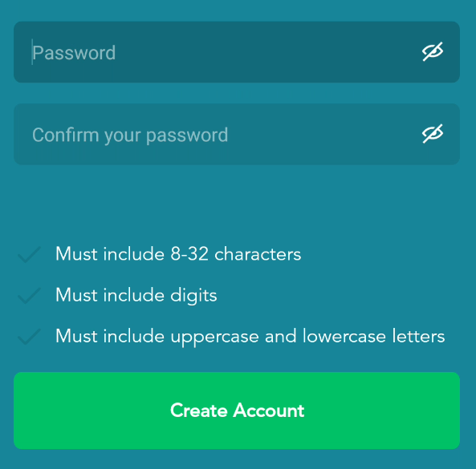

Once this is done, you will need to verify your email.

Click on **Verify Email** and then go check your email inbox.

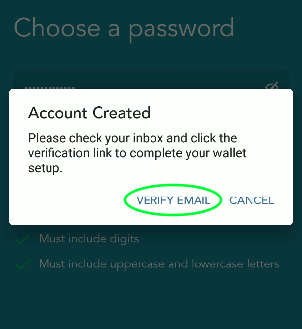

Simply click on **Verify Email** on the email you've received.

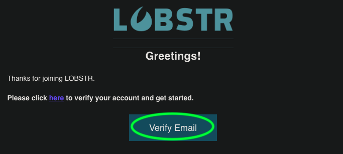

Once your email is verified, you can sign in to your Lobstr account:

## Connect Your TF Connect App Wallet

You will then need to either create a new wallet or connect an existing wallet.

For this guide, we will show how to connect your TF Connect app wallet, but please note that you can create a new wallet on Lobstr by clicking **Create Stellar Wallet**.

Since we are working with the Threefold ecosystem, it is very easy and practical to simply connect your TF Connect app wallet to Lobstr. This way, when you buy XLM and swap XLM tokens for TFTs, they will be directly available on your TF Connect app wallet.

To connect your TF Connect app wallet, you will need to find your Stellar address and chain secret key.
This is very simple to do.

Click on **I have a public or secret key**.

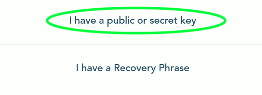

As you can see on this next picture, you need the Stellar address and secret key to properly connect your TF Connect app wallet to Lobstr:

To find your Stellar address and secret key, go on the TF Connect app and select the **Wallet** section:

At the top of the section, click on the **copy** button to copy your Stellar Address:

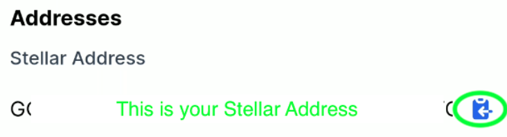

Now, we will find the Stellar secret key.
At the botton of the section, click on the encircled **i** button:

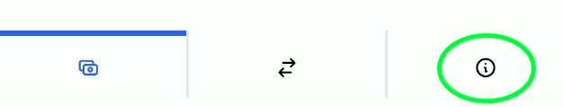

Next, click on the **eye** button to reveal your secret key:

You can now simply click on the **copy** button on the right:

That's it! You've now connected your TF Connect app wallet to your Lobstr account.

## Buy XLM with Fiat Currency

Now, all we need to do, is buy XLM and then swap it for TFT.
It will be directly available in your TF Connect App wallet.

On the Lobstr app, click on the top right menu button:

Then, click on **Buy Crypto**:

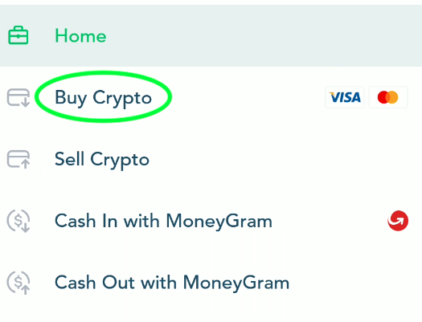

By default, the crypto selected is XLM. This is alright for us as we will quickly swap the XLM for TFT.

On the Buy Crypto page, you can choose the type of Fiat currency you want.
By default it is in USD. To select some othe fiat currency, you can click on **ALL** and see the available fiat currencies:

You can search or select the current you want for the transfer:

You will then need to decide how much XLM you want to buy. Note that there can be a minimum amount.
Once you chose the desired amount, click on **Continue**.

Lobstr will then ask you to proceed to a payment method. In this case, it is Moonpay.
Note that in some cases, your credit card won't accept Moonpay payments. You will simply need to confirm with them that you agree with transacting with Moonpay. This can be done by phone. Check with your bank and credit card company if this applies.

Once you've set up your Moonpay payment method, you will need to process and confirm the transaction:

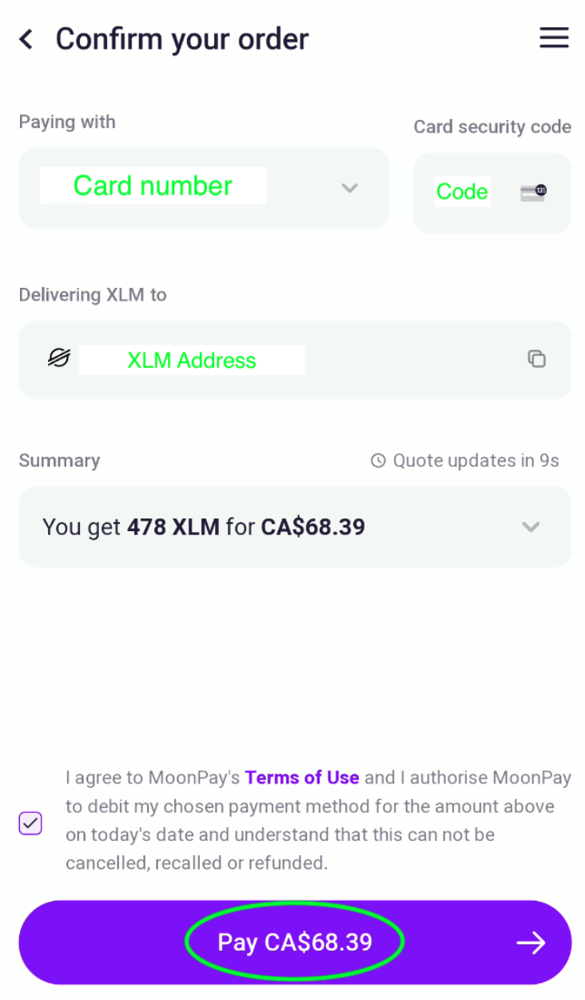

You will then see a processing window.
This process is usually fast. Within a few minutes, you should receive your XLM.

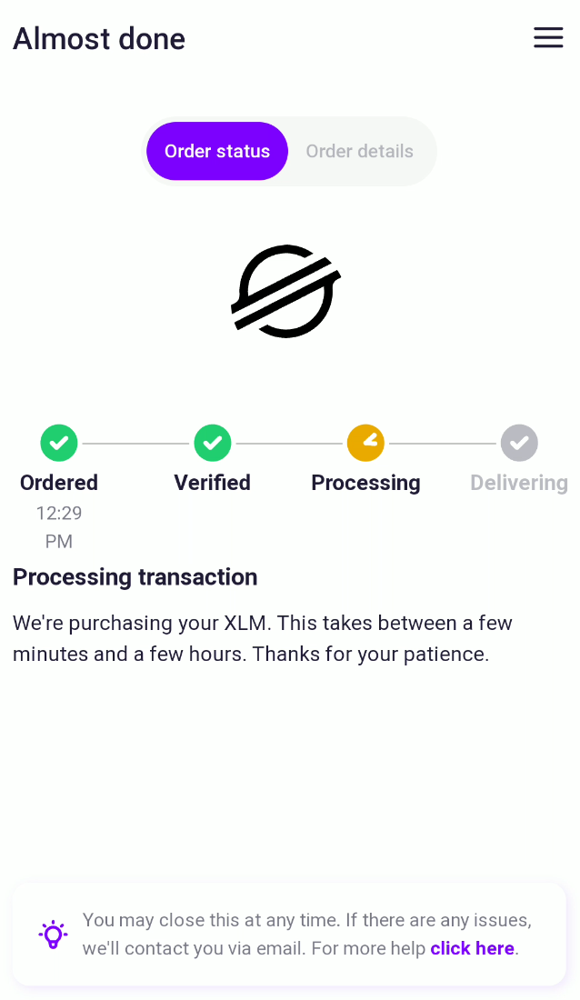

Once the XLM is delivered, you will receive a notification:

When your transaction is complete, you will see this message:

On the Trade History page, you can choose to download the csv file version of your transaction:

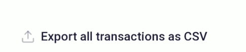

That's it! You've bought XLM on Lobstr and Moonpay.

## Swap XLM for TFT

Now we want to swap the XLM tokens for the Threefold tokens (TFT).
This is even easier than the previous steps.

Go to the Lobstr Home menu and select **Swap**:

On the **Swap** page, write "tft" and select the Threefold token:

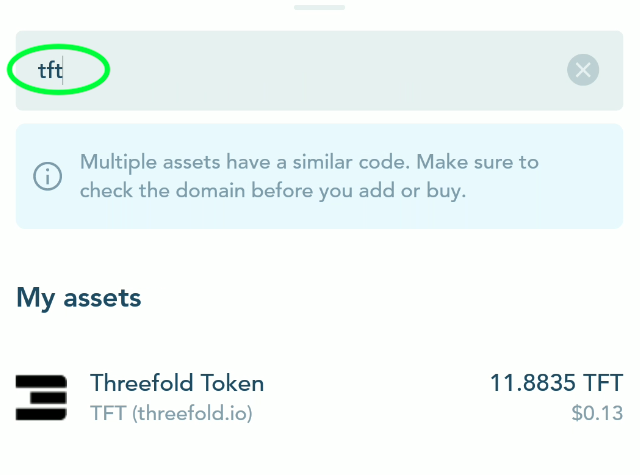

Select the amount of XLM you want to swap. It is recommended to keep at least 1 XLM in your wallet for transaction fees.

Within a few seconds, you will receive a confirmation that your swap is completed:
Note that the TFT is directly sent on your TF Connect app wallet.

That's it. You've swapped XLM for TFT.

You can now use your TFT to deploy workloads on the Threefold Grid.

## Disclaimer

> The information provided in this tutorial or any related discussion is not intended as investment advice. The purpose is to provide educational and informational content only. Investing in cryptocurrencies or any other assets carries inherent risks, and it is crucial to conduct your own research and exercise caution before making any investment decisions. 
> 
> **The ThreeFold Token (TFT)** is not to be considered as a traditional investment instrument. The value of cryptocurrencies can be volatile, and there are no guarantees of profits or returns. Always be aware of the risks involved and make informed choices based on your own assessment and understanding. We strongly encourage you to read our [full disclaimer](../../../../knowledge_base/legal/disclaimer.md) and seek advice from a qualified financial professional if needed.
