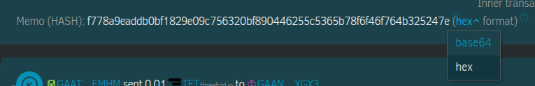
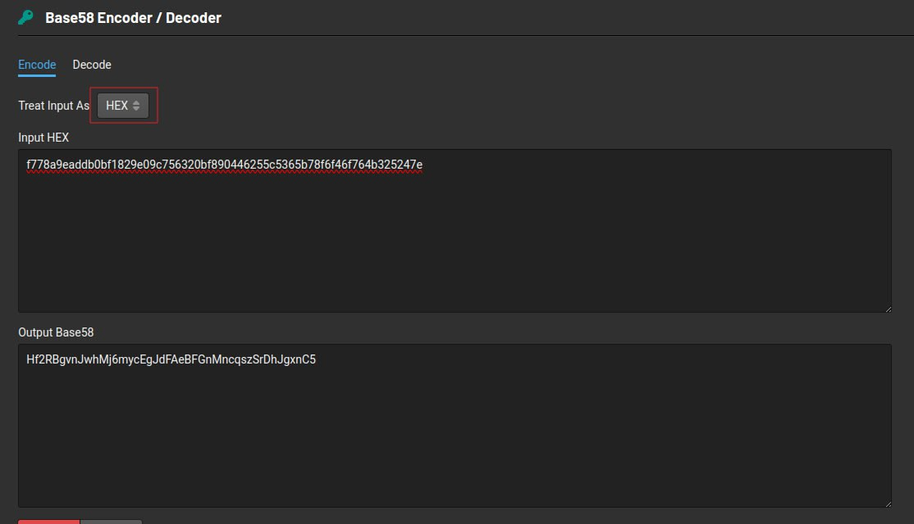
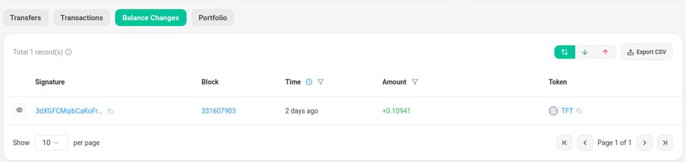

# Tracking Solana Bridge Transfers

## Overview

This guide explains how to track TFT transfers from Stellar to Solana using the bridge. When you initiate a bridge transfer, the destination Solana address is encoded in the memo field of the Stellar transaction and requires conversion to be readable.

## Prerequisites

- Access to a Stellar blockchain explorer
- Basic understanding of hexadecimal and Base58 encoding
- The transaction hash or details from your bridge transfer

## Step 1: Locate Your Transaction on Stellar Explorer

1. Navigate to your Stellar transaction in the [blockchain explorer](https://stellar.expert/)
2. Ensure you are viewing the transaction in **HEX format**

## Step 2: Extract and Convert the Memo Field

### Extract the Memo

The destination Solana address is encoded in the memo field of your Stellar transaction. This memo is in hexadecimal format and needs to be converted to Base58.

### Convert Hex to Base58

1. Copy the hexadecimal memo from your Stellar transaction
2. Use a hex-to-Base58 conversion tool such as the [Base58 Encoder/Decoder](https://appdevtools.com/base58-encoder-decoder)
3. Select **hex** as the input format
4. Paste the memo content into the conversion tool

**Example conversion process:**

### Retrieve Your Solana Address

The conversion output will display your destination Solana address:

## Step 3: Verify Transfer on Solana

### Search Your Address on Solscan

1. **Navigate to Solscan**: Go to [Solscan](https://solscan.io/)

2. **Enter your Solana address**: 
   - Paste the Base58 converted address (from Step 2) into the search bar
   - Press Enter or click the search button

3. **Access your account page**: Solscan will display your account details page

### Check Balance Changes

4. **Navigate to Balance Changes**:
   - On your account page, look for the **"Balance Changes"** tab
   - Click on it to view your transaction history

5. **Verify your TFT transfer**: Look for the incoming TFT transaction that corresponds to your bridge transfer

**Example**: [View balance changes](https://solscan.io/account/Hf2RBgvnJwhMj6mycEgJdFAeBFGnMncqszSrDhJgxnC5#balanceChanges)

*This example shows how the balance changes section displays TFT transfers on a Solana address.*

## Troubleshooting

### Common Issues

- **Memo not visible**: Ensure you're viewing the transaction in HEX format
- **Conversion errors**: Verify you've copied the complete memo field
- **Address not found**: Allow time for blockchain confirmation (typically 5-10 minutes)

### Additional Resources

- [Stellar Explorer](https://stellar.expert/)
- [Solscan Explorer](https://solscan.io/)
- [Base58 Conversion Tool](https://appdevtools.com/base58-encoder-decoder)

## Next Steps

Once you've successfully tracked your transfer:

- Verify the TFT balance in your Solana wallet
- Use your TFT on the Solana network as needed
- Keep transaction records for future reference

For additional bridge support, consult the [Stellar-Solana Bridge documentation](./stellar_solana_bridge.md).