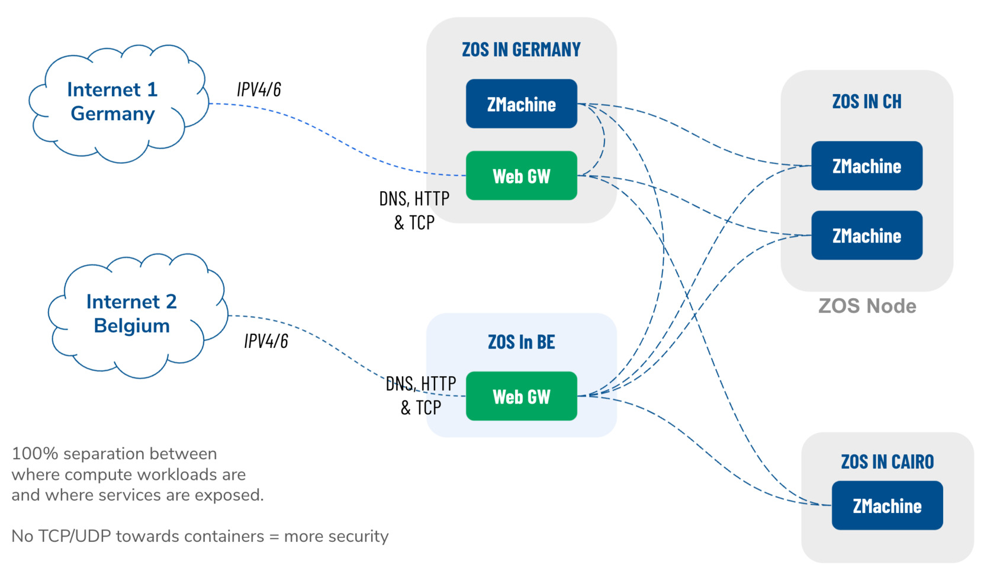
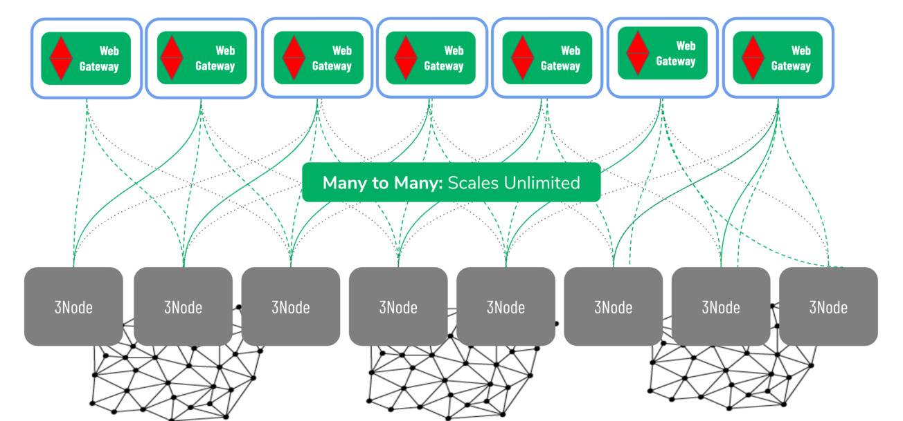

## Introduction

The Web Gateway is a mechanism to connect the private networks to the open Internet, in such a way that there is no direct connection between internet and the secure workloads running in the ZMachines.

## Overview

A Web Gateway connects the public internet to nodes in the ThreeFold Grid network by using reverse proxy software running on nodes with public IP addresses. It acts as an intermediary that:

1. Receives incoming requests from internet users
2. Routes them to the appropriate node in the private network
3. Returns responses to the requester

This enables any node to serve web content publicly without needing its own public IP address. Web Gateways provide cost efficiency (cheaper than dedicated public IPs), simplified management (automatic routing), and global accessibility without complex setup.

While Web Gateways have some limitations (less flexibility than dedicated IPs and shared resources that may affect performance during peak loads), they're ideal for hosting static websites, API endpoints, web applications, and content distribution.

## Web Gateway Architecture

A distributed web gateway architecture creates a strategic separation between backend computing resources and user-facing services.

- Separation between where compute workloads are and where services are exposed.
- Redundant
    - Each app can be exposed on multiple webgateways at once.
- Support for many interfaces...
- Helps resolve shortage of IPv4 addresses

## Implementation

Some 3nodes supports gateway functionality (configured by the farmers). A 3node with gateway config can then accept gateway workloads and then forward traffic to ZMachines that only has yggdrasil (planetary network) or Ipv6 addresses.

The gateway workloads consists of a name (prefix) that need to be reserved on the block chain first. Then the list of backend IPs. There are other flags that can be set to control automatic TLS (please check terraform documentations for the exact details of a reservation)

Once the 3node receives this workloads, the network configure proxy for this name and the yggdrasil ips.

## Security

ZMachines has to have an yggdrasil IP or any other IPv6 (also IPv4 are accepted) but it means that any person who is connected to the yggdrasil network, can also reach the ZMachine without the need for a proxy.

So ti's up to the ZMachine owner/maintainer to make sure it is secured and only have the required ports open.

## Redundant Network Connection

## Unlimited Scale

The network architecture is a pure scale-out network system, it can scale to unlimited size, there is simply no bottleneck. Network "supply" is created by network farmers, and network "demand" is done by TF Grid users.  Supply and demand scale independently, for supply there can be unlimited network farmers providing the web gateways on their own 3nodes and unlimited compute farmers providing 3nodes for compute and storage. The demand side is driven by developers creating software that runs on the grid, system integrators creating solutions for enterprise and this demand side is exponentially growing for data processing and storage use cases.
