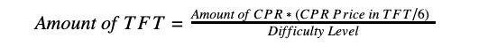

### 8. TFT Minting (Token Creation ‘FARMING of capacity’) TFGrid 2.x

#### 8.1 General Principle

Farmers who connect 3Nodes on an ongoing basis to the ThreeFold_Grid by running the Software and making IT Capacity available to the Users, get rewarded by receiving ThreeFold_Tokens (TFTs) which are generated by the Software. TFTs are exclusively issued (created) by the TF Chain for each active Capacity Pool which gets and remains connected to the ThreeFold_Grid. Such issuance of TFTs that results from connecting a 3Node to the ThreeFold_Grid and making IT Capacity available on a global scale to Users is called "**Farming**".

#### 8.2 Calculation of Farmed TFTs

The details of farming (minting of TFT’s) are described on our farming logic TFGrid 2 and this location serves as master for the TFT Reward Process. 

The wiki is version controlled (on github), so all changes can be followed.All connected IT Capacity gets registered on the TF Chain, i.e. ThreeFolds blockchain software. Each month the TF Chain issues new TFTs and transfers them to Farmers in respect of each 3Node that remained connected to the ThreeFold_Grid during the preceding month, using the following calculation in respect of each 3Node:

The concepts of CPR, CPR Price and Difficulty Level are determined in the aforementioned wiki and are incorporated into this Agreement by reference.

The amount of TFTs that are Farmed hence depends on three variables:

_1. Proof-of-Capacity_

The specs of the Farmer’s relevant 3Node:

- Compute Capacity (CPU) = CRU
- Memory Capacity (RAM) = MRU
- Storage Capacity (SSD/HDD) = SRU/HRU

The performance/capability of this hardware is attributed with Cloud Units that then summarized to a Cloud Production Rate (CPR) (as further described in the abovementioned wiki) for the relevant 3Node. The higher the CPR, the more TFTs are Farmed.

_2. Difficulty Level_

The amount of ThreeFold_Tokens (TFTs) that Farmers receive for Farming also depends on the amount of TFTs that are already in circulation. The more TFTs already exist, the lower the rewards. This follows the principle of diminishing returns. We call this Farming limitation to reward the "**Difficulty Level**".

When the amount of existing TFT nears 4 billion, the amount of TFTs received by Farmers will decrease progressively. Once the aggregate amount of "Farmed" TFTs reaches four billion ThreeFold_Tokens (4,000,000,000 TFTs), there won’t be any rewards for Farming anymore and no new TFTs will be generated by the Software.

The Difficulty Level is the same for all Farmers at a certain point in time.

_3. Certification_

When connecting reliable hardware the Farmer can request a certification from TF Tech NV which leads to increased earnings in TFT for such ‘Certified Farmers’. We automatically measure uptime, bandwidth and the utilization of the node for this certification. The details of this certification have to be further defined and will be set out on our wiki.

#### 8.3 Uptime

In addition thereto, the Company will determine in its sole discretion the reasonable uptime that each 3Node of the Farmer needs to to achieve when they register their 3Node(s) in the TF Chain. ThreeFold expects most 3Nodes to achieve an uptime of more than 98%, commercial providers can go as high as 99.9%. The TF Chain will only issue TFTs if the IT Capacity was connected to the internet and was usable during the last month at least up to the specified uptime guarantee.

#### 8.4 Taxes

You will be solely responsible for payment of all applicable taxes (if any) associated with your Farming of ThreeFold_Tokens (TFTA, TFT), including but not limited to value added taxes, taxes on gross receipts and income, Social Security taxes, business license fees and other payment obligations applicable to your business.

#### 8.5 Modification

The Company reserves the right to modify the terms of this section 8 (‘_Capacity Measurement and Minting - ‘Farming’_) at any time, including but not limited to the determination of the Difficulty Level. Such amendments will be subject to the approval of a majority of the members of the Company’s ‘Grid Counsel’ and a majority of the Farmers (whereby majority is measured based on nr of 3Nodes a Farmer has, each 3Node entitles the Farmer to one vote, Farmers who do not vote have no say in the decision process) who participate in an online poll organized by the Company In case of modification to these terms, the Company shall inform the Farmer at least one month in advance. In case the Farmer would not agree to such modifications, the Farmer shall have the right to immediately and unilaterally terminate this Agreement by disconnecting the Farming Pool from the ThreeFold_Grid.

