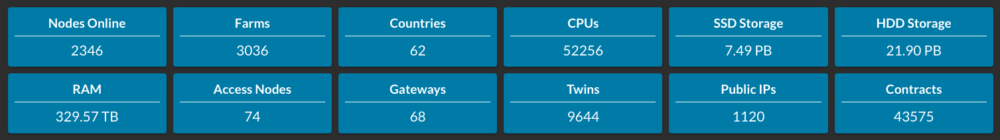

<h1> 3Bot Concepts of the TFGrid </h1>

<h2> Table of Contents </h2>

- [Current State of the TFGrid](#current-state-of-the-tfgrid)
- [3Bot and TFGrid Utilization Economy](#3bot-and-tfgrid-utilization-economy)
- [Ask the 3Bot to Deploy for You](#ask-the-3bot-to-deploy-for-you)
- [Solution Providers](#solution-providers)

***

## Current State of the TFGrid

Today, the ThreeFold technology is live in its 3rd generation (with version 4 coming later in 2023), and the TFGrid has been connected in more than 60 countries across the globe.

(Date: 22-06-23)

***

## 3Bot and TFGrid Utilization Economy

Users of the ThreeFold Grid need to spend CHI to reserve and/or use the TFGrid range of services. A user will use his/her 3Bot to use the services provided on the TFGrid.

The user's 3Bot can query the TFChain and the TFGrid Universe to find the required IT capacity providing services based on the following criteria:

- Reputation of farmer
- Whether the farmer is commercial (see above) or not
- Pricing of the IT capacity
- Components inside the nodes (type of CPU, GPU, amount of SSD, …)
- Network connectivity (performance)
- Location (country, region, …)
- Service levels provided (e.g. a user can specify that they want to achieve 99,9% uptime)

Starting from TFGrid 4.0 (summer 2023) we base all commercial payments based on a IOU (I Owe You) Invoicing and Payment mechanism. This is an exciting mechanism allowing for much more scalability.

The basic pricing for the services (compute, storage and network) are defined by the DAO, the Commercial Service Level Fees are specified by the farmer.

***

## Ask the 3Bot to Deploy for You

A user asks the 3Bot to prepare the deployment of a solution on his/her behalf and specifies the criteria (quality, location, etc.). The 3Bot will use the TFGrid Universe and the TFChain to make sure the deployment request gets executed. We call this concept “smart contract for IT”, where a consensus can be achieved between multiple parties for deploying a workload in a predefined deterministic way.

The Farming Bot in combination with our Zero-OS (the operating system of 3Node) will track capacity used and will send IOU Invoices to the Validators as well as to the relevant User 3Bot. All of them will sign off on the validity of the IOU Invoice which will then become an IOU Payment as executed by 3Bot. At certain intervals, all these IOU Payments will get consolidated on the TFChain and thus the payment becomes final. This design is very scalable and flexible. If the farmer or the user is of bad intent, this will reflect on their Reputation Score.

While many other systems rely on “zero trust,” we want trust in our system. However, with trust comes responsibility and accountability. Thus, the Reputation Score is introduced to ensure that if, for example, payments are not made, this is reflected publicly and will damage this person’s opportunity to do business in the future.

***

## Solution Providers

Solution Providers can create solutions on top of the TFGrid and charge CHI for it, or charge for specific types of hardware, e.g. special purpose GPU, or ASIC, or else. They can define their own price.

Once the Payments are being executed and consolidated, the CHI will get distributed as follows:

- Payments for services as delivered by 3Nodes (capacity) will be be distributed as follows
  - 30-50% to TFChain Treasury (treasury owned by DAO)
  - 70-50% will be burned, which makes for healthy tokenomics, keeps the amount of CHI low
  - The percentage mix is voted for by the community DAO.
- Payments for services delivered by Solution Providers independent of grid capacity will be sent to the Account of the parties involved to deliver the Solution (can be more than 1), minus 10% which is sent to the TFChain Treasury for funding development and promotion of the project.

Consumers of TFGrid capacity can receive discounts by having enough CHI in their 3Bot wallet (can be multisignature for security). The mechanism is very simple, if the Consumer has 12x the monthly required CHI wallet there is a 40% discount, 24x the monthly 60%. These percentages are defined by DAO of a Regional Internet TFGrid. A Consumer can be a solution provider who consumes capacity to deliver their own solution.

Anyone building on top of TFGrid (a solution provider) can receive additional discounts for deploying on the grid, these discounts are time bound and levels defined by the DAO. A solution provider needs to stake CHI and in case the terms and conditions or service levels are not achieved, the solution provider will lose some of his staked tokens. Added value and importance of the solution will have to be proven to the community.
