The ***Threefold Farming Guide on How to Build a DIY 3node Server*** is presented to you by the Threefold community.

This community initiative will be updated as we learn and gain knowledge. As always: **Do your own research**. 

And now *...Let's New Internet...*

***
*Hint: Use the search function (Ctrl+F) to locate specific keywords*
***

- [Building a DIY 3node - From Zero to Hero](#building-a-diy-3node---from-zero-to-hero)
  - [1. Create a Farm](#1-create-a-farm)
    - [1) Creating a Polkadot.js account](#1-creating-a-polkadotjs-account)
    - [2) Creating the Farm on the Threefold Grid](#2-creating-the-farm-on-the-threefold-grid)
    - [Optional: Add Public IP Addresses](#optional-add-public-ip-addresses)
      - [How to configure public IP addresses for a Threefold farm or a 3node](#how-to-configure-public-ip-addresses-for-a-threefold-farm-or-a-3node)
      - [The Difference Between IPs Assigned to Nodes Versus a Farm](#the-difference-between-ips-assigned-to-nodes-versus-a-farm)
  - [2. Create a Zero-OS Bootstrap Image](#2-create-a-zero-os-bootstrap-image)
    - [Burning the Zero-OS Bootstrap Image](#burning-the-zero-os-bootstrap-image)
      - [CD/DVD BIOS](#cddvd-bios)
      - [USB Key BIOS+UEFI](#usb-key-biosuefi)
  - [3. Set the Hardware](#3-set-the-hardware)
    - [Hardware Requirements](#hardware-requirements)
    - [Bandwidth Requirements](#bandwidth-requirements)
    - [Link to Share Farming Setup](#link-to-share-farming-setup)
    - [List of Common DIY 3nodes](#list-of-common-diy-3nodes)
      - [The Mini PC DIY 3node](#the-mini-pc-diy-3node)
      - [The Desktop PC DIY 3node](#the-desktop-pc-diy-3node)
      - [The Mini Server DIY 3node](#the-mini-server-diy-3node)
      - [The Tower Server DIY 3node](#the-tower-server-diy-3node)
      - [The Rack Server DIY 3node](#the-rack-server-diy-3node)
    - [Powering the 3node](#powering-the-3node)
      - [Surge Protector](#surge-protector)
      - [Power Distribution Unit (PDU)](#power-distribution-unit-pdu)
      - [Uninterrupted Power Supply (UPS)](#uninterrupted-power-supply-ups)
      - [Generator](#generator)
    - [Using Onboard Storage (3node Servers)](#using-onboard-storage-3node-servers)
    - [Upgrading a DIY 3node](#upgrading-a-diy-3node)
  - [4. Wipe All the Disks](#4-wipe-all-the-disks)
    - [1. Create a Linux Bootstrap Image](#1-create-a-linux-bootstrap-image)
    - [2. Boot Linux in *Try Mode*](#2-boot-linux-in-try-mode)
    - [3. Use wipefs to wipe all disks](#3-use-wipefs-to-wipe-all-disks)
  - [5. Set the BIOS/UEFI](#5-set-the-biosuefi)
    - [The Essential Features of BIOS/UEFI for a 3node](#the-essential-features-of-biosuefi-for-a-3node)
      - [Setting the Remote Management of a Server (Static IP Address)](#setting-the-remote-management-of-a-server-static-ip-address)
    - [Update the BIOS/UEFI firmware](#update-the-biosuefi-firmware)
        - [Check your BIOS/UEFI version on Windows](#check-your-biosuefi-version-on-windows)
        - [Check your BIOS/UEFI version on Linux](#check-your-biosuefi-version-on-linux)
      - [Update the BIOS firmware](#update-the-bios-firmware)
    - [BIOS/UEFI and Zero-OS Bootstrap Image Combinations](#biosuefi-and-zero-os-bootstrap-image-combinations)
      - [Example of BIOS Settings - Rack Server - Dell R720](#example-of-bios-settings---rack-server---dell-r720)
      - [Example of UEFI Settings - Desktop Computer - Dell Optiplex 7010](#example-of-uefi-settings---desktop-computer---dell-optiplex-7010)
  - [6. Boot the 3node](#6-boot-the-3node)
    - [1. Booting the 3node with Zero-OS bootstrap image](#1-booting-the-3node-with-zero-os-bootstrap-image)
    - [2. Check 3node Status on the TF Explorer](#2-check-3node-status-on-the-tf-explorer)
    - [3. Receive the Farming Rewards](#3-receive-the-farming-rewards)
    - [Advanced Booting Option - Network Booting (PXE)](#advanced-booting-option---network-booting-pxe)
      - [PXE Booting with OPNsense](#pxe-booting-with-opnsense)
      - [PXE Booting with pfSense](#pxe-booting-with-pfsense)
  - [Set Up a Threefold Farm in a Data Center](#set-up-a-threefold-farm-in-a-data-center)
    - [Gold Farming Qualification Requirements](#gold-farming-qualification-requirements)
    - [Data Center Cable Management](#data-center-cable-management)
- [Farming Optimization and Planification](#farming-optimization-and-planification)
  - [Calculate the ROI of a DIY 3node](#calculate-the-roi-of-a-diy-3node)
  - [Air Conditioner, Relative Humidity and Air Changes per Hour](#air-conditioner-relative-humidity-and-air-changes-per-hour)
    - [Calculate the Minimum BTU Needed for the AC](#calculate-the-minimum-btu-needed-for-the-ac)
    - [Ensure Proper Relative Humidity](#ensure-proper-relative-humidity)
    - [Ensure Proper Air Changes per Hour](#ensure-proper-air-changes-per-hour)
  - [Calculate Power, Internet and Total Costs](#calculate-power-internet-and-total-costs)
    - [Calculate the Total Electricity Cost of Your Farm](#calculate-the-total-electricity-cost-of-your-farm)
    - [Calculate the Proper Bandwidth Needed for Your Farm](#calculate-the-proper-bandwidth-needed-for-your-farm)
      - [The Minimum Bandwidth per 3node Equation](#the-minimum-bandwidth-per-3node-equation)
      - [Cost per Month for a Given Bandwidth](#cost-per-month-for-a-given-bandwidth)
    - [Calculate the Total Cost and Revenue](#calculate-the-total-cost-and-revenue)
      - [Check Revenue with the Threefold Simulator](#check-revenue-with-the-threefold-simulator)
      - [Economics of Farming](#economics-of-farming)
- [Threefold Token (TFT)](#threefold-token-tft)
  - [6 Facts About the ThreeFold Tokens](#6-facts-about-the-threefold-tokens)
  - [Threefold Wallet](#threefold-wallet)
    - [Threefold Connect App Wallet](#threefold-connect-app-wallet)
      - [Threefold Connect Installation](#threefold-connect-installation)
      - [Verify your identity (KYC) by email](#verify-your-identity-kyc-by-email)
      - [Change email associated with TF account](#change-email-associated-with-tf-account)
      - [Create a Wallet](#create-a-wallet)
      - [Create a Farm](#create-a-farm)
      - [See Threefold Connect App and Wallet Transactions](#see-threefold-connect-app-and-wallet-transactions)
      - [Connect to the Planetary Network](#connect-to-the-planetary-network)
      - [Show Seed Phrase - Remove Account from TF Connect App](#show-seed-phrase---remove-account-from-tf-connect-app)
      - [Recover Account on the Threefold Connect App](#recover-account-on-the-threefold-connect-app)
      - [Move Farm from the TF app to the TF Portal (polkadot.js)](#move-farm-from-the-tf-app-to-the-tf-portal-polkadotjs)
      - [Import TF Portal (polkadot.js) wallet to the TF Connect App Wallet](#import-tf-portal-polkadotjs-wallet-to-the-tf-connect-app-wallet)
      - [Send and Receive TFT between TF Connect Wallets](#send-and-receive-tft-between-tf-connect-wallets)
        - [Send TFT](#send-tft)
        - [Receive TFT](#receive-tft)
      - [Send TFT to Hardware Wallet on Stellar Blockchain](#send-tft-to-hardware-wallet-on-stellar-blockchain)
    - [Hardware Wallet](#hardware-wallet)
      - [Setting up a TFT Trustline on Stellar Blockchain](#setting-up-a-tft-trustline-on-stellar-blockchain)
  - [How to Buy and Sell TFT](#how-to-buy-and-sell-tft)
    - [Where to Buy and Sell TFT](#where-to-buy-and-sell-tft)
      - [The different TFT Threefold bridges: TFChain-Stellar Bridge and BSC-Stellar Bridge](#the-different-tft-threefold-bridges-tfchain-stellar-bridge-and-bsc-stellar-bridge)
      - [How to set up a Stellar address for TFT transactions](#how-to-set-up-a-stellar-address-for-tft-transactions)
    - [How to use the TFChain-Stellar Bridge](#how-to-use-the-tfchain-stellar-bridge)
    - [How to use the BSC-Stellar Bridge](#how-to-use-the-bsc-stellar-bridge)
      - [Bridge from Stellar to BSC](#bridge-from-stellar-to-bsc)
      - [Bridge from BSC to Stellar](#bridge-from-bsc-to-stellar)
      - [Setting Up TFT on Metamask](#setting-up-tft-on-metamask)
  - [Validator](#validator)
    - [Introduction to Validator](#introduction-to-validator)
    - [More Information](#more-information)
  - [How to Stake TFT](#how-to-stake-tft)
- [Using TFT on the Grid](#using-tft-on-the-grid)

***

#  Building a DIY 3node - From Zero to Hero

## 1. Create a Farm

***

The following guide will show you how to create a farm and a farm ID. In doing so, we will also learn how to create a Threefold Twin and how to use the polkadot.js extension on Chrome or Firefox to create an account on the blockchain. You can also [create a Threefold Farm with the Threefold Connect App](#create-a-farm).

***

### 1) Creating a Polkadot.js account

    https://polkadot.js.org/extension/

Go on this link and download the extension based on your browser.

 

Choose Chrome or Firefox.

    https://addons.mozilla.org/en-US/firefox/addon/polkadot-js-extension/

In this case, we use Firefox. Clicking on Download for Firefox leads us to this URL.


Click Add to Firefox.


Click Add.

 

This message tells you that the extension was added. Select Allow this extension to run in Private Windows if you want, then click Okay.
***


At first, you have no account. Click on the + sign to create an account.

 

Write down your 12-word mnemonic seed and select ***I have saved my mnemonic seed safely***, once you’ve done so!


Choose a descriptive name for your account. This name is not relevant. If you remove your account from the browser, you will need to enter your 12-word mnemonic seed and choose a new descriptive name.

You will need the password when accepting transactions. Choose it wisely.


 

This is what you see when your account is created.

***

### 2) Creating the Farm on the Threefold Grid

Go on the Threefold Portal.

```
https://portal.grid.tf
```

As you’ve created and logged in your account, you will see your account in the list of connected accounts. Click on your account.

 

You will be asked to read and accept the `Terms and Conditions`.

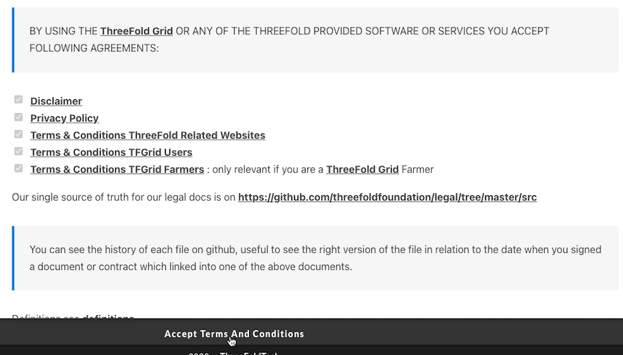

You will be asked your password in order to confirm the transaction.

 

***

Once you confirm the transaction, you want to create a Twin and let the standard IP address already written, as shown below:

```
::1
```

Note that this is a IPv6 address as the twin is using the Planetary Network.

Click Create. 

 

You will once again be asked to confirm the transaction.

Then, click on the "Farms" button in the Portal menu to your left:

 

On the "Farms" page, click on "Create Farm".

 

Choose a farm name and click "Submit".

 

Once the farm is created, click on the down arrow to see your farm details.

 

In this section, click on "Add V2 Address" to add your farming rewards address.

 

Write a valid Stellar address and click "Submit". 

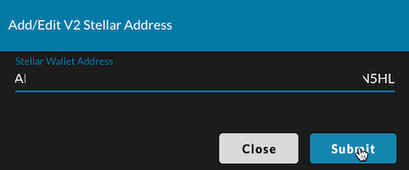 

You can, for example, use your Threefold Connect App* address or your hardware wallet address (Ledger, Trezor).

*Threefold Connect App Hyperlinks:
* Link for [Android](https://play.google.com/store/apps/details?id=org.jimber.threebotlogin&hl=en&gl=US)
* Link for [iOS](https://apps.apple.com/us/app/threefold-connect/id1459845885)

***
### Optional: Add Public IP Addresses
***

> Note: Assuming you are a farmer operating from your home, this field can usually be left blank. You do not have to fill in any details. The add IP option is for farmers that have a block of IP addresses routed to their router (in data centers mostly) and want to present “dedicated IP” addresses for deployments.

The add IP option is for farmers that have a block of IP addresses routed to their router. This is mainly for data centers, but some ISP can provide this service for residential locations. With such public IP addresses, your TF farm and/or your 3nodes can present “dedicated IP” addresses for deployments.
Unless you are paying for a block of IPs, you only have one static IP which is needed for you router

The [Threefold simulator](https://simulator.grid.tf/) is referring to this IP address. Only check the Public IP option in the simulator if you have such block of IP addresses.

 

***
#### How to configure public IP addresses for a Threefold farm or a 3node
***

To configure public IP addresses for your 3node farm, select the  *Farms*  section of the Portal menu in the [Threefold Dashboard](https://dashboard.grid.tf/), expand your farm by clicking on the down arrow on the left, then click on the down arrow to the right of the subsection *Public IPs*.

 

Click on "Add IP".

 

Specify the IP address using CIDR format, add the gateway and then click "Save".

 

The same process can be done for individual 3nodes. This is available in the  *Nodes*  section, just below the  *Farms*  section of the "Farms" page.

To configure public IP addresses to a specific 3node, click on the Actions *Add a public config* (represented with a Earth icon).

 

Fill in the necessary information and click save. Only the IPv4 address and gateway are necessary. The IPv6 address and the Domain are optional.

 

***
#### The Difference Between IPs Assigned to Nodes Versus a Farm
***

IPs assigned to a farm are available to be rented by workloads. They can be assigned to virtual machines for example. IPs assigned to nodes enable each node to become a gateway.

***

## 2. Create a Zero-OS Bootstrap Image

***

We will now learn how to create a Zero-OS Bootstrap Image in order to boot a DIY 3node.

    https://v3.bootstrap.grid.tf

Go on the [Threefold Zero-OS Bootstrap Link](https://v3.bootstrap.grid.tf) as shown above.

 

This is the Zero-OS v3 Bootstrapping page.

  

Write your farm ID and choose production mode.

  

If your system is new, you might be able to run the bootstrap in UEFI mode.

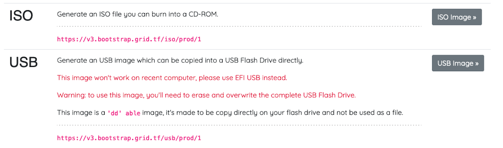 

For older systems, run the bootstrap in BIOS mode. For BIOS CD/DVD, choose **ISO**. For BIOS USB, choose **USB**

Download the bootstrap image. Next, we will burn the bootstrap image.

***

### Burning the Zero-OS Bootstrap Image

#### CD/DVD BIOS 
***
For the BIOS **ISO** image, download the file and burn it on a DVD.
***

#### USB Key BIOS+UEFI

For **MAC**, **Linux** and **Windows**, you can use [BalenaEtcher](https://www.balena.io/etcher/) to load/flash the image on a USB stick. This program also formats the USB in the process. This will work for the option **EFI IMG** for UEFI boot, and with the option **USB** for BIOS boot. Simply follow the steps presented to you and make sure you select the bootstrap image file you downloaded previously.

General Steps:

1. Download BalenaEtcher
2. Open BalenaEtcher
3. Select **Flash from file**
4. Find and select the bootstrap image (with your correct farm ID)
5. Select **Target** (your USB key)
6. Select **Flash**

That's it. Now you have a bootstrap image on Zero-OS as a bootable removable media device.
***

For the BIOS **USB** and the UEFI **EFI IMG** images, with Linux, you will want to do:

    sudo dd status=progress if=FILELOCATION.ISO(or .IMG) of=/dev/sd*.

Here the * is to indicate that you must adjust according to your disk. To see your disks, write lsblk in the command window. Make sure you select the proper disk!

*If you USB key is not new, make sure that you format it before burning the Zero-OS image.
***

For Windows, if you are using the ***"dd" able image***, instead of writing command line, you can use the free USB flashing program called [Rufus](https://sourceforge.net/projects/rufus.mirror/) and it will automatically do this with no need for Linux or command line. Rufus also formats the boot media in the process.

***

## 3. Set the Hardware

***

### Hardware Requirements

***

In this section, we cover the essential farming requirements when it comes to Threefold 3node hardware.

You need a theoretical minimum of 500 GB of SSD and 2 GB of RAM on a mini pc, desktop or server. In short, for peak optimization, aim for 100 GB of SSD and 8GB of RAM per thread. (Thread is equivalent to virtual core or logical core.)

Also, TFDAO might implement a farming parameter based on [passmark](https://www.cpubenchmark.net/cpu_list.php). From the ongoing discussion on the Forum, you should aim at a CPU mark of 1000 and above per core.

> 3node optimal farming hardware ratio -> 100 GB of SSD + 8 GB of RAM per Virtual Core

Note that you can run Zero-OS on a Virtual Machine (VM), but you won't farm any TFT from this process. To farm TFT, Zero-OS needs to be on bare metal.

Also, note that Threefold runs its own OS, which is Zero-OS. You thus need to start with completely wiped disks. You cannot farm TFT with Windows, Linux or MAC OS installed on your disks. If you need to use such OS temporarily, boot it in Try mode with a removable media (USB key).

Note: Once you have the necessary hardware, you need to [create a farm](#1-create-a-farm), [create a Zero-OS bootstrap image](#2-create-a-zero-os-bootstrap-image), [wipe your disks](#4-wipe-all-the-disks) and [set the BIOS/UEFI](#5-set-the-biosuefi) . Then you can [boot your 3node](#6-boot-the-3node). 

***

**3NODE REQUIREMENTS**

***

Any computer with the following specifications can be used as a DIY 3node.

- Any 64-bit hardware with an Intel or AMD processor chip.
- Servers, desktops and mini computers type hardware are compatible.
- A minimum of 500 GB of SSD and a bare minimum of 2 GB of RAM is required.
- A ratio of 100GB of SSD and 8GB of RAM per thread is recommended.
- A wired ethernet connection is highly recommended to maximize reliability and the ability to farm TFT.
- A [passmark](https://www.passmark.com/) of 1000 per core is recommended and will probably be a minimum requirement in the future.

*A passmark of 1000 per core is recommend and will be a minimum requirement in the future. This is not yet an official requirement. A 3node with less than 1000 passmark per core of CPU would not be penalized if it is registered before the DAO settles the [Passmark Question](https://forum.threefold.io/t/cpu-benchmarking-for-reward-calculations/2479).

***

### Bandwidth Requirements

<!---
This section should be checked and validated with the TF Team. We can change the constant (here it's 10) if needed. Or use another equation if this one is deemed suboptimal. This equation is an attempt at a synthesis of the discussions we had on the TF Forum.
-->

***

A 3node connects to the Threefold Grid and transfers information, whether it is in the form of compute, storage or network units (CU, SU, NU respectively). The more resources your 3nodes offer to the Grid, the more bandwidth will be needed to transfer the additional information. In this section, we cover general guidelines to make sure you have enough bandwidth on the Threefold Grid when utilization will be happening.

Note that the TFDAO will need to discuss and settle on clearer guidelines in the near future. For now, we propose those general guidelines. Being aware of these numbers as you build and scale your Threefold farm will set you in the proper direction.

> **The strict minimum for one Titan is 1 mbps of bandwidth**. 

If you want to expand your Threefold farm, you should check the following to make sure your bandwidth will be sufficient when there will be Grid utilization.
***
**Bandwidth per 3node Equation**
***
> min Bandwidth per 3node (mbps) = 10 * max((Total SSD TB / 1 TB),(Total Threads / 8 Threads),(Total GB / 64 GB)) + 10 * (Total HDD TB / 2)

This equation means that for each TB of HDD you need 5 mbps of bandwidth, and for each TB of SSD, 8 Threads and 64GB of RAM (whichever is higher), you need 10 mbps of bandwidth. 

This means a proper bandwidth for a Titan would be 10 mbps. As stated, 1 mbps is the strict minimum for one Titan.

***

### Link to Share Farming Setup

***

If you want ideas and suggestions when it comes to building DIY 3nodes, a good place to start is by checking what other farmers have built. [This post on the Forum](https://forum.threefold.io/t/lets-share-our-farming-setup/286) is a great start. The following section also contains great DIY 3node ideas.

***

### List of Common DIY 3nodes

***

From the data collected by the Threefold DIY Farming Community, we can list some common 3node builds. Note that these builds can be used as starting inspiration to build your own unique 3node! That's the beauty of *the TF 3node DIY Adventure*.

Building a 3node depends a lot on the hardware accessibility in your specific location. Do your own research and check what are the best deals when it comes to buying computers and parts where you live.

We regroup the 3node builds in 5 main categories:

1. [Mini PC](#the-mini-pc-diy-3node)
2. [Desktop](#the-desktop-pc-diy-3node)
3. [Mini server](#the-mini-server-diy-3node)
4. [Tower Server](#the-tower-server-diy-3node)
5. [Rack Server](#the-rack-server-diy-3node)

***

#### The Mini PC DIY 3node

***

Many farmers start with a Titan plug n play and then explore the world of Mini PC DIY 3nodes. 

***

**Lenovo M900 Tiny**


- Lenovo M900 Tiny
- Intel Core i7-6700T CPU (8 Threads)
- CPU Passmark per Core: 1817.75
- 1TB SSD
- Crucial 64GB RAM CT2K32G4SFD8266 (2x32GB) DDR4 2666 MHz CL19 Laptop Memory

A common Mini PC is the Lenovo M900 tiny. Equipped with an i7-6700T CPU (or i7-6700), this 3node can have up to 64GB of RAM. Note that for a i7-6500 and below, the maximum is 32GB of RAM.

For this DIY 3node, you usually need to buy the RAM and SSD separately to get the best price. Here's an [amazing TF video](https://www.youtube.com/watch?v=-AmDJYWWS5M) to get you started on this 3node DIY journey.

***

#### The Desktop PC DIY 3node

***

**DELL OptiPlex 7020**

- DELL OptiPlex 7020
- i5-4570
- CPU Passmark per Core: 1300
- 32GB Ram
- 1x 512GB SSD

This 3node is a great way to start your Threefold adventure: it requires no upgrade or any hardware tweaking. 

It has the minimum SSD requirement as well as 32GB of RAM. This SSD/RAM ratio optimizes the farming reward. In short, for around 240$, you can farm around 257 TFT per month. With the current TFT price of 8 cents, this gives you a return on investment of less than 12 months. Building the New Internet isn't that hard after all!

***

**HP EliteDesk 800 G1 Desktop**


- HP EliteDesk 800 G1 Desktop
- Intel Core i7-6700
- CPU Passmark per Core: 2019
- 32GB DDR3 RAM
- 1TB SSD Hard Drive
- Zero-OS boot mode: UEFI

This model has a nice CPU Passmark ratio and has the same basic specs as a Titan. A great advantage of this model is that you can buy it as is, wipe the disk and plug in your bootstrap image and that's it, you're farming TFT! It's thus an excellent first DIY 3node. 

This build can be upgraded to 64GB of RAM, but it requires SODIMM RAM, which can be expenseive. DYOR.

***
#### The Mini Server DIY 3node
***

**Supermicro Pizza Box Chassis** 


- AMD 5700G - 8 Core 16 Thread CPU
- CPU Passmark per Core: 3066.875
- Asrock Rack X470 Motherboard
- 128GB RAM
- 2x 2TB Kingston NVME SSD’s
- 1x 8TB Enterprise SATA HDD

This 3node build is very effective and has a good ratio investment/TFT rewards if you can get the parts online. This takes a little bit of DIY working as you need to assemble the parts. The CPU mark is also excellent.

***

#### The Tower Server DIY 3node

***

**HP Z800**

- HP Z800
- 2x Xeon 5650(16 Cores / 32 Threads)
- 192 GB RAM (12x 16GB DDR3 PC3L-8500R)
- CPU Passmark per Core: 960.83
- 3TB SSD (1x1TB + 1x2TB)
- Zero-OS boot mode: UEFI

***

**Dell Precision T5810**


- Dell Precision T5810
- Intel Xeon E5-2698 V3 (16 Cores / 32 Threads)
- CPU Passmark per Core: 1237.125
- 256GB SK Hynix DDR4 ECC RAM
- 4TB Crucial MX500 SSD

***

A Tower Server DIY 3node is a good way to get major TFT rewards while also having an ergonomic and quiet 3node. Note that the Rack Server DIY 3node are usually louder, due to the fans spinning.

Building tower servers as DIY 3nodes is also has a clear advantage: when GPU will be available on TF Grid, you will have ample room to add a decent GPU. This is thus future-proof in that regard.

***

#### The Rack Server DIY 3node

***

**DELL R720**

- Dell R720 refurbished (125 USD)
- 2 x Intel Xeon E5-2695 V2 (123 USD)
- CPU Passmark per Core: 1126.75
- 48 Threads
- 12 x 32GB (384GB) LR Ram ddr3 ebay (458 USD)
- 2 x 2TB ssd (360 USD)
- 1 x 1TB ssd (80 USD)
- cabels, caddies, etc: (15 USD)
- Zero-OS boot mode: BIOS

Total : 1161 USD

- 3122.5 TFT per month
- 175 Watt
- 126 kWh/month without any cultivation.

Estimated ROI: around 6 months

The prices are subjected to change depending on where you buy them. DYOR.

This 3node build by @Valentine969 is quite amazing. You get great TFT rewards in a 2U rack server. 

Note that 2U servers are quieter than 1U. The reason is simple, 2U servers have larger fans, thus they can move more volume of air with a slower speed than would 1U fans. This is a general statement and it depends on the specific hardware.

***

**DELL R620**


- Dell R620
- 2x E5 2640 V2
- CPU Passmark per Core: 967.625
- 32 Threads
- 256 GB RAM 
- 16x16GB RAM DDR3 (256 GB)
- 2x 2TB SSD NVME with PCIe 3.0 X 4 Adaptor Card
- Zero-OS boot mode: BIOS


You can usually build the same 3node build with a R620 as with a R720. The difference is that the R620 is a 1U server so it can generate more noise. The smaller form factor is a plus though. The HP Proliant 

***

**DELL R630**

- E5-2630 v3 - 8 core / 16 thread CPU (32 threads total)
- CPU Passmark per Core: 1298.25
- 256GB DDR4 RAM
- Inland Premium 2TB NVME
- Intel DC P4500 2TB NVME

This server has the same specs as the R620 above, but it is a newer generation of server.

***

**HP Proliant DL 580 G8**

- 4 x Intel Xeon E7-4880 V2 15 core / 30 threads (60/120 total)
- 960 GB DDR3
- CPU Passmark per Core: 3229
- 5 TB SSD (1TB Samsung 860 EVO + 4TB Samsung 870 QVO)
- 3,3 TB HDD (few SAS Samsung / HP)
- Power Consumption (Idle): 283 W

This server is an amazing 3node with a great CPU passmark ratio. The HDD won't make much difference in terms of farming rewards, but it's alway a nice addition if you have some spare disks to add for your 3node!

***

Those were examples of what you can do as a DIY 3node build. The possibilities are huge. Explore and build the New Internet!

***

### Powering the 3node
***

#### Surge Protector

A surge protector is highly recommended for your farm and your 3nodes. This ensures your 3nodes will not overcharge if a power surge happens. Whole-house surge protectors are also an option.
***
#### Power Distribution Unit (PDU)

A PDU (power distribution unit) is useful in big server settings in order to manage your wattage and keep track of your power consumption.

***
#### Uninterrupted Power Supply (UPS)


A UPS (uninterrupted power supply) is great for a 3node if your power goes on and off frequently for short periods of time. This ensures your 3node does not need to constantly reboot. If your electricity provider is very reliable, a UPS might not be needed, as the small downtime resulting from rare power outages with not exceed the DIY downtime limit*. (95% uptime, 5% downtime = 36 hours per month.) Of course, for greater Grid utilization experience, considering adding a UPS to your Threefold farm can be highly beneficial.

Note: Make sure to have AC Recovery Power set properly so your 3node goes back online if power shutdowns momentarily. UPS are generally used in data center to make sure people have enough time to do a "graceful" shutdown of the units when power goes off. In the case of 3nodes, they do not need graceful shutdowns as Zero-OS cannot lose data while functioning. The only way to power down a 3node is simply to turn it off directly on the machine.

***
#### Generator


A generator will be needed for very large installation with or without an unsteady main power supply.

***


### Using Onboard Storage (3node Servers)

If your 3node is based on a server, you can either use PCIe slots and PCIe-NVME adapter to install SSD NVME disk, or you can use the onboard storage.

Usually, servers use RAID technology for onboard storage. RAID is a technology that has brought resilience and security to the IT industry. But it has some limitations that ThreeFold did not want to get stuck with. Threefold developed a different and more efficient way to [store data reliably](https://library.threefold.me/info/threefold#/cloud/threefold__cloud_products?id=storage-quantum-safe-filesystem). This Quantum Safe Storage overcomes some of the shortfalls of RAID and is able to work over multiple nodes geographically spread on the TF Grid. This means that there is no RAID controller in between data storage and the TF Grid.

For your 3nodes, you want to bypass RAID in order for Zero-OS to have bare metals on the system. 

To use onboard storage on a server without RAID, you can

1. [Re-flash](https://fohdeesha.com/docs/perc.html) the RAID card
2. Turn on HBA/non-RAID mode
3. Install a different card.
   
For HP servers, you simply turn on the HBA mode (Host Bus Adapter). 

For Dell servers, you can either cross, or [re-flash](https://fohdeesha.com/docs/perc.html), the RAID controller with an “IT-mode-Firmware” (see this [video](https://www.youtube.com/watch?v=h5nb09VksYw)) or get a DELL H310-controller (which has the non-RAID option). Otherwise, you can install a NVME SSD with a PCIe adaptor, and turn off the RAID controller.

***

Once the disks are wiped, you can shutdown your 3node and remove the Linux Bootstrap Image (USB key). Usually, there will be a message telling you when to do so.


***
### Upgrading a DIY 3node

***

As we've seen in the [List of Common DIY 3nodes](#list-of-common-diy-3nodes), it is sometimes necessary, and often useful, to upgrade your hardware.

**Type of upgrades possible**

- Add TBs of SSD/HDD
- Add RAM
- Change CPU
- Change BIOS battery
- Change fans

For some DIY 3node, no upgrades are required and this constitutes a good start if you want to explore DIY building without going into too much additional steps.

For in-depth videos on how to upgrade mini-pc and rack servers, watch these great [DIY videos](https://www.youtube.com/user/floridanelson).

For a DIY picture guide on how to build a R620 3node rack server, read [this documentation](../3node_diy_rack_server/3node_diy_rack_server.md).
***
## 4. Wipe All the Disks
***

1. Create a Linux Bootstrap Image
1. Boot Linux in *Try Mode*
1. Wipe All the Disks

Threefold runs its own OS, which is Zero-OS. You thus need to start with completely wiped disks. Note that ALL disks must be wiped. Otherwise, Zero-OS won't boot.

An easy method is to simply download a Linux distribution and wipe the disk with the proper command line in the Terminal.

We will show how to do this with Ubuntu 20.04. LTS. This distribution is easy to use and it is thus a good introduction for Linux, in case you haven't yet explored this great operating system.

### 1. Create a Linux Bootstrap Image

Download the Ubuntu 20.04 ISO file [here](https://releases.ubuntu.com/20.04/) and burn the ISO image on a USB key. Make sure you have enough space on your USB key. You can also use other Linux Distro such as [GRML](https://grml.org/download/), if you want a ligther ISO image.

The process here is the same as in section [Burning the Bootstrap Image](#burning-the-zero-os-bootstrap-image), but with the Linux ISO instead of the Zero-OS ISO. [BalenaEtcher](https://www.balena.io/etcher/) is recommended as it formats your USB in the process, and it is available for MAC, Windows and Linux.

### 2. Boot Linux in *Try Mode*

When you boot the Linux ISO image, make sure to choose *Try Mode*. Otherwise, it will install Linux on your computer. You do not want this.

### 3. Use wipefs to wipe all disks

When you use wipefs, you are removing all the data on your disk. Make sure you have no important data on your disks, or make sure you have copies of your disks before doing this operation, if needed. 

Once Linux is booted, go into the terminal and write the following command lines.

First, you can check the available disks by writing in a terminal or in a shell:

>lsblk

To see what disks are connected, write this command:

> fdisk -l

If you want to wipe one specific disk, here we use *sda* as an example, write this command:

> sudo wipefs -a /dev/sda

And replace the "a" in sda by the letter of your disk, as shown when you did *lsblk*. The term *sudo* gives you the correct permission to do this.

To wipe all the disks in your 3node, write the command:

> sudo for i in /dev/sd*; do wipefs -a $i; done

If you have any `fdisk` entries that look like `/dev/nvme`, you'll need to adjust the command line.

For a nvme disk, here we use *nvme0* as an example, write:

> sudo wipefs -a /dev/nvme0

And replace the "0" in nvme0 by the number corresponding to your disk, as shown when you did *lsblk*. 

To wipe all the nvme disks, write this command line:

> for i in /dev/nvme*; do wipefs -a $i; done

***

> Note 1: If you're having trouble getting your disks recognized by Zero-OS, some farmers have had success enabling AHCI mode for SATA in their BIOS.

> Note 2: If you are using a server with onboard storage, you might need to [re-flash the RAID card](/faq/faq.md#is-there-a-way-to-bypass-raid-in-order-for-zero-os-to-have-bare-metals-on-the-system-no-raid-controller-in-between-storage-and-the-grid).

***
## 5. Set the BIOS/UEFI
***
For this section, note that the BIOS mode is usually needed for older hardware while the UEFI mode is usually needed for newer hardware, when it comes to booting properly Zero-OS on your DIY 3node.

If it doubt, start with UEFI and if it doesn't work as expected, try with BIOS.

***
### The Essential Features of BIOS/UEFI for a 3node
***
There are certain things that you should make sure are set properly on your 3node.

As a general advice, you can Load Defaults (Settings) on your BIOS, then make sure the options below are set properly.

* Choose the correct combination of BIOS/UEFI and bootstrap image on [https://bootstrap.grid.tf/](https://bootstrap.grid.tf/)
  * Newer system will use UEFI
  * Older system will use BIOS
    * Hint:  If your 3node boot stops at *Initializing Network Devices*, try the other method (BIOS or UEFI)
* Set Multi-Processor and Hyperthreading at Enabled
  * Sometimes, it will be written Virtual Cores, or Logical Cores. 
* Set Virtualization at Enabled
  * On Intel, it is denoted as CPU virtualization and on ASUS, it is denoted as SVM. 
  * Make sure virtualization is enabled and look for the precise terms in your specific BIOS/UEFI.
* Set AC Recovery at Last Power State
  * This will make sure your 3node restarts after losing power momentarily.
* Select the proper Boot Sequence for the 3node to boot Zero-OS from your bootstrap image
  * e.g., if you have a USB key as a bootstrap image, select it in Boot Sequence
* Set Server Lookup Method (or the equivalent) at DNS. Only use Static IP if you know what you are doing.
  * Your router will assign a dynamic IP address to your 3node when it connects to Internet.
* Set Client Address Method (or the equivalent) at DHCP. Only use Static IP if you know what you are doing.
  * Your router will assign a dynamic IP address to your 3node when it connects to Internet.
* Secure Boot should be left at disabled
  * Enable it if you know what you are doing. Otherwise, it can be set at disabled.


***
#### Setting the Remote Management of a Server (Static IP Address)
***

Note from the list above that by enabling the DHCP and DNS in BIOS, dynamic IP addresses will be assigned to 3nodes. This way, you do not need any specific port configuration when booting a 3node.

As long as the 3node is connected to the Internet via an ethernet cable (WiFi is not supported), Zero-OS will be able to boot. By setting DHCP in BIOS, an IP address is automatically assigned to your 3node every time you boot it. This section concerns 3node servers with remote management functions and interfaces.

You can set up a node through static routing at the router without DHCP by assigning the MAC address of the NIC to a IP address within your private subnet. This will give a static IP address to your 3node.

With a static IP address, you can then configure remote management on servers. For Dell, [iDRAC](https://www.dell.com/support/kbdoc/en-us/000134243/how-to-setup-and-manage-your-idrac-or-cmc-for-dell-poweredge-servers-and-blades) is used, and for HP, [ILO](https://support.hpe.com/hpesc/public/docDisplay?docId=a00045463en_us&docLocale=en_US) is used.


***
### Update the BIOS/UEFI firmware
***

Updating the BIOS firmware is not always necessary, but to do so can help prevent future errors and troubleshootings. Making sure the Date and Time are set correctly can also help the booting process.

Note: updating the BIOS/UEFI firmware is optional, but recommended.

***
##### Check your BIOS/UEFI version on Windows
***
Hit *Start*, type in *cmd* in the search box and click on *Command Prompt*. Write the line

> wmic bios get smbiosbiosversion

This will give you the BIOS or UEFI firmware of your PC.
***
##### Check your BIOS/UEFI version on Linux
***
Simply type the following command 

> sudo dmidecode | less

or this line:

> sudo dmidecode -s bios-version
***
#### Update the BIOS firmware
***
1. On the manufacturer's website, download the latest BIOS/UEFI firmware
2. Put the file on a USB flash drive (+unzip if necessary)
3. Restart your hardware and enter the BIOS/UEFI settings
4. Navigate the menus to update the BIOS/UEFI


***
### BIOS/UEFI and Zero-OS Bootstrap Image Combinations
***
To boot your 3node, you need to create your own boot device for your system. This might sound like a big project to accomplish, but it's actually pretty simple. As simple as can be, you need a removable media (USB key for example) where you will burn/install the Zero-OS bootstrap image on it. The type of file you burn on the removable media will change depending if your system is old or recent. Older system uses BIOS and newer system uses UEFI.

Whether you use BIOS or UEFI, 3nodes are also self-healing, so once you set up your 3node, maintenance is minimal. 

To properly boot the Zero-OS image, you can either use an image made for a BIOS system or a UEFI system, this depends on your system. 

BIOS is older technology. It means *Basic Input/Output System*. 

UEFI is newer technology. It means *Unified Extensible Firmware Interface*. BIOS/UEFI is, in a way, the link between the hardware and the software of your computer.

In general, setting a 3node is similar whether it is with a BIOS or UEFI system. The important is to choose the correct combination of boot media + boot mode (BIOS/UEFI).

The bootstrap images are available [here](https://bootstrap.grid.tf/).

The choices are:

1. EFI IMG - UEFI
2. EFI FILE - UEFI
3. iPXE - Boot from network
4. ISO - BIOS
5. USB - BIOS
6. LKRN - Boot from network

Choices 1 and 2 are for UEFI (newer models).
Choices 4 and 5 are for BIOS (newer models).
Choices 3 and 6 are mainly for network boot.

For information on how to boot Zero-OS with iPXE, read [this section](#advanced-booting-option---network-booting-pxe).

You might have to try UEFI first and if it doesn't work, try BIOS. Usually when this is the case (UEFI doesn't work with your current computer), the following message will be shown:

> Initializing Network Devices...

And then... nothing. This means that you are still in the BIOS of the hardware and boot is not even started yet. When this happens, try the BIOS mode of your computer. 

***

**Additional information :** One of the great features of Zero-OS is that it can be completely run within the cache of your 3node. Indeed, the booting device, that contains your farm ID, will connect to the Threefold Grid and download everything needed to run smoothly. There are many benefits in terms of security and protection of data that comes with this.

***

Let's go into BIOS mode now!

***
#### Example of BIOS Settings - Rack Server - Dell R720
***

The following covers proper settings for the BIOS mode of a DIY 3node. Note that it is also called the normal BIOS or legacy BIOS.

There might be other ways to configure those settings, depending on the specific computer. Depending on your hardware (disks connections, RAID controller, etc.), you might need to change some settings to fit the specific model. Most of the time, if you follow these lines, your 3node should work 100% with the Grid. Check the [Troubleshooting and Error Messages](/faq/faq.md#troubleshooting-and-error-messages) section if you have trouble on your way to booting Zero-OS.

It is possible that your 3node needs to be booted with the UEFI mode. In this case, refer to the [next section](#example-of-uefi-settings---desktop-computer---dell-optiplex-7010).

***

Note that the settings are similar for UEFI and non-UEFI. But some details are important.

To boot Zero-OS, you need to use the bootstrap image [here](https://bootstrap.grid.tf/).

Old servers/desktops will need to use the 4th and 5th options (named: ISO and USB). Newer servers/desktops can use UEFI (1st and 2nd option).

The BIOS setting in BIOS (non-UEFI) mode presented here is mostly based on a Dell R720. We also add information to cover more broadly the subject. There may be differences with your specific 3node hardware. The following should give you a good overview of how to set it up and you can adjust the details. For newer servers, UEFI mode might be the preferred option.
***

Please note that you can set your iDRAC with remote access. In this section, we set up the 3node directly with a monitor and keyboard. Once this BIOS settings are set and the 3node is running, you will not need to do much maintenance on the server's BIOS or iDRAC settings, thanks to the Self-Healing properly of Threefold's Zero-OS.

***

SYSTEM SETUP
***

To enter into system setup, you need to press a certain key when the computer is powered on. With Dell server R720, hit F2 to get into System Setup.

To set the 3node running, you will need to configure the following sections:

- System BIOS
- iDRAC Settings

First, let's go into System BIOS.

***

**System BIOS**

***

MEMORY SETTINGS
***

In `System BIOS`, go into `Memory Settings` and make sure the Memory parameters are correct (Size, Type, Speed, Voltage). If you have less GB of RAM than expected, perhaps the RAM sticks are not well seated. 

You will have the choice of enabling or disabling the function `System Memory Testing`. You can leave this at `disabled` in general. You will want it at `enabled` when you want to tests the condition and integrity of the 3node's memory.

The options for `Memory Operating Mode` are the following, with **Optimizer Mode** being the option by default, which you can leave as such:

- Optimizer Mode
- Advanced ECC Mode
- Mirror Mode
- Spare Mode
- Dell Fault Resilient Mode

You will have the choice of enabling or disabling the function `Node Interleaving`.

Usually your system will run faster with this option `disabled`.

When `enabled`, Node Interleaving will interleave the memory addresses across the memory in each processor. In some situation and for certain workload, this can improve the performance.

***
PROCESSOR SETTINGS 
***
Next, we will adjust the proper settings for the processors in `Processor Settings`. 

| #  | Settings  | Option  |
|---|---|---|
| 1  | Logical Processors  | **Enabled**  |
|  2 |  QPI Speed | Maximum datarate  |
|   3|  Alternate RTID | Disabled  |
|  4 |  Virtualization Technology | Enabled  |
| 5  | Adjacent Cache Line Prefetch  | Enabled   |
|  6 | Hardware Prefetcher  | Enabled  |
| 7  | DCU Streamer Prefetcher  | Enabled  |
| 8  | DCU IP Prefetcher  | Enabled  |
| 9  | Execute Disable  | Enabled  |
| 10  | Logical Processor Idling  | Disabled  |
| 11  | Dell Controlled Turbo  | Disabled  |
| 12  | Number of Cores per Processor  | **All**  |

Setting Logical Processor at Enabled is particularly important. If you're supposed to have `x` vcores, and the Explorer says you only have `x/2` (only half of expected vcores), chances are you need to enable this setting. Also make sure the number of cores is set to **All**.

Next in the section Processor Settings, you will see the information of your processor(s). The number of cores per processor will also be shown. In short, make sure you have the expected processors and number of cores.

***

SATA SETTINGS
***

Next, we will adjust the proper software settings for the SATA connections and hardware in `SATA Settings`.

| #  | Settings  | Option  |
|---|---|---|
| 1  | Embedded SATA  | **AHCI**/RAID/ATA/Off  |
|  2 |  Port A (First port) | Auto  |
|   3|  ... | ...  |
|  4 |  Port Z (Last port) | Auto  |

If you are using SATA disks, you probably want #1 set to AHCI. Depending on your disks configurations, you might need to chance this parameter.

The rest of the settings are for the Ports. You can always check in the User's Guide of your server to check which ports are for which hardware. For example, on Dell R720, Port E is for the optical drive (CD/DVD).

***
BOOT SETTINGS
***

Next, we will adjust the proper settings for the processors `BOOT Settings`.

| #  | Settings  | Option  |
|---|---|---|
| 1  | BOOT Mode  | **BIOS** / UEFI  |
|  2 |  Boot Sequence Retry | **Enabled** / Disabled  |
|   3|  BIOS Boot Settings | ...  |
|  4 |  BIOS Boot Settings | ...  |

Since we are doing a BIOS boot, and not a UEFI boot, for the 3node, make sure you have BIOS mode instead of UEFI selected. Otherwise it won't boot properly. For newer servers, work with UEFI instead.

You can have Boot Sequence Retry Enabled, but your server should boot fine without. When enabled, the system will reattempt the boot sequence 30 seconds after a failed booting sequence.

Then you need to save these changes and come back to access BIOS Boot Settings (if you were previously set to UEFI mode).

***
BIOS Boot Settings
***

Next, we will adjust the proper settings for the processors `BIOS Boot Settings`. Note that USB keys will often be called **Hard drive C:**. Click on **Boot Sequence** and choose the proper order for your 3node configuration. Here we choose **Hard drive C:** as we will be booting from USB key. If you use another method than a USB key, make sure you select it. 

- BOOT Sequence
  - **Hard drive C:**
  - SATA Port
  - Integrated NIC
  - ...

- Boot Option Enable/Disable
  -   [x]  Hard drive C:
  -   [ ]  SATA Port:
  -   [ ]  ...

In Boot Option Enable/Disable, you can check the option you will be using for your booting device. Here we check `Hard drive C:`, as we are booting Zero-OS from a USB key.

***

INTEGRATED DEVICES
***

Next, we will adjust the proper settings for the `Integrated Devices`.
This will change depending on your hardware configuration.

| #  | Settings  | Option  |
|---|---|---|
| 1  | Integrated RAID Controller  | Enabled / **Disabled**  |
| 2  | User Accesible USB Ports  | **All Ports On** / Only Back Ports / All Ports Off  |
| 3  | Internal USB  | **On** / Off  |
| 4  | Integrated Network Card 1  | **Enabled** / Disabled  |
| 5  | OS Watchdog Timer  | Enabled / **Disabled**  |
| 6  | Embedded Video Controller  | **Enabled** / Disabled   |
| 7  | SR-IOV Global Enable | **Enabled** /*Disabled  |
| 8  | Memory Mapped I/O above 4 GB  | **Enabled** / Disabled   |
| 9  | Slot Disablement  | **Enabled** / Disabled   |


1. The RAID controller can be disabled if you are plugging your disks with a PCIe adaptors or the SATA connection of the optical drive. If you are using the front panel disks, you will need to deal with RAID configuration. You can also use RAID 0. But in general, 3nodes do not use RAID. 

    You can use the onboard storage on a server without RAID. You can [re-flash](https://fohdeesha.com/docs/perc.html) the RAID card, turn on HBA/non-RAID mode, or install a different card. There is no need for RAID on a 3node.
    
    It's usually easy to set servers such as a HP Proliant with the HBA mode. For Dell servers, you can either cross-flash the RAID controller with an “IT-mode-Firmware” (see this [video](https://www.youtube.com/watch?v=h5nb09VksYw)) or get a DELL H310-controller (which has the non-RAID option). Otherwise, you can install a NVME SSD with a PCIe adaptor as stated above.

    Concerning RAID technology, here is what Weynand Kuijpers, one of Threefold's co-founders, has to say:

    > RAID is a technology that has brought resilience and security to the IT industry. But it has some limitations that we at ThreeFold did not want to get stuck in. We developed a different (and more efficient way to store data reliably). Please have a look [here](https://library.threefold.me/info/threefold#/cloud/threefold__cloud_products?id=storage-quantum-safe-filesystem). 
    > 
    > This Quantum Safe Storage overcomes some of the shortfalls of RAID and is able to work over multiple nodes geographically spread on the TF Grid.

2. Usually you can leave all USB ports accessible. 
3. You can choose to leave your booting device inside the server (this is recommended). You might sometimes have to upgrade the booting device, but minor upgrades are always done via the Threefold Grid so this would not happen often.
4. It is important to enable your Network Card so your 3node can connect to the Threefold Grid.
5. OS Timer is not necessary as Zero-OS is self-healing.
6. By default, this parameter is enabled. The video controller is used to check the 3node Zero-OS status. Note that it is possible to run a 3node headless, and/or without a GPU connected.
7. This is for virtualization devices.
8. Memory Mapped is to perit PCIe devices to uses a lot of memory. Useful for NVME SSD PCIe adaptor 3node build.
9. To enable PCIe slots. You can leave them all enabled, and disabled them for specific use cases.

| #  | Settings  | Option  |
|---|---|---|
| 1  | First Slot (1)  | **AHCI**/RAID/ATA/Off  |
|   3|  ... | ...  |
|  4 |  Last Slot (7) | **Enabled** / Disabled / Boot Driver Disabled |

All slots should be set at Enabled in Slot Disablement. You might want to disable unused slots depending on your spectific configuration.

***
SERIAL COMMUNICATION
***

Next, we will adjust the proper settings for the `Serial Communication`.
This can change depending on your hardware configuration.

| #  | Settings  | Option  |
|---|---|---|
| 1  | Serial Communication  | **On without Console Redirection**  |
|   2|  Serial Port Address | **Serial Device 1=COM2, Serial Device 2=COM1** |
|  3 |  External Serial Connector | **Serial Device1** |
| 4 | Failsafe Baud Rate  | **115200**  |
|  5|  Remote Terminal Type | **VTT100/VT220** / ANSI  |
|  6 |  Redirection After Boot | **Enabled** / Disabled |

In general, this section can be left with the default parameters. It can be useful when you have specific connections and want to use remote access device.

1. To select serial communication devices.
2. This can be used to set the port address for serial devices.

***

SYSTEM PROFILE
***

Next, we will adjust the proper settings for the `System Profile`.
This can change depending on your hardware configuration.

| #  | Settings  | Option  |
|---|---|---|
| 1  | System Profile  | **Performance Per Watt (DAPC)**  |
|   2| CPU Power Management | **System DBPM (DAPC)** |
|  3 |  Memory Frequency | **Maximum Performance** |
| 4 | Turbo Boost  | **Enabled**  |
|  5| C1E  |  **Enabled**|
|  6| C States  | **Enabled** |
|  7| Monitor/Mwait  | **Enabled** |
|  8|  Memory Patrol Scrub | **Standard** |
|  9|  Memory Refresh Rate | **1x** |
|  10| Memory Operating Voltage  | **Auto** |
|  11| Collaborative CPU Performance Control  | **Disabled** |

System Profile Settings can be at Performance Per Watt. In this case, all the parameters are locked to default. This is aimed at being efficient and consume less power.

You can also use custom parameters. Make sure you know what you are doing. Many things can be done such as changing the frequency and the DIMM voltage selection. This can, in certain situations, increase the 3node's performance.

***

SYSTEM SECURITY
***

Next, we will adjust the proper settings for the `System Security`. Here you can set a password for the BIOS and also set the AC Power Recovery with a set detay.

| #  | Settings  | Option  |
|---|---|---|
| 1  | Password Status  | **Unlocked** / Locked  |
| 2  | ...  | ...  |
| 3  | Power Button  | **Enabled** / Disabled  |
| 4  | ...  | ...  |
| 5  | AC Power Recovery  | **Last** / On / Off  |
| 6  |  AC Power Recovery Delay | **User Defined***  |
| 7  | ...  | ...  |

*In System Security, it can be very useful to set AC Power Recovery at **Last**. If your 3node is powered on and you have an electric outage, your 3node will power back on when the power outage is over. You can also set it to **power on** after X seconds (from 0 to 240 with Dell servers). Imagine if you have 15 power outage in the same 30 minutes, your serves would constantly power back on, and this could damage the unit if this is done too frequently. For this reason, it is good to set the power on after 30 seconds or more.

To reset your Trusted Platform Module (TPM), use TPM Clear.

***
MISCELLANEOUS SETTINGS
***

Next, we will adjust the proper settings for the `Miscellaneous Settings`.
This can change depending on your hardware configuration.

| #  | Settings  | Option  |
|---|---|---|
| 1  | System Time  | HH:MM:SS PM  |
| 2  | System Date  | DD/MM/YYYY  |
| 3  |  ... | ...  |
| 4  | F1/F2 Prompt on Error  | **Enabled** / Disabled  |
| 5  |  ... | ...  |

The settings in this section can be left at default. It is good to verify that the date and time are correct. Some farmers have reported that their 3nodes were not booting easily when they were out of sync.

***

**iDRAC Settings**
***

The next section covers the basic to set a iDRAC that will run properly with the 3node and help ease the farming maintenance. It is possible to set the iDRAC completely with a remote access. This will be partly covered here, but it is not the focus. Once your 3node is booted and connected to the TF Grid, minimal maintenances are required.
***
SYSTEM SUMMARY
***
In System Summary, you can see your computer informations. It's a good thing to make sure you have the latest iDRAC Firmware. Here you can make sure IPv4 and DHCP are Enabled.

To set the iDRAC remotely, you can look at the iDRAC MAC Address.
***
SYSTEM EVENT LOG
***
In System Event Log, you can Clear Records. This can be a good thing to do when you buy a used server. 
In Display System Event Log, you can check the history of your 3node. This can be good for specific troubleshootings.
***
NETWORK
***
In Network, make sure to set Enabled at Enable NIC and Auto Dedicated NIC. You will also need to enable DHCP and IPV4 (and IPV6 if needed). For remote access, you will need to Enabled Register DRAC on DNS and Use DHCP to obtain DNS server addresses.
***
FRONT PANEL SECURITY
***
In Front Panel Security, you want to make sure Disable Power Button is set at No. Front Panel Access can be set to Full Capabilities as this can be useful to check your server's parameters. 
***
VIRTUAL MEDIA
***
Virtual Media setting can be set at Auto attach. This is for remote usage of software image files (ISO-files). This is used to update servers and install operating systems.

***
vFlash Media
***
Enable vFlash can be set at Disabled in the vFlash Media section. This SD card can be used as a storage device to boot Zero-OS. It can also be used as a storage backup when replacing the motherboard.

***
LIFECYCLE CONTROLLER
***
It's good to set Enabled at Lifecycle Controller and Collect System Inventory on Restart. This checks if anything new was added to the server between usages. Also Lifecycle Controller can be used to set iDRAC remotely.
***
POWER CONFIGURATION
***
You can disable Power Cap Policy and set Power Supply Options - Redundant Policy at Not Redundant. If you want to put a power limit on the system, you can set Power Cap Policy at enabled.

You can enable Power Factor Correction to improve the server's efficiency and reduce current, but this is not necessary.

Make sure **Hot Spare is Enabled**. This feature makes sure the server will function properly if one of the two PSU (power supply unit) is damaged or removed during use.

***

SMART CARD
***
The Smart Card option can be Disabled. This can be used to connect to iDRAC with a Two Factor Authetication (2FA).
***
THERMAL
***
In the section Thermal, you can set Thermal Base Algorithm at Auto and the Cooling Options at Default.
***
COMMUNICATION PERMISSIONS
***
Communication Permissions can be disabled. When enabled, you can launch the browswer in the host OS, but this does not really apply to a 3node.
***
USER CONFIGURATION
***
In User Configuration, you want to enable Enable User. You can set a password.
***
REMOTE ENABLEMENT
***
To use iDRAC remotely with Dell OpenManage Server Administrator (OMSA), you will need to set Enable Auto-Discovery at Enabled. Otherwise, you can set it at Disabled.
***
SYSTEM LOCATION
***
System Location can be useful if you are in a data center. You don't need to fill in any information.
***
RESET iDRAC
***
If ever needed, you can do a Factory Reset of the iDRAC configuration.
***
We have been through the BIOS settings and th iDRAC settings of a typical Dell R720 Server. With these notions in mind, you should be able to properly set your DIY 3node. Some changes may be needed depending on your hardware and desired configuration. 
***
#### Example of UEFI Settings - Desktop Computer - Dell Optiplex 7010
***

The UEFI mode is usually needed for newer hardware.
***
There might be other ways to configure those settings, depending on the specific computer. Depending on your hardware (disks connections, RAID controller, etc.), you might need to change some settings to fit your specific computer model. Most of the time, if you follow these lines, your 3node should work 100% with the Threefold Grid. Check the [Troubleshooting and Error Messages](/faq/faq.md#troubleshooting-and-error-messages) section if you have trouble on your way to booting Zero-OS.

It is possible that your 3node needs to be booted with the BIOS mode. In this case, refer to the [previous section](#example-of-bios-settings---rack-server---dell-r720).

***
To boot Zero-OS, you need to use the bootstrap image [here](https://bootstrap.grid.tf/).

Old servers/desktops will need to use the non-UEFI mode, which are the 4th and 5th options (named: ISO and USB). Newer servers/desktops can use UEFI (1st and 2nd option).

We will now present the BIOS/UEFI settings that work with Threefold Zero-OS.
Note that the settings are similar for UEFI and non-UEFI. But some details are important.

The UEFI settings are from a HP G1 EliteDesk Desktop. These should give you a good overview of how to set it up.
***

**UEFI mode with HP EliteDesk.**

***

The following section will propose UEFI settings to boot a 3node properly on the TF Grid. Note that the settings might need some modifications in your specific situations. These guidelines will help you set your 3node properly.

Start your computer and hit Escape to get into the startup Menu. For some other computers, it can be another key. It's usually shown at the start of the boot.
Hit F10 or click on Computer Setup.

***
It can be a good idea to first check in System Information that your setup is as expected.

Here you can see your computer model and manufacturer. You can check that the processors are properly recognized and that you have the correct quantity of RAM. It's a good idea to check the BIOS and Firmware Versions. Updating the UEFI can help to boot the 3node.

***

In Storage -> Device Configuration, you can see if all your disks are well connected (SATA, USB, etc.). Usually, to be recognized, you need to plug your removable media before booting the 3node.
***

In Storage -> Storage Options, select AHCI as SATA Emulation and make sure Removable Media Boot is Enabled. For some specific configurations, you will want to use another paramter than AHCI.

***

In Storage -> Boot Order, you can choose the UEFI Boot Sources. If you are using a removable media, make sure it is the first in the list. Options can be: USB Hard Drive, USB Floppy/CD, CD/DVD Drive and more.

If you are booting from a USB key, you'll want to select USB Hard Drive first for the Boot Order.

***

In the section Security -> Device Security, you can see that your devices are available. 

- Netowrk Controller
- SATA0
- ...
- SATA2
- ...
In the section Device Security, make sure all are set to Device Available.

***

In Security -> USB Security, make sure the port you want to use is Enabled. The easy way is to make them all Enabled.

***

In Security -> Slot Security, you can enable the PCI Express (PCIe) slots. This can be useful when you have SSD NVME disk to use via a PCIe adapter.

***

Network boot can be set at Disabled if you are booting with a removable media (USB key, CD/DVD). If you are using PXE mode, you will need to set the Network Boot at Enabled.

***

In Security -> Master Boot Record Security, you can se it at Disabled. This is used to successfully boot from a disk while accessing the data it contains. In the case of Zero-OS, the OS is on the removable media.
***

In Security -> System Security, you can enable Data Execution Prevention and OS management of Embedded Security Device. This is the place to set the Virtualization Technology (VTx). It is needed with Zero-OS in order for users to deploy virtual machines on the 3nodes.
***

In Security -> Secure Boot Configuration, make sure you have Legacy Support set at Enabled (without this, your 3node can't boot without a monitor). You should also Disabled the Secure Boot. Sometimes Zero-OS won't boot otherwise. There is no security problem when doing so to a 3node running on Zero-OS. 

Enabling Secure Boot can be helpful when setting a 3node and you want to be sure no one can access the BIOS/UEFI and change the settings.

***

In Power -> OS Power Management, it can be set to Enabled Extended and Disabled.

***

In Power -> Hardware Power Management, both SATA Power Management and PCI Express Power Mangement can be set at Enabled. It can be set to Enabled Extended and Disabled. Here are the settings for Hard Power Management. S5 Maximum Power Savings can be set at Disabled. This function, when the computer is off, will turn off the power of all nonessential hardware.
***
In Advanted -> Power-On Options, it is a good idea to have After Power Loss set at Previous State. You can select a proper POST Delay (in seconds). This means if your servers are running and you get a power outage, they will turn back on when power comes back. As 3nodes don't have "graceful shutdown", if you lose electricity momentarily, the 3node will symply reboot and continue its work. No data can be lost when a 3node is shutdown.

If you have different 3nodes on the same breaker, it can be a good idea to set different POST delay timer. This will ensure that you do not have a sudden high power demand when they power on.

***

In Advanced -> BIOS Power-On, you can set all the BIOS Power-On Option at Disabled.

***
In Advanced -> Bus Options, you can set PCI SERR# Generation at Enabled, but it is simply concerning ill-behaved PCI add-in cards. PCI VGA Palette Snooping concerns graphics and can be set at Disabled.
***

In Advanced -> Device Options, you can Enabled Turbo Mode. It is very important to have **Multi-Processor and Hyperthreading at Enabled.** Sometimes, it will be written Virtual Cores, or Logical Cores. 

***

In Advanced -> Management Operations, you can set the Active Management Technology (AMT). This is for remote access and is not necessary when it comes to booting and running a 3node.

***

In Advanced -> Option ROM Launch Policy, you can all all the parameters at Legacy Only. In Legacy mode, the computer will be able to boot from all bootage devices. 

***

In Advanced -> Update BIOS via Network, you can set automatic BIOS Update and enabled Update via Network. You can either leave it Enabled or Disabled. To upgrade the BIOS, you can also use a booting removable device (USB key) containing the newer firmware file.

***

In Advanced -> Ethernet Connection -> NIC Configuration, make sure your Link Status is at Connected.

***

That's it. You went through the whole Computer Setup and this should get your 3node working good.

In the next section, we will boot the 3node and connect to the Threefold Grid. How exciting!

***
## 6. Boot the 3node
***
### 1. Booting the 3node with Zero-OS bootstrap image
***

To boot Zero-OS, insert your Zero-OS Bootstrap Image, power on your computer and choose the right booting sequence and parameters ([BIOS or UEFI](#5-set-the-biosuefi)) in your BIOS/UEFI settings. Then, restart the 3node. Zero-OS should boot automatically.

Note that you need an ethernet cable connected to your router or switcher. You cannot farm on the Threefold Grid with Wifi.

The first time you boot a 3node, it will be written: “This node is not registered (farmer ***: NameOfFarm). This is normal. The Grid will create a node ID and you will be able to see it on screen. This can take a couple of minutes.

If time passes (an hour and more) and the node does not get registered, in many cases, [wiping the disks](#4-wipe-all-the-disks) all over again and trying another reboot usually resolves this issue.

Once you have your node ID, you can also go on the Threefold Explorer to see your 3node and verify that your 3node is online.
***
### 2. Check 3node Status on the TF Explorer
***
In your browser, go on the [3nodes Explorer section](https://dashboard.grid.tf/explorer/nodes) of the Threefold Dashboard. 


Make sure to select the filter "Node ID".


In "NODE ID", write your node ID. We use the node ID 25 as an example.


If you node is online, you should see "up" written under the column "Status".


To see offline nodes, unselect the option "Online (Only").


This example is done with the Threefold Dashboard on Main Net. To access the Threefold Dashboard on different networks, select those links:

* [Threefold Dev Net Dashboard](https://dashboard.dev.grid.tf/)
* [Threefold Test Net Dashboard](https://dashboard.test.grid.tf/)

***
### 3. Receive the Farming Rewards
***
The farming reward will be sent once per month at the address you gave when you set up your farm. You can review this process in the section [Creating the Farm on Threefold Grid](#2-creating-the-farm-on-threefold-grid). If you created a TF farm with the TF Connect App, the address will be your TF Connect Wallet address.

For the TF V3, rewards are locked for a 24 months period of after 30% of farm utilization. As of now, this is not implemented. This means that you can withdraw your farming rewards anytime you want. For more details on this, please refer to the section [Threefold Token (TFT)](#threefold-token-tft). Details of this locking system implementation will most likely be discussed by the upcoming DAO. Stay tuned.

***

That's it. You've now completed the necessary steps to build a DIY 3node and to connect it to the Grid. In the next section, we will give you more details on Farming Optimization and Planification. This will maximize your farming efficiency as well as help you plan the economics of farming.
  
***

### Advanced Booting Option - Network Booting (PXE)
***

#### PXE Booting with OPNsense
***
> This documentation comes from the [amazing Network Booting Guide](https://forum.threefold.io/t/network-booting-tutorial/2688) by @Fnelson on the Threefold Forum. 

Network booting ditches your standard boot USB with a local server. This TFTP server delivers your boot files to your 3 nodes. This can be useful in bigger home farms, but is all but mandatory in a data center setup. 

Network boot setup is quite easy and is centered about configuring a TFTP server. There are essentially 2 options for this, a small dedicated server such as a raspberry pi, or piggybacking on your pfsense or opnsense router. I would recommend the latter as it eliminates another piece of equipment and is probably more reliable.

**Setting Up Your Router to Allow Network Booting**

These steps are for OPNsense, PFsense may differ. These set are required regardless of where you have your TFTP server.

> Services>DHCPv4>LAN>Network Booting

Check “Enable Network Booting”

Enter the IP address of your TFTP server under “Set next-server IP”. This may be the router’s IP or whatever device you are booting from.

Enter “pxelinux.0” under Set default bios filename.

Ignore the TFTP Server settings.


**TFTP server setup on a debian machine such as Ubuntu or Raspberry Pi**

> apt-get update
> 
> apt-get install tftpd-hpa
>
> cd /srv/tftp/
>
> wget http://ftp.nl.debian.org/debian/dists/buster/main/installer-amd64/current/images/netboot/netboot.tar.gz
>
> wget http://ftp.nl.debian.org/debian/dists/buster/main/installer-amd64/current/images/netboot/pxelinux.0
>
> wget https://bootstrap.grid.tf/krn/prod/<FARMID> --no-check-certificate
>
> mv <FARMID> ipxe-prod.lkrn
>
> tar -xvzf netboot.tar.gz
>
> rm version.info netboot.tar.gz
>
> rm pxelinux.cfg/default
>
> chmod 777 /srv/tftp/pxelinux.cfg (optional if next step fails)
>
> echo 'default ipxe-prod.lkrn' >> pxelinux.cfg/default


**TFTP Server on a OPNsense router**

> Note: When using PFsense instead of OPNsense, steps are probably similar, but the directory or other small things may differ.

The first step is to download the TFTP server plugin. Go to system>firmware>Status and check for updates, follow prompts to install. Then click the Plugins tab and search for tftp, install os-tftp. Once that is installed go to Services>TFTP (you may need to refresh page). Check the Enable box and input your router ip (normally 192.168.1.1). Click save.

Turn on ssh for your router. In OPNsense it is System>Settings>Administration. Then check the Enable, root login, and password login. Hop over to Putty and connect to your router, normally 192.168.1.1. Login as root and input your password. Hit 8 to enter the shell.

In OPNsense the tftp directory is /usr/local/tftp

> cd /usr/local
>
> mkdir tftp
>
> cd ./tftp
>
> fetch http://ftp.nl.debian.org/debian/dists/buster/main/installer-amd64/current/images/netboot/netboot.tar.gz
>
> fetch http://ftp.nl.debian.org/debian/dists/buster/main/installer-amd64/current/images/netboot/pxelinux.0
>
> fetch https://bootstrap.grid.tf/krn/prod/<FARMID> 
>
> mv <FARMID> ipxe-prod.lkrn
>
> tar -xvzf netboot.tar.gz
>
> rm version.info netboot.tar.gz
>
> rm pxelinux.cfg/default
>
> echo 'default ipxe-prod.lkrn' >> pxelinux.cfg/default

You can get out of shell by entering exit or just closing the window.

**3Node Setup**

Set the server to BIOS boot and put PXE or network boot as the first choice. At least on Dell machines, make sure you have the network cable in plug 1 or it won’t boot.

***

#### PXE Booting with pfSense
***
> This documentation comes from the [amazing Network Booting Guide](https://forum.threefold.io/t/network-booting-tutorial/2688/7) by @TheCaptain on the Threefold Forum. 

These are the steps required to enable PXE booting on pfSense. This guide assumes you’ll be using the router as your PXE server; pfSense allows boot file uploads directly from its web GUI.

* Log into your pfSense instance
  * Go to System>Package Manager
    * Search and add ‘tftpd’ package under ‘Available Packages’ tab
* Go to Services>TFTP Server
  * Under ‘Settings’ tab check enable and enter the router IP in TFTP Server Bind IP field
* Switch to ‘Files’ tab under Services>TFTP Server and upload your ‘ipxe-prod.efi’ file acquired from https://v3.bootstrap.grid.tf/ (second option labeled ‘EFI Kernel’)
* Go to Services>DHCP Server
  * Under ‘Other Options’ section click Display Advance next to ‘TFTP’ and enter router IP
  * Click Display Advance next to ‘Network Booting’
  * Check enable, enter router IP in Next Server field
  * Enter ipxe-prod.efi in Default BIOS file name field
  
That's it! You’ll want to ensure your clients are configured with boot priority set as IPv4 in first spot. You might need to disable secure boot and enable legacy boot within BIOS.

***

## Set Up a Threefold Farm in a Data Center
***

Setting up a Threefold farm in a data center has a lot in common with setting up a farm at home. But some details should be taken into account.

For farmers who want to set up a Threefold farm in a data center, the Gold Farming Certification can be very interesting. Indeed, Gold Farming Certification comes with 50% more farming reward and a better storage unit calculation price.

Following the requirements for Gold Farming Certification will ensure an efficient Threefold farm in a data center environment.
***
### Gold Farming Qualification Requirements
***
* Hardware purchased from a recognized vendor
* Minimum 5 IPv4 addresses per server
* Two power supplies or PDU with 2 power feeds which automatically fails over
* Two routers per rack (connections to internet)
* At least Two Internet Service Provider connections
* Tier 3 or 4 data center certified to ISO 27001
* Uptime 99.8%
* Network connection at least 1GBit/sec per TBD nr of CU/SU
* Geographic decentralization - no more than one full data center rack per TBD Region size unless and until utilization in that rack is > 50%.
* The 3Nodes need to be certified (can be done by TFTech or other actors on blockchain)

> Note: This certification is not yet implemented and changes may apply. Look for upcoming information in the Threefold Forum and on threefold.io.

***
### Data Center Cable Management
***
It's important to have a good cable management, specially if you are in a data center. Proper cable management will improve the cooling streams of your farm. There shouldn't be any cable in front of the fans. This way, your servers will last longer. If you want to patch a rack, you have to have all lenght of patch cables from 30cm to 3m. Also, try to keep the cables as short as possible. Arrange the cables in bundles of eight and lead them to the sides of the rack as much as possible for optimal airflow.

***

# Farming Optimization and Planification

The last section covered the notions necessary to build a DIY 3node server. The following section will give you additional information with the goal of optimizing your farm while also being able to plan ahead the costs in terms of energy and capitals. We note that the Threefold token entry priced is locked for 5 years when you connect a 3node to the Threefold Grid v3. This means that you will farm a constant number of TFT per month, and this, for a duration of 60 months. 

This fact is very important as it gives you the basis for economic planning. Setting the price of the TFT you will sell at the same price of your 3node entry price is a conservative approach. Why? Because, as TFT becomes scarce, and the Grid's utility and diversity expand, it is logical to plan that the price of TFT will increase. In short, if you can have a decent return on investment (ROI) with your 3node(s) and your Threefold farm, based on your TFT entry price, you can have a greater confidence that you will be fruitful in this New Internet Adventure. Of course, this is not financial advice.

As an economic comparative tool, many farmers will check the TFT per month for each dollar invested. This constitutes a good way to see if a 3node build is economically sound. It's then easy to compare between two different 3nodes configurations.

 Note that the goal is to bring the best service and resources possible on the Grid, while maximizing profits. Why? Because the sooner you pay back your initial investment, the sooner you can build even more 3nodes and decentralized even more Internet! You are warned, You Farmer of the New Internet, that once you start to walk on the Threefold journey, it becomes harder and harder to resist the temptation of building another 3node, and then another, and another...

 On a more serious note, remember that the CPU of your 3node should have 1000 passmark per core. This ensures a minimum of quality for the whole TF Grid. Also, it is important to have a sufficient bandwidth in terms of Internet Service Provider (ISP). Why? Because you will need to have sufficient badnwidth when your 3nodes will be used by Threefold users on the Grid. 

The CPU passmark threshold is not yet implemented, but it constitutes a good way to make sure the hardware you bring to the Threefold Grid will contribute healthily to the New Internet.

***

## Calculate the ROI of a DIY 3node

***

To calculate the ROI of a DIY 3node, we first calculate the Revenue per Month:

>Revenue per month = TFT price when sold * TFT farmed per month

The ROI of a DIY 3node is:

> Cost of 3node / Revenue per month = ROI in months

For example, a Rack Server farming 3000 TFT per month with an initial cost of 1500$USD has the following ROI:

> 1500 / (3000 * 0.08) = 6.25 month ROI

This, we remember, is with a conservative TFT price. Yummy. (Not Financial Advice!)

Is it possible to build such DIY 3node? Yes it is! Check this section [The Rack Server DIY 3node](#the-rack-server-diy-3node) and try not to build more 3nodes.

Note that this ROI equation is used to compare efficienty between different DIY 3nodes. It does not constitute real final gains as additional costs must be taken into consideration, such as electricity for the 3nodes, for the AC system, as well as Internet bandwidth. This will be covered later.

***

## Air Conditioner, Relative Humidity and Air Changes per Hour 
***
### Calculate the Minimum BTU Needed for the AC
***
Let's see how to calculate how powerful your AC unit needs to be when it comes to cooling down your server room.

As we know, servers generate heat when they are working. While a desktop 3node will generate under 20W at idle and a server 3node might use 100W at idle, when you pile up some 3nodes desktops/servers in the same location, things can get pretty warm when cultivation on the Grid is happening. Indeed, when your servers will be using a lot of power, especially in the summer time, you might need some additional cooling.

A good thing about servers generating heat is that this can be used as a **heat source in the winter**. Other more advanced techniques can be used to maximize the heat production. But that's for another day! 

Note that for small farms, your current heating and cooling system may suffice.

So let's do the calculation:
***
**How Much BTU does your Threefold Farm Need to Cool Your Servers?**
***
It's pretty simple actually. You need to keep in mind that **1 kW of power is equivalent to 3413 BTU** (Britisth Thermal Unit). 

> 1 kW = 3413 BTU

So with our idle server example running at 100W, we have 0.1 kW. This is 341.3 BTU.

> 100 W / 1000 = 0.1 kW

Here we have that 100 Watt is 0.1 kiloWatt.

> 0.1 kWh * 3413 = 341.3 BTU

Here we multiply our kW by BTU factor **3413**.
Say you have 5 servers with this same configuration. It means you have 

> (# of servers) * (BTU per server) = Total BTU
 
> 5 * 341.3 =  1706.5 BTU

Thus, a 2000 BTU Air Conditioner would be able to compensate for the heat when your servers are at idle.
***
Please take note that this does not take into account the energy needed to cool down your environment. You'd need to take into consideration **the heat of the servers and the general heat of your environment** to figure out how much BTU your AC needs in the big heat days of the summer.
***
**Let there Be Cultivation**
***
But then, what happens at cultivation? Well, say your server needs 400W of power when it's being fully cultivated by some lively Threefold Users of the New Internet. In this case, we would say that 400 W is the power consumption at **full load**.

As we started with 100 W, and we now have 400 W, it means that you'd need four times the amount of BTU. 

Here we show how to calculate this with any other configuration of full load/idle. 

> Cultivation-Idle Ratio =  Cultivation W / Idle W

> 4 = 400 W / 100 W

The BTU needed in cultivation would be 

> (Full-Load / Idle Ratio) * Idle BTU = Full Load BTU  

> 4 * (1706.5 BTU at Idle) = 6826 BTU at Full Load

Thus, you would need 6826 BTU from the AC unit for 5 servers running each at 400W. In that case, a 8000 BTU AC unit would be sufficient. Let's say your environment would typically need 4000 BTU to cool the room, you'd need about 12000 BTU AC unit for the whole setup. 

> If: BTU needed < BTU AC Unit, Then: AC Unit is OK for TF farming at full load.

***

Now you can have a better idea of how much BTU is necessary for your AC unit. Of course, this can be a useful piece of data to incorporate in your simulation of Revenue/Cost farming.

The **general equation** would then be:

> Server Power in kW at Full Load * 3413 * Number of Servers = Total Maximum BTU needed per Threefold Farm

***

As another example, 7 servers using 120 W of power at idle would need:

> 0.12 * 3413 * 7 = 2866.92 BTU

During cultivation, these 7 servers might use 480 W. This would be:

> 0.48 * 3413 * 7 = 11467.68 BTU

To be sure everything's OK, this set up would need a 12 000 BTU AC unit to compensate for the heat generated by the Threefold Farm during full cultivation. This example considers the environment heat to be negligible.

> 11467.68 < 12000 --> 12K BTU AC Unit is OK for farm
***

That's it! It ain't any more complicated. Straight up mathematics and some judgment.

Now, let's calcute the costs of running all this!

***

### Ensure Proper Relative Humidity
***
To ensure that the relative humidity in your server room stays within a proper range, look in your server's user manual to know the proper range of relative humidity your server can handle. If necessary, use an hygrometer to measure relative humidity and make sure it stays within an acceptable range for your 3nodes.

Depending on your geographical location and your current situation, it could be interesting to consider having a AC unit equipped with a dehumidifier. Read your servers' manual to check the proper relative humidity range and set the unit accordingly. The maximum/minimum temperature and relative humidity a 3node server can handle will depend on the specific server/computer you are using. You should check the server's technical guide/manual to get the proper information. The following is an example.

We will use here the Dell R720 as an example since it is a popular 3node choice. In this case, we use the R720's [Technical Guide](https://downloads.dell.com/manuals/all-products/esuprt_ser_stor_net/esuprt_poweredge/poweredge-r720_reference-guide_en-us.pdf) as reference.

For the R720, between 35˚C and 40˚C (or 95˚F and 104˚F), with 5% to 85% relative humidity, you can have this <10% of annual operating hours (around 36 days per year), and between 40˚C and 45˚C (or 104˚F and 113˚F), with 5 to 90% relative humidity, it’s <1% of annual operating hours (around 3.6 day per year). All this considers that there is no direct sunlight.

From 10˚C to 35˚C (thus from 50˚F to 95˚F), it’s considered standard operating temperature. With relative humidity from 10% to 80%.

This can give you a good idea of the conditions a 3node can handle, but make sure you verify with your specific server's manual.
***
### Ensure Proper Air Changes per Hour
***
To ensure that the air changes per hour is optimal in your 3node servers' room, and depending on your current situation, it can be recommended to ventilate the server room in other to disperse or evacuate excess heat and humidity. In those cases, ventilation flow will be set depending on the air changes per hour (ACPH) needed. Note that the [ASHRAE](https://www.ashrae.org/File%20Library/Technical%20Resources/Standards%20and%20Guidelines/Standards%20Addenda/62-2001/62-2001_Addendum-n.pdf) recommends from 10 to 15 ACPH for a computer room.

> Note: A good AC unit will be able to regulate the heat and the relative humidity as well as ensure proper air changes per hour.

***
## Calculate Power, Internet and Total Costs
***
### Calculate the Total Electricity Cost of Your Farm
***
The total electricity cost of your farm is the sum of all Power used by your system times the price you pay for each kWh of power.

> Total electricity cost = Total Electricity in kWh * Cost per kWh

> Total Electricty in kWh = 3nodes' electricity consumption * Number of 3nodes + Cooling system electricity consumption

With our example, we have 5 servers running at 400 W at Full Load and we have a 12K BTU unit that is consuming in average 1000W. 

We would then have:

> 5 * 400 W + 1000 W = 3000 W = 3 kW

To get the kWh per day we simply multiply by 24. 

> kW * (# of hour per day) = daily kWh consumption

> 3 kW * 24 = 72 kWh / day

We thus have 72 kWH per day. For 30 days, this would be 

> kWh / day * (# day in a month) = kWh per month

> 72 * 30 = 2160 kWH / month.  

At a kWh price of 0.10$ USD, we have a cost of 216 $USD per month for the electricity bill of our Threefold farm.

> kWH / month of the farm * kWh Cost = Electricity Bill per month for the farm

> 2160 * 0.1 = 216$USD / month for electricity bills

***
### Calculate the Proper Bandwidth Needed for Your Farm
***

The bandwidth needed for a given 3node is not yet set in stone and you are welcome to participate in ongoing [discussion on this subject](https://forum.threefold.io/t/storage-bandwidth-ratio/1389) on the Threefold Forum.

In this section, we will give general guidelines. The goal is to have a good idea of what constitutes a proper bandwidth available for a given amount of resources utilized on the Threefold Grid.

Starting with a minimum of 1 mbps per Titan, which is 1 TB SSD and 32 GB RAM, we note that this is the lowest limit that gives the opportunity for the most people possible to join the Threefold Grid. That being said, we could set that 10 mbps is an acceptable upper limit for 1 TB SSD and 64 GB of RAM. 

Those numbers are empirical and more information will be shared in the future. The ratio 1TB SSD/64GB RAM is in tune with the optimal TFT rewards ratio. It is thus logical to think that farmers will build 3node based on this ratio. Giving general bandwidth guidelines based on this ratio unit could thus be efficient for the current try-and-learn situation. 
***
#### The Minimum Bandwidth per 3node Equation
***

Here we explore some equations that can give a general idea to farmers of the bandwidth needed for their farms. As stated, this is not yet set in stones and the TFDAO will need to discuss and clarify those notions.

Here is a general equation that gives you a good idea of a correct bandwidth for a 3node:

> min Bandwidth per 3node (mbps) = k * max((Total SSD TB / 1 Tb),(Total Threads / 8 Threads),(Total GB / 64 GB)) + k * (Total HDD TB / 2)

Setting k = 10 mbps, we have:

> min Bandwidth per 3node (mbps) = 10 * max((Total SSD TB / 1 TB),(Total Threads / 8 Threads),(Total GB / 64 GB)) + 10 * (Total HDD TB / 2)

As an example, a Titan, with 1TB SSD, 8 Threads and 64 GB of RAM, would need 10 mbps:

> 10 * max(1, 1, 1) = 10 * 1 = 10

With the last portion of the equation, we can see that for each additional 1TB HDD storage, you would need to add 5 mbps of bandwidth.

***
Let's take a big server as another example. Say we have a server with 5TB SSD, 48 threads and 384 GB of RAM. We would then need 60 mbps of bandwidth for each of these 3nodes:

> 10 * max((5/5), (48/8), (384/64)) = 10 * max(5,6,6) = 10 * 6 = 60

This server would need 60 mbps minimum to account for a full TF Grid utilization.

You can easily scale this equation if you have many 3nodes.

***

Let's say you have a 1 gbps bandwidth from your Internet Service Provider (ISP). How much of those 3nodes could your farm have?

> Floor (Total available bandwidth / ((Bandwidth needed per 3nodes)) = Max servers possible

With our example we have:

> 1000 / 60 = 16.66... = 16

We note that the function Floor takes the integer without the decimals.

Thus, a 1 gbps bandwidth farm could have 16 3nodes with each 5TB SSD, 48 threads and 384 GB of RAM.

***

In this section, we used **k = 10 mbps**. If you follow those guidelines, you will most probably have a decent bandwidth for your Threefold farm. For the time being, the goal is to have farmers building Threefold farms and scale them reasonably with their available bandwidth. 

Stay tuned for official bandwidth parameters in the future.

****

#### Cost per Month for a Given Bandwidth
***
Once you know the general bandwidth needed for your farm, you can check with your ISP the price per month and take this into account when calculating your monthly costs.

Let's take the example we used with 5 servers with 400 W at Full Load. Let's say these 5 servers have the same parameters we used above here. We then need 60 gbps per 3nodes. This means we need 300 mbps. For the sake of our example, let's say this is around 100$ USD per month.

***
### Calculate the Total Cost and Revenue
***

As the TFT price is fixed for 60 months when you connect your 3node for the first time on the TF Grid, we will use the period of 60 months, or 5 years, to calculate the total cost and revenue.

The total cost is equal to:

> Total Cost = Initial investment + 60 * (electricity + Internet costs per month)

In our example, we can state that we paid each server 1500$ USD and that they generate each 3000 TFT per month, with an entry price of 0.08$ USD per TFT. 

The electricity cost per month is 

> 144$ for the electricity bill
> 
> 100$ for the Internet bill
> 
> Total : 244 $ monthly cost for electricity and Internet

The revenues are

> Revenues per month = Number of 3nodes * TFT farmed per 3node * Price TFT Sold

In this example, we have 5 servers generating 2000 TFT per month at 0.08$ USD per TFT:

> 5 * 3000$ * 0.08$ = 1200$

The net revenue per month are thus equal to 

> Net Revenue = Gross revenue - Monthly cost.

We thus have 

> 1200$ - 244$ = 956$

This means that we generate a net profit of 956$ per month, without considering the initial investment of building the 3nodes for the farm.

In the previous AC example, we calculate that a minimum of 12K BTU was needed for the AC system. Let's say that this would mean buying a 350$ USD 12k BTU AC unit.

The initial cost is the cost of all the 3nodes plus the AC system.

> Number of 3nodes * cost per 3nodes + Cost of AC system = Total Cost

In this case, it would be:

> Total initial investment = Number of 3nodes * Cost of 3node + Cost of AC system

Then we'd have:

> 5 * 1500 + 350 = 7850 $

Thus, a more realistic ROI would be:

> Total initial investment / Net Revenue per Month = ROI in months

In our case, we would have:

> 7850$ / 956$ = Ceiling(8.211...) = 9

With the function Ceiling taking the upper integer, without any decimals.

Then within 9 months, this farm would have paid itself and from now on, it would be only positive net revenue of 956$ per month.

We note that this takes into consideration that we are using the AC system 24/7. This would surely not be the case in real life. This means that the real ROI would be even better. It is a common practice to do estimates with stricter parameters. If you predict being profitable with strict parameters, you will surely be profitable in real life, even when "things" happen and not everything goes as planned. As always, this is not financial advice.

We recall that in the section [Calculate the ROI of a DIY 3node](#calculate-the-roi-of-a-diy-3node), we found a simpler ROI of 6.25 months, say 7 months, that wasn't taking into consideration the additional costs of Internet and electricity. We now have a more realistic ROI of 9 months based on a fixed TFT price of 0.08$ USD. You will need to use to equations and check with your current TF farm and 3nodes, as well as the current TFT market price.

***
#### Check Revenue with the Threefold Simulator
***
To know how much TFT you will farm per month for a giving 3node, the easiest route is to use the [Threefold Simulator](simulator.grid.tf). You can do predictions of 60 months as the TFT price is locked at the TFT price when you first connect your 3node, and this, for 60 months.

To know the details of the calculations behind this simulator, you can read [this documentation](https://library.threefold.me/info/threefold#/tfgrid/farming/threefold__farming_reward).

***
#### Economics of Farming
***
As a brief synthesis, the following equations are used to calculate the total revenues and costs of your farm.

        - Total Monthly Cost = Electricity cost + Internet Cost
        - Total Electricity Used = Electricy per 3node * Number of 3node + Electricity for Cooling
        - Total Monthly Revenue = TFT farmed per 3 node * Number of 3nodes * TFT price when sold
        - Initial Investment = Price of farm (3nodes) + Price of AC system
        - Total Return on investment = (60 * Monthly Revenue) - (60 * Monthly cost) - Initial Investment

***

This section constitutes a quick synthesis of the costs and revenues when running a Threefold Farm. As always, do your own reseaerch and don't hesitate to visit the [Threefold Forum](https://forum.threefold.io/) on the [Threefold Telegram Farmer Group](https://t.me/threefoldfarmers) if you have any questions.

***  

# Threefold Token (TFT)

The Threefold Toke (TFT) is a decentralized digital currency used to buy autonomous and decentralized Internet services (compute, storage, and application) on the ThreeFold Grid.

No ThreeFold Tokens have ever been minted. ThreeFold Tokens are generated through a process called “Farming”. Farming happens when active internet capacity is added to the ThreeFold Grid. Independent farmers earn ThreeFold Tokens (TFT) by providing neutral and decentralized internet capacity, thus expending the usable TF Grid. Therefore no central entity controls the internet.

## 6 Facts About the ThreeFold Tokens

1. TFTs are exclusively generated when new capacity is added to the TF Grid. There are no centralized issuers. Tokens have not been created out of thin air.
1. While the ThreeFold Grid can expand, a maximum of 4 Billion TFTs can ever be in circulation. This limit ensures stability of value and incentivization for all stakeholders.
1. TFT lives on the Stellar Blockchain. TFT holders benefit from a big ecosystem of proven wallets and mediums of exchange.
1. By employing Stellar technology, TFT transactions and smart contracts are powered by one of the most energy-efficient blockchains available. Furthermore, TFT is the medium of exchange on the greenest internet network in the world.
1. The market for farming, cultivating and trading TFT is open to all. Anyone with internet connection, power supply and necessary hardware can become a Farmer or trade ThreeFold tokens (TFT).
1. By farming, buying, holding, and utilizing ThreeFold Tokens, you are actively supporting the expansion of the ThreeFold Grid and its use cases — creating a more sustainable, fair, and equally accessible Internet.
***
## Threefold Wallet
***

### Threefold Connect App Wallet 
***


The easiest way to send your farming rewards is to use the free Threefold Connect App. 

It is available for [Android](https://play.google.com/store/apps/details?id=org.jimber.threebotlogin&hl=en&gl=US) and [iOS](https://apps.apple.com/us/app/threefold-connect/id1459845885).

- Note that for Android phones, you need at minimum Android Nougat, the 8.0 software version.
- Note that for iOS phones, you need at minimum iOS 14.5. It will be soon available to iOS 13.
***
#### Threefold Connect Installation
***
Either use the links above, or search for the Threefold Connect App on the Apple Store or the Google Play store. Then install and open the app. If you want to leave a 5 star review of the App, no one here will stop you!


When you try to open the App, if you get an error message such as : "Error in initialization in Flagsmith...", you might need to upgrade your phone to a newer software version (8.0 for Android and 13 for iOS).

Once you are in the application, you will see some introduction pages to help you familiarize with the TF Connect App. You will also be asked to read and accept Threefold's Terms and conditions.

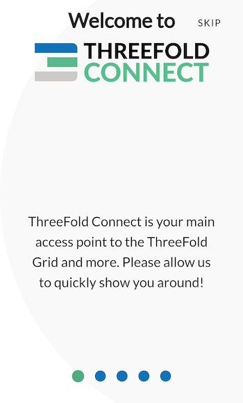


You will then be asked to either *SIGN UP* or *RECOVER ACCOUNT*. For now, we will show how to sign up. Later in the guide, we will show you how to recover an account.


You will then be asked to choose a *Threefold Connect Id*. This ID will be used, as well as the seed phrase, when you want to recover an account. Choose wisely. And do not forget it! Here we will use TFExample, as an example.


Next, you need to add a valid email address. This will be used as a broad KYC. You will need to access your email and confirm the validation email from Threefold to use properly the TF Connect App Wallet.


Then, the next step is crucial! Make sure no one is around looking at your screen. You will be shown your seed phrase. Keep this in a secure and offline place. You will need the 3bot ID and the seed phrase to recover your account. This seed phrase is of utmost important. Do not lose it nor give it to anyone.


Once you've hit Next, you will be asked to write down 3 random words of your seed phrase. This is a necessary step to ensure you have taken the time to write down your seed phrase.


Then, you'll be asked to confirm your TF 3bot name and the associated email.

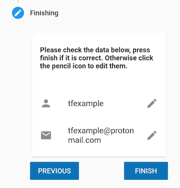

Finally, you will be asked to choose a 4-digit pin. This will be needed to use the Threefold Connect App. If you ever forget this 4-digit pin, you will need to recover your account from your 3bot name and your seed phrase. You will need to confirm the new pin in the next step.


That's it! You've created your Threefold Connect account. You can press the hamburger menu on the top left to explore the Threefold Connect App.


In the next step, we will create a Threefold Connect Wallet. You'll see, it's very simple!
***
#### Verify your identity (KYC) by email
***
Once you've created your account, an email will be sent to the email address you've chosen in the account creation process. 

To verify your email, go on your email account and open the email sent by *info@openkyc.live* with the subject *Verify your email address*. 

In this email, click on the link *Verify my email address*. This will lead you to a *login.threefold.me* link. The process should be automatic. Once this is done, you will receive a confirmation on screen, as well as on your phone.


If for some reason, you did not receive the verification email, simply click on *Verify* and another email will be sent.


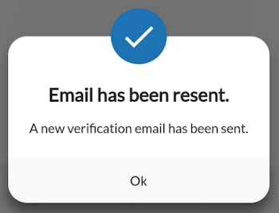

#### Change email associated with TF account

If you want to change your email, simply click on the *pencil* next to your email and write another email. You will need to redo the KYC verification process.


***
#### Create a Wallet
***
To create a wallet, click on the Threefold Connect App menu. This is what you see. Choose *Wallet*.

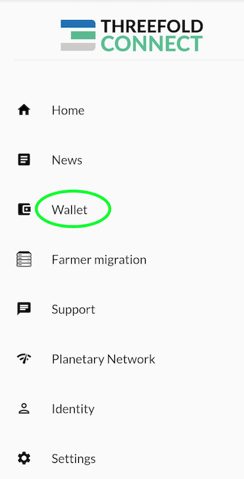

Once you are in the section *Wallet*, click on *Create Initial Wallet*. If it doesn't work the first time, retry some more. If you have trouble creating a wallet, make sure your connection is reliable. You can try a couple of minutes later if it still doesn't work. With a reliable connection, there shouldn't be any problem. Contact TF Support if problems persist.

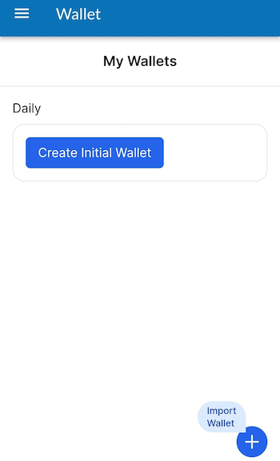

This is what you see when the TF Grid is initializing your wallet.


Once your wallet is initialized, you will see *No blanace found for this wallet*. You can click on this button to enter the wallet.


Once inside your wallet, this is what you see.


We will now see where the Stellar and the TF Chain Addresses and Secrets are to be found. We will also changing the wallet name. To do so, click on the *circled i* at the bottom right of the screen.


You can choose the name you want for your wallet. Here we use TFWalletExample. Note that you can also use alphanumeric characters.


At the top of the section *Wallet*, we can see that the name has changed.


Now, if you want to copy your Stellar Address, simply click on the button presented with the green circle. To access the TF Chain address, click on the button presented with the red circle. When your phone has copied the address, the TF App will give show a confirmation message as shown below.


In some situations, you will want to access the Stellar and TF Chain secrets. To do so, simply click on the "eye" button of the desired chain, and then copy the secret.


***
#### Create a Farm
***
Now, being a farmer, you might wonder: can I create a Threefold Farm with the Threefold Connect App. Well, yes! Here is how to do so.

Click on the hamburger menu on the top left of your screen and select *Farmer Migration*. This title is somehow misleading, as you can not only migrate farms, but create farms too!


To create a farm, either click on the *plus* sign at the top right, or click on *Click to create ->*.


To create a farm, choose the wallet associated with the farm. Also, choose a Farm Name then read and accept the Terms and Conditions. Finally, click *submit*.


The TF Connect App will give you a confirmation message if the farm was created successfully. If it doesn't work the first time, make sure you have a good Internet connection and try again. If you click on the down arrow, you will be able to see your *Farm Information*.


You can see on this screen the address were your farming rewards will be sent to. It is the Stellar address associated with the Threefold Wallet used to create the farm.


***
#### See Threefold Connect App and Wallet Transactions
***
To see your transactions, simply click on the two arrows at the bottom of the screen, as shown below.


***
#### Connect to the Planetary Network

To connect to the Planetary Network, click on the Planetary Network on the TF menu as shown below.


Connecting to the Planetary Network couldn't be easier. Simply click on the connection button and you will see *Connected* on the screen once the connection is settled.


***
#### Show Seed Phrase - Remove Account from TF Connect App
***
To see your seed phrase or remove your account from the TF Connect App, choose *Settings* in the Threefold Connect App menu.


First, to see your seed phrase, click on this button as shown below:

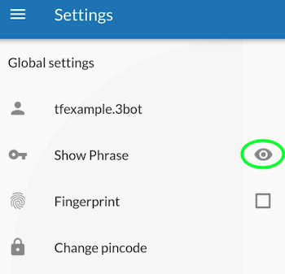

You will then be able to see your seed phrase. You can make sure you have your seed phrase somewhere safe, offline, before removing your account.

Now, we will remove the account from the Threefold Connect App. In Settings, click on the arrow circled in green and click on the red button with a white dashed in it. Beware: once done, you can only recover your account with your **3bot ID** and your **seed phrase**.


You will be asked to confirm your action as a security check.

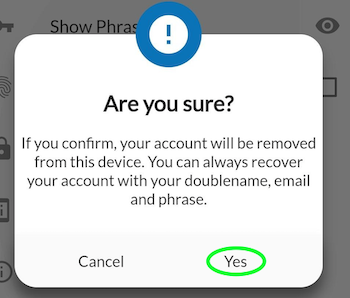
***
#### Recover Account on the Threefold Connect App
***
Once you're removed your account, if you want to recover your account, choose the option *RECOVER ACCOUNT* on the opening screen on the app.


You will be asked to enter your *3bot ID* as well as your *seed phrase*.


You will then be asked to choose and confirm a new 4-digit pin code. Once this is done, you will receive the following confirmation:


That's it! You've recovered your account.

***
#### Move Farm from the TF app to the TF Portal (polkadot.js)
***
If you want to move your farm from the Threefold Connect App to the portal.grif.tf (polkadot.js), follow these steps. Note that you cannot, for now, move your farm from the Portal to the Threefold Connect App.

First, you want to find the TF Chain Secret, this is, in short, a hex version of the private key. To find the secret, head over to the *Farmer migration* (via the TF Menu).

In the *Farming migration* section, click on the arrow (in green here) of the farm you want to export on the Threefold Portal.


Then, click on the arrow (in green) to see your TF Chain Secret.


Click on the button to copy the Secret. The App will show a confirmation message. 

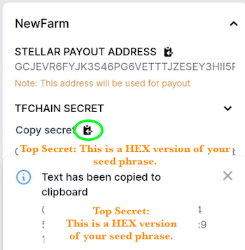

Now head over to the browser with your polkadot.js extension. For more information on this, check the section [Creating a Polkadot.js account](#1-creating-a-polkadotjs-account).

On your browser, click on the extension button (in green).


Select the polkadot{.js} extension.


Click on the *plus* button as shown in green.


Choose the option *Import account from pre-existing seed*.


In the box *EXISTING 12 OR 24-WORD MNEMONIC SEED*, paste the TF Chain Secret. Note that this Secret is a HEX version of your seed phrase.


Choose a name for your account. Choose a password.

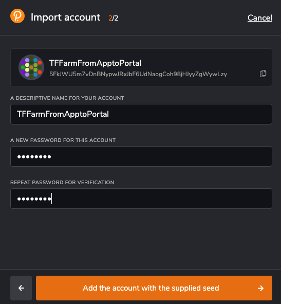

When you go on the [Threefold Portal](https://portal.grid.tf/), you will now see your newly added account. Click on it.


In the Farm section, you can now see your farm. You have successfully move the farm from the Threefold Connect App to the Threefold Portal.


You can see here that the farming reward address is the same as before.


That's it! You have successfully move the farm from the Threefold Connect App to the Threefold Portal.

***

#### Import TF Portal (polkadot.js) wallet to the TF Connect App Wallet

Now that we've seen how to go from the TF Connect App to the Threefold Portal (Polkadot.js), we will now show how to go the other way around. This method is very simple. You will need your Polkadot.js seed phrase handy.

Go in the Wallet section of the Threefold Connect App and click on import at the bottom right (in green).

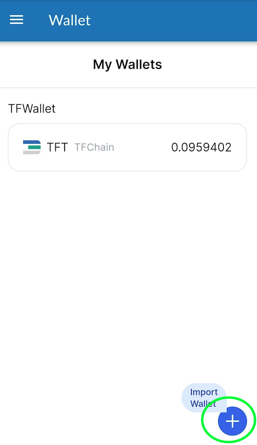

Then simply name your wallet and enter the Polkadot.js seed phrase.


Then in the Wallet section, you will now see the wallet.


***

#### Send and Receive TFT between TF Connect Wallets
***
To send and receive TFT between TF Connect Wallet, go into Wallet and select the wallet you want to use.Remember that you must always send and receive TFT on the same chain, so choose either Stellar or TFChain.
***
##### Send TFT
***
To send tokens, select *Send Coins* in the wallet section. To send TFT, you can scan the QR code of the address you wish to send tokens to. This will enter automatically the necessary information. Make sure to double check that the information is correct to avoid any complications. Otherwise, you can simply enter the correct address in the section *To*. Choose the amount you want to send. Then click on *SEND TOKENS*. 

Note that, for such transactions, there is a maximum fee of 0.10 TFT on the Stellar blockchain, and a maximum fee of 0.01 TFT on the TFChain. This amount is taken from the amount you are sending. It is not taken directly in your wallet. 
***
##### Receive TFT
***
To receive tokens, select *Receive Coins* in the wallet section. To receive TFT, you can generate a QR code to share to the person waiting to send you tokens. Otherwise, the sender can simply use your Stellar or TFChain address and send you TFT.

To generate the QR Code, select the chain you want to use, Stellar or TFChain, enter the amount and the message if needed and click on *GENERATE QR CODE*. Note that there is no message option for TFChain, only for Stellar. This will generate a QR Code that can be scanned by other devices.

***
#### Send TFT to Hardware Wallet on Stellar Blockchain
***
Before sending TFT to a hardware wallet, make sure the hardware wallet has a TFT trustline on the Stellar Blockchain. For more information, read the section below.
***
### Hardware Wallet 
***

You can also have your farming rewards sent to a hardware wallet. In this case, you will need to enable a TFT trustline to receive TFT. 

You can use any hardware wallet that supports the Stellar Blockchain, such as a [Ledger](https://www.ledger.com/).

***

#### Setting up a TFT Trustline on Stellar Blockchain
***
Setting up a trustline is simple.

We will show an example with a Ledger hardware wallet. The process is similar with other hardware wallets. Just make sure that your hardware wallet is compatible with the Stellar blockchain, as the TFT from farming rewards will be sent on the Stellar Blockchain.

***

First, [download Ledger Live](https://www.ledger.com/ledger-live/download) and download the Stellar application in **Manager**. Then, go on an official Stellar website such as [Stellarterm](https://stellarterm.com/) or [StellarX](https://www.stellarx.com/). For this example, we will be using Stellarterm.com.

Unlock your Ledger by entering your digit password.

Select the Stellar App.

In our case, we do not need to create an account on Stellerterm, since we are using a hardware wallet.


On Stellarterm.com, click on the button **LOGIN**.


At the bottom of the page, select the option **Ledger** or another option if you are using a different hardware wallet.


Click **Connect with Ledger**.


Read and accept the Terms of Use.


On the main page, click on **Assets**.


Scroll down and write **Threefold.io** in the Text box. Select **TFT Threefold.io**. Click **Accept**. Then follow the steps presented on your hardware wallet to confirm the trust line.

***
You now have a TFT trust line on the Stellar Blockchain. You can now receive TFT on this wallet. Perfect for safe TFT farming!


***

## How to Buy and Sell TFT
***
### Where to Buy and Sell TFT
***
There are many ways to buy and sell TFT. Here is a list of places [where to Buy and Sell TFT](https://library.threefold.me/info/threefold#/tokens/threefold__how_to_buy).

***
#### The different TFT Threefold bridges: TFChain-Stellar Bridge and BSC-Stellar Bridge
***
In short, there is the [BSC-Stellar Bridge](https://bridge.bsc.threefold.io/) and the [TF Chain-Stellar](https://portal.grid.tf/) Bridge.

The BSC-Stellar Bridge is used to go between the Stellar Chain and Binance Smart Chain (BSC).
The TFChain-Stellar Bridge is used to go between Stellar Chain and TF Chain.

To go from BSC to TF Chain, or from TF Chain to BSC, you need to use the two bridges.

BSC can be used to sell/buy TFT while TF Chain can be used to deploy Dapps on https://play.grid.tf

> Note: Always start with a small amount the first time you try a bridge.

***

#### How to set up a Stellar address for TFT transactions
***
In general, to set up a Stellar address to transact TFT on Stellar chain, you can use any Stellar wallet that has a TFT trustline enabled. Note that on Stellar chain, fees are paid in XLM. 

The easiest way is to simply create an account on the Threefold Connect App (for [Android](https://play.google.com/store/apps/details?id=org.jimber.threebotlogin) and [iOS](https://apps.apple.com/us/app/threefold-connect/id1459845885)) and to then use the TFT wallet of the app, which has by default a TFT trustline on Stellar chain and also comes with 1 XLM sponsored by Threefold for transaction fees.
***
### How to use the TFChain-Stellar Bridge
***
1. Go on the [Threefold Dashboard](https://dashboard.grid.tf)
2. Sign-in with your Polkadot extension account
3. Go in the section **Swap** of the Portal menu
4. 2-Way Bridge:
   * Transfer TFT from Stellar to TFChain
      * Click on *Deposit*
   * Transfer TFT from TFChain to Stellar
      * Click on *Withdraw*

Note: If you are on Threefold Connect App, you can export your account to the Polkadot extension. Look at the section [Move Farm from the TF app to the TF Portal (polkadot.js)](#move-farm-from-the-tf-app-to-the-tf-portal-polkadotjs).
***
### How to use the BSC-Stellar Bridge
***
To use the BSC-Stellar Bridge, follow the following steps. If this is your first time with MetaMask and BSC, read the section [Setting up TFT on Metamask](#setting-up-tft-on-metamask).

It will cost 50 TFT* to bridge from Stellar to BSC, and 1 TFT to bridge from BSC to Stellar. There is also a fixed fee of 0.01 TFT when using the Stellar blockchain. Those fees are taken from the total of what you are bridging. 

*For example, if you Bridge 80 TFT, from Stellar to BSC, you will receive 30 TFT.

> Note: The bridge will process deposits/withdrawals within 48 hours.

***
#### Bridge from Stellar to BSC
***
**Pre-requisites:**

* Metamask account
* TF Connect App+Wallet
* TFT on Stellar Blockchain

**Steps**

1. Go to the BSC-Stellar [Bridge website](https://bridge.bsc.threefold.io/).
2. Connect your MetaMask Wallet.
3. Sign in with MetaMask.
4. Choose the option  *Deposit from Stellar*.
5. Agree to the  *Threefold Terms*.
6. Read and tick the box of the  *Warning Message*.
7. On your phone, open up your Threefold Connect App and go to the wallet section.
8. Select the option  *Send*.
9. Select the  *Stellar*  chain.
10. Click on the button  *Scan QR Code* . The QR Code option automatically fill up your  *MESSAGE*.
11. Scan the QR code that appears on the Bridge window (or write the information manually).
12. Make sure the  *MESSAGE*  is correctly entered.
13. Press  *Send Tokens*.
14. Press  *Confirm*.

In this method, you use the Bridge directly. Thus, it is normal if you do not see your standard MetaMask address. MetaMask is on ERC20 and TFT is on Stellar. You are sending TFT to the Bridge's address, and the Bridge sends money to your wallet afterward.

***

#### Bridge from BSC to Stellar
***
**Pre-requisites:**

* Metamask account
* TF Connect App+Wallet
* BNB for gas fees
* TFT

**Steps**

1. Go to the BSC-Stellar [Bridge website](https://bridge.bsc.threefold.io/).
2. Connect your MetaMask Wallet.
3. Sign in with MetaMask.
4. Choose the option  *Deposit from BSC*.
5. Agree to the  *Threefold Terms*.
6. Read and tick the box of the  *Warning Message*.
7. On your phone, open up your Threefold Connect App and go to the wallet section.
8. Copy your Stellar address.
9. Paste your Stellar address in the proper field on The BSC-Stellar Bridge.
10. Enter the amount of TFT you want to bridge.
11. Click on  *Withdraw*.
12. Follow the instructions on your Metamask Wallet.

**General Tips**

* It's a good idea to start with a small amount the first time.
* The process is usually quick, but it can take up to 48h. In doubt, contact [TF Support](https://threefold.io/support/).
* Going from Stellar to BSC costs 50 TFT.
* Going from BSC to Stellar costs 1 TFT.
* There is also fixed fee of 0.01 TFT when using the Stellar Blockchain.
* Gas fees on BSC is usually around 5-20 gwei.
* You can try the bridge later if gas fees are high at the moment of your transaction.

***
#### Setting Up TFT on Metamask
***
* Download Metamask [here](https://metamask.io/download.html). Then, install the Metamask extension in your local browser.
* Create a Metamask account
* Switch the network to  `Binance chain` . You will have to create a new network with following information):
  * Mainnet
  * Network Name: Smart Chain
  * New RPC URL: https://bsc-dataseed.binance.org/
  * ChainID: 56
  * Symbol: BNB
  * Block Explorer URL: [https://bscscan.com](https://bscscan.com/)
* Add TFT token in Metamask -> custom token -> contract address =  `0x8f0FB159380176D324542b3a7933F0C2Fd0c2bbf`

***
## Validator
***
### Introduction to Validator

A blockchain validator participates in “consensus” and maintains the record of transactions. Once transactions are verified. Validators are computers that maintain the blockchain’s integrity by keeping a record of the whole transaction history, from the first block to the last.
***
### More Information

Now that you have farmed TFT, you might want to invest those farming rewards into the TF ecosystem. If you want to know more about the role of a validator and how to become one, read this [VALIDATOR FAQ](../faq/faq.md#validator-faq).
***
## How to Stake TFT

With the validator program comes *Delegated Staking*. This feature will be implemented soon. Stay tuned!

***

# Using TFT on the Grid

Now that you know how to farm TFT, you might want to explore the possibilities of the Threefold Token. 

When it comes to learning about the real-world application and use of TFT, a good place to start is the [USER FAQ](../faq/faq.md#user-faq).
