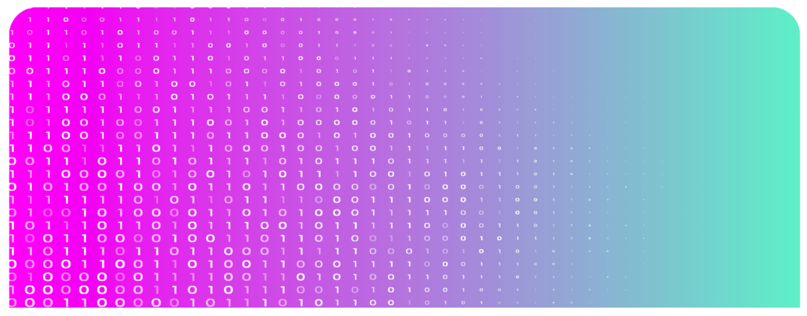

<h1> TFGrid Advanced </h1>

In this section, we delve into sophisticated topics and powerful functionalities that empower you to harness the full potential of TFGrid 3.0. Whether you're an experienced user seeking to deepen your understanding or a trailblazer venturing into uncharted territories, this manual is your gateway to mastering advanced concepts on the ThreeFold Grid.

<h2>Table of Contents</h2>

- [Grid3 Stellar-TFChain Bridge](./grid3_stellar_tfchain_bridge.md)
- [Token Transfer Keygenerator](./token_transfer_keygenerator.md)
- [Cancel Contracts](./cancel_contracts.md)
- [Contract Bills Reports](./contract_bill_report.md)
- [Listing Free Public IPs](./list_public_ips.md)
- [Redis](./grid3_redis.md)
- [IPFS](./ipfs/ipfs_toc.md)
  - [IPFS on a Full VM](./ipfs/ipfs_fullvm.md)
  - [IPFS on a Micro VM](./ipfs/ipfs_microvm.md)
- [RMB Proxy](/proxy/proxy.md)
- [TFChain Extrinsics (Blockchain Functions)](/tfchain/tfchain.md)
- [Create Farm](/dashboard/portal/dashboard_portal_ui_farming.md)
- [Solution Provider](/tfchain/tfchain_solution_provider.md)
