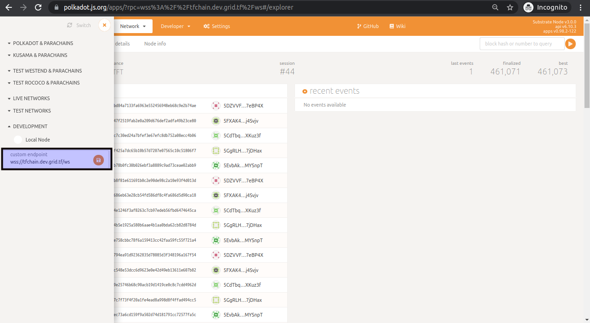
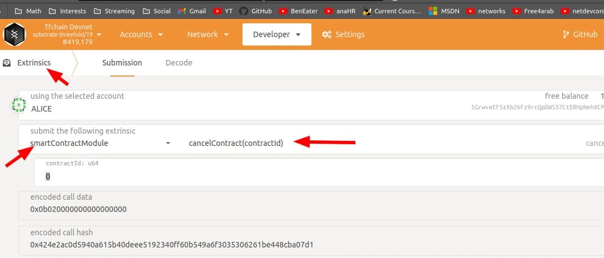

# Canceling contracts

## Playground

Read about [How to cancle all contracts from the playground](/weblets/weblets_cancel_contracts.md)

## Graphql

from the graphql service execute the following query.

```
query MyQuery {

  nodeContracts(where: {twinId_eq: TWIN_ID, state_eq: Created}) {
    contractId
  }
}

```

replace `TWIN_ID` with your twin id. the information should be available on the [Dashboard](/dashboard/dashboard.md)

then from [polkadot UI](https://polkadot.js.org/apps/), add the tfchain endpoint to development



go to extrinsics, choose the smartContract module and cancelContract extrinsic and use the IDs from graphql to execute the cancelation



## Cancel using code

can also cancel them using [code](https://github.com/threefoldtech/grid3_client_ts/blob/development/scripts/delete_all_contracts.ts)

after cloning `grid3_client_ts`, `yarn install`, and update the `config.json` (beside the script), execute  `yarn run ts-node --project ./tsconfig-node.json scripts/delete_all_contracts.ts`
