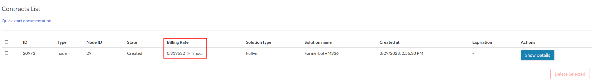

<h1> Contract Bills Reports </h1>

<h2>Table of Contents</h2>

- [Introduction](#introduction)
- [Contract Billing Report (GraphQL)](#contract-billing-report-graphql)
- [Consumption](#consumption)

***

## Introduction

Now you can check the billing rate of your contracts directly from the `Contracts` tab in the Dashboard.

> It takes an hour for the contract to display the billing rate (Until it reaches the first billing cycle).

The `Billing Rate` is displayed in `TFT/Hour`



## Contract Billing Report (GraphQL)

- you need to find the contract ID
- ask the graphql for the consumption

> example query for all contracts

```graphql
query MyQuery {
  contractBillReports {
    contractId
    amountBilled
    discountReceived
  }
}
```

And for a specific contract

```graphql
query MyQuery {
  contractBillReports(where: { contractId_eq: 10 }) {
    amountBilled
    discountReceived
    contractId
  }
}
```

## Consumption

```graphql
query MyQuery {
  consumptions(where: { contractId_eq: 10 }) {
    contractId
    cru
    sru
    mru
    hru
    nru
  }
}
```
