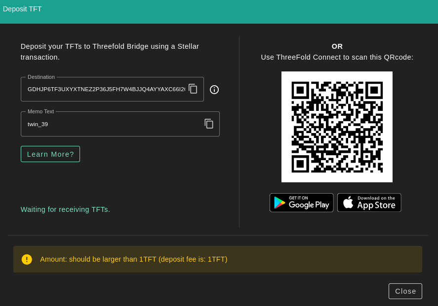
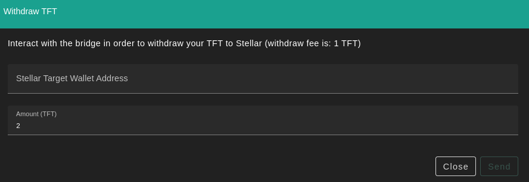

<h1> Transferring TFT Between Stellar and TFChain</h1>

<h2>Table of Contents</h2>

- [Usage](#usage)
- [Prerequisites](#prerequisites)
- [Stellar to TFChain](#stellar-to-tfchain)
- [TFChain to Stellar](#tfchain-to-stellar)

***

## Usage

This document will explain how you can transfer TFT from Tfchain to Stellar and back.

For more information on TFT bridges, read [this documentation](../threefold_token/tft_bridges/tft_bridges.md).

## Prerequisites

- [Stellar wallet](../threefold_token/storing_tft/storing_tft.md)

- [Account on TFChain (use TF Dashboard to create one)](../dashboard/wallet_connector.md)

## Stellar to TFChain

You can deposit to Tfchain using the bridge page on the TF Dashboard, click deposit:

## TFChain to Stellar

You can bridge back to stellar using the bridge page on the dashboard, click withdraw:

A withdrawfee of 1 TFT will be taken, so make sure you send a larger amount as 1 TFT.
The amount withdrawn from TFChain will be sent to your Stellar wallet.
