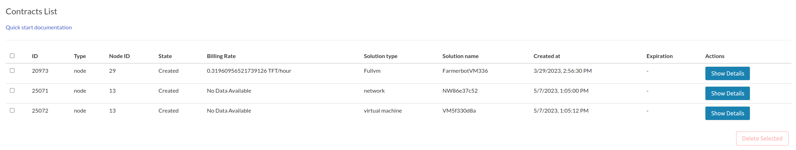
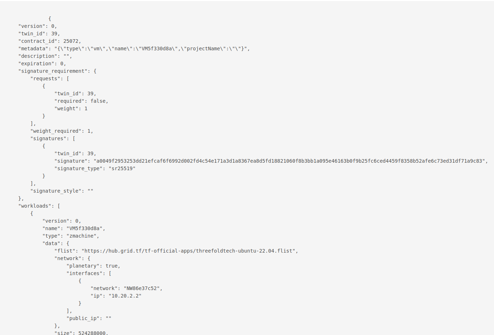

### Contracts List

From the Dashboard you can check your contracts by navigating to the `Contracts` tab from the sidebar.

From there you will see the `Contracts List`

This list includes the following information about each contract.

- Contract ID.
- Contract Type.
- Contract State (Created, Deleted, GracePeriod).
- Billing Rate (in TFT/Hour).
- Solution Name.
- Created At.
- Expiration (Only appears if the contract is in GracePeriod).
- Show Details (This button will display the detailed information of the desired contract).

