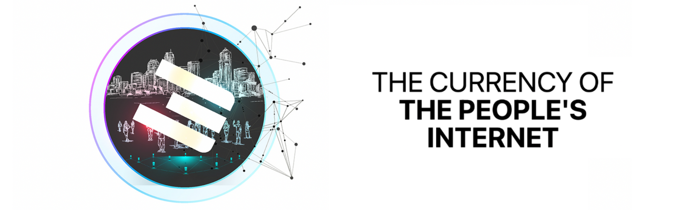

# Buying and Storing TFTs

If you're looking to navigate the [TFT Ecosystem](https://library.threefold.me/info/manual/#/tokens/threefold__tft_ecosystem), this collection of tutorials and manuals is here to help. Learn how to purchase, trade, and securely store your TFTs with ease.

For a comprehensive introduction to TFT, we recommend exploring the [TFT Home Section in the ThreeFold Library](https://library.threefold.me/info/threefold#/tokens/threefold__tokens_home).

## Manuals on How to Buy TFT
Discover step-by-step instructions on buying and storing TFTs across different platforms. Our manuals cover:

- [BSC - Pancake Swap](https://library.threefold.me/info/manual/#/tokens/threefold__tft_binance_defi)
- [BSC - 1inch.io](https://library.threefold.me/info/manual/#/tokens/threefold__tft_1inch)
- [GetTFT.com](https://gettft.com/gettft/#how-it-works)
- [Albedo Wallet](https://library.threefold.me/info/manual/#/tokens/threefold__albedo)
- [Solar Wallet](https://library.threefold.me/info/manual/#/tokens/threefold__solar_wallet)
- [Lobstr Wallet](https://library.threefold.me/info/manual/#/tokens/threefold__lobstr_wallet)
- [StellarTerm](https://library.threefold.me/info/manual/#/tokens/threefold__tft_stellarterm)
- [Interstellar](https://library.threefold.me/info/manual/#/tokens/threefold__tft_interstellar)
- [BTC-Alpha Exchange](https://library.threefold.me/info/manual/#/tokens/threefold__tft_btc_alpha)
- [StellarX Exchange](https://library.threefold.me/info/manual/#/tokens/threefold__tft_stellarx)
- [TF Live Desk (OTC)](https://library.threefold.me/info/manual/#/tokens/threefold__tft_otc)
- [Mazraa (Farmers)](https://library.threefold.me/info/manual/#/tokens/threefold__tft_mazraa)
- [Bettertoken (Farmers)](https://library.threefold.me/info/manual/#/tokens/threefold__tft_bettertoken)

## Other Related Manuals on TFT
- [Store TFTs on Hardware Wallets](https://manual.grid.tf/TF_Farmer_Guide/TF_Complete_Farmer_Guide/farmer_guide.html?highlight=hardware#hardware-wallet)
- [Storing TFTs on TF Connect App](https://manual.grid.tf/TF_Farmer_Guide/TF_Complete_Farmer_Guide/farmer_guide.html#create-a-wallet)
- [Bridge TFT between Stellar and Binance Smart Chain](https://manual.grid.tf/TF_Farmer_Guide/TF_Complete_Farmer_Guide/farmer_guide.html?highlight=tfchain%20bridge#how-to-use-the-tfchain-stellar-bridge)
