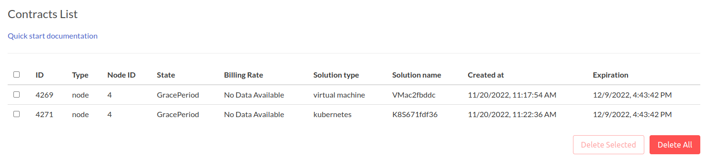
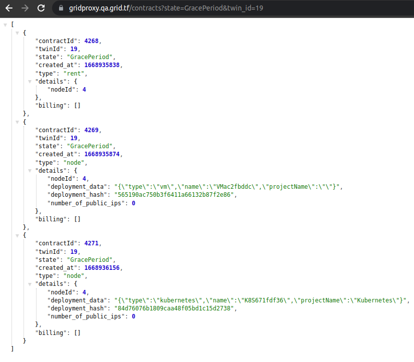
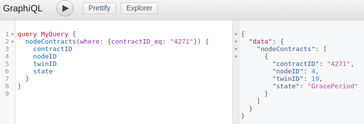
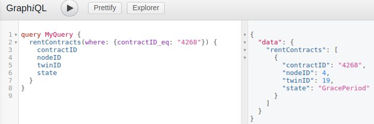
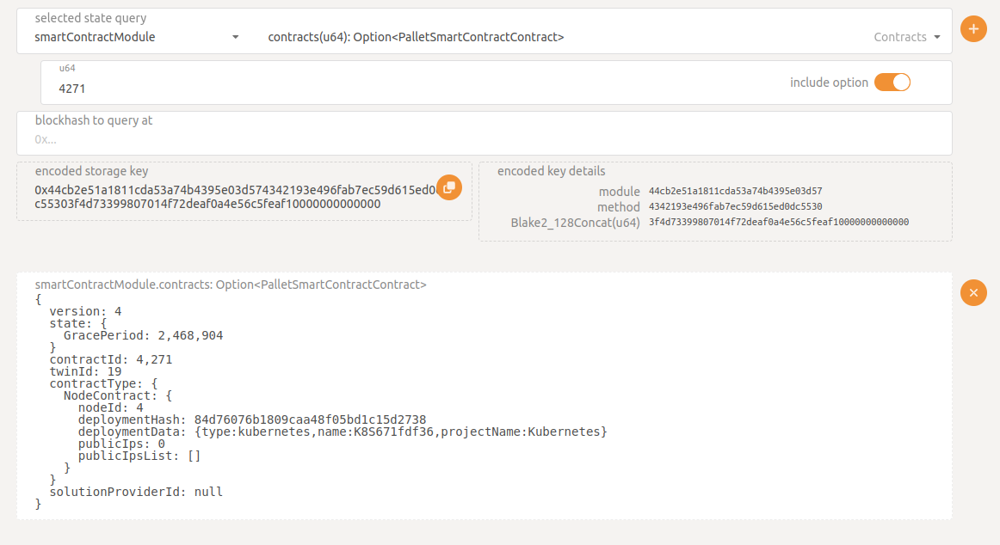

<h1> Grace Period: Ensuring Seamless Operations </h1>

<h2>Table of Contents</h2>

- [Introduction](#introduction)
- [What is the Grace Period?](#what-is-the-grace-period)
- [How does it work?](#how-does-it-work)
- [When does the Grace Period kick in?](#when-does-the-grace-period-kick-in)
- [How to resume your workloads:](#how-to-resume-your-workloads)
- [Grace Period Contract State: Easily Accessible Information](#grace-period-contract-state-easily-accessible-information)
  - [Grid Weblets:](#grid-weblets)
  - [ThreeFold Grid Proxy:](#threefold-grid-proxy)
- [TFChain GraphQL:](#tfchain-graphql)
  - [Node Contract](#node-contract)
  - [Rent Contract](#rent-contract)
- [PolkadotJS UI:](#polkadotjs-ui)

***

## Introduction

__The Grace Period__ serves as a crucial aspect of the ThreeFold ecosystem, providing a safety net for users when their funds run low. Let's explore the key details in a user-friendly manner:

## What is the Grace Period?

When a contract owner exhausts their wallet funds required for their deployment, the contract enters a Grace Period. During this time, the deployment becomes temporarily inaccessible to the user. However, once the wallet is replenished with TFT (ThreeFold Tokens), the contract resumes normal operation. 

It's important to note that if the Grace Period expires (typically after 2 weeks), the user's deployment and data will be deleted from the node.

## How does it work?

When a ``twin`` (a user account) depletes its funds, all linked contracts enter a Grace Period during the next billing cycle.
By default, the Grace Period lasts for 14 days. Throughout this period, users cannot utilize any deployments associated with the twin.

Additionally, users cannot delete contracts during the Grace Period, whether they are related to nodes, names, or rent.
Workloads become usable again when the twin is funded with the required amount of TFT.

If the twin is not funded during the Grace Period, the contracts will be automatically deleted after this period.

## When does the Grace Period kick in?
The Grace Period commences when the twin balance falls below the minimum required for the respective deployments or workloads.

## How to resume your workloads:
To regain access to workloads within the Grace Period, it is essential to fund your twin with sufficient TFT tokens. This action ensures the resumption of operations and allows you to continue your work seamlessly.

The Grace Period feature acts as a safeguard, providing users with the opportunity to manage their funds effectively and maintain uninterrupted operations within the ThreeFold ecosystem.

## Grace Period Contract State: Easily Accessible Information

Checking the state of your contracts within the ``Grace Period`` is simple and convenient. Here's how you can do it:

### Grid Weblets:
The Contracts tab on the Dashboard provides an easy way to monitor your contracts. Here, you can find comprehensive details about the desired ``contract``, including its ``State`` and ``Expiration date`` if the node is in the Grace Period.

### ThreeFold Grid Proxy:
Access the Grace Period contracts through the following endpoint: 

``https://gridproxy.grid.tf/contracts?state=GracePeriod&twin_id=<YOUR_TWIN_ID>``

This allows you to retrieve information about contracts that are currently in the Grace Period.

## TFChain GraphQL:
You can also check the Contract State using [__GraphQL queries__](https://graphql.grid.tf/graphql). Depending on the contract type, utilize the appropriate queries available for ``Node Contract`` and ``Rent Contract``. 

### Node Contract

### Rent Contract
These queries provide insights into the status and details of the contracts.

## PolkadotJS UI:
Another option is to check the Contract state using the [__PolkadotJS UI__](https://polkadot.js.org/apps/?rpc=wss%3A%2F%2Ftfchain.grid.tf#/chainstate). Simply navigate to ``chainstate`` -> ``SmartContractModule`` -> ``Contracts(ID_OF_CONTRACT)`` to view the relevant contract information.

With these user-friendly options at your disposal, you can effortlessly track and monitor the state of your contracts within the Grace Period.

