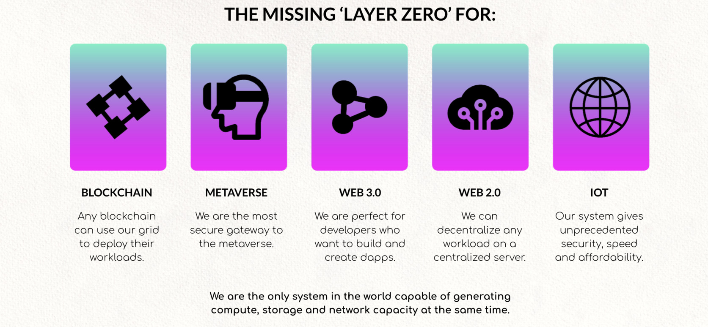

# ThreeFold Grid Primitives: Empowering Your Solutions

Within the ThreeFold Grid, we offer a range of __low-level constructs known as Primitives__. These powerful functionalities enable you to create diverse and customized solutions atop the grid, opening up a world of possibilities. It's important to note that any application compatible with Linux can seamlessly run on the ThreeFold Grid, ensuring maximum flexibility.

## Here are the key ThreeFold Grid Primitives:

- __Compute__ - ( measured in [Compute Units - CU](https://library.threefold.me/info/manual/#/technology/threefold__cloudunits) ):Harness the power of computation with our Compute Primitives.
    - [ZKube](https://library.threefold.me/info/threefold#/technology/threefold__zkube?id=zkube): Deploy and manage Kubernetes clusters effortlessly.
    - [ZMachine](https://library.threefold.me/info/threefold#/technology/threefold__zmachine?id=zmachine): Run your applications within containers or virtual machines powered by the Zero-OS operating system.
    - [CoreX](https://library.threefold.me/info/threefold#/technology/threefold__corex?id=corex) (optional): Gain remote access to your ZMachine by utilizing the CoreX process manager.

 

- __Storage__ (measured in [Storage Units - SU](https://library.threefold.me/info/manual/#/technology/threefold__cloudunits) ): Leverage our robust storage Primitives to meet your data storage requirements efficiently.
    - [ZOS Filesystem](https://library.threefold.me/info/manual/#/technology/threefold__zos_fs): Enjoy a deduplicated and immutable filesystem for secure and reliable data storage.
    - [ZOS Mount](https://library.threefold.me/info/manual/#/technology/threefold__zmount): Utilize a portion of a high-speed SSD (Solid State Drive) as a mounted disk directly accessible within your ZMachine.
    - [Quantum Safe Filesystem](https://library.threefold.me/info/manual/#/technology/threefold__qsfs): Secure your data with an unbreakable storage system, ideal for secondary storage needs.
    - [Zero-DB](https://library.threefold.me/info/manual/#/technology/threefold__zdb): Experience a powerful key-value storage mechanism that serves as the foundation for other storage mechanisms.
    - [Zero-Disk](https://library.threefold.me/info/manual/#/technology/threefold__zdisk) (OEM only): Employ a virtual disk format designed exclusively for original equipment manufacturers.

 

- __Network__ (measured in [Network Units - NU](https://library.threefold.me/info/manual/#/technology/threefold__cloudunits) ): Harness our network Primitives to enable seamless communication and connectivity.
    - [ZNET](https://library.threefold.me/info/manual/#/technology/threefold__znet): Establish private networks between [ZMachines](https://library.threefold.me/info/manual/#/technology/threefold__zmachine), ensuring secure and efficient communication.
    - [Planetary Network](https://library.threefold.me/info/manual/#/technology/threefold__planetary_network): Unlock the potential of a [peer-to-peer](https://library.threefold.me/info/manual/#/technology/threefold__peer2peer), end-to-end encrypted global network, providing secure and reliable connectivity.
    - [ZNIC](https://library.threefold.me/info/manual/#/technology/threefold__znic): Access and manage network interfaces within the Planetary Network, enabling efficient data transfer and communication.
    - [WebGateway](https://library.threefold.me/info/manual/#/technology/threefold__webgw): Connect your [ZNET](https://library.threefold.me/info/manual/#/technology/threefold__znet) to the internet with ease, facilitating seamless integration with the wider network.

      

- __Zero-OS Advantages__: Enjoy the numerous advantages that Zero-OS brings to the table.
    - [Zero Install](https://library.threefold.me/info/manual/#/technology/threefold__zero_install): Experience hassle-free deployment without the need for complex installations.
    - [Unbreakable Storage](https://library.threefold.me/info/manual/#/technology/threefold__unbreakable_storage): Ensure the integrity and security of your data with our robust storage mechanisms.
    - [Zero Hacking Surface](https://library.threefold.me/info/manual/#/technology/threefold__zero_hacking_surface): Benefit from a minimized attack surface, bolstering the security of your infrastructure.
    - [Zero Boot](https://library.threefold.me/info/manual/#/technology/threefold__zero_boot): Enjoy lightning-fast boot times, allowing for swift and efficient system initialization.
    - [Deterministic Deployment](https://library.threefold.me/info/manual/#/technology/threefold__deterministic_deployment): Achieve consistent and predictable deployments, streamlining your development process.
    - [ZOS Protect](https://library.threefold.me/info/manual/#/technology/threefold__zos_protect): Experience enhanced protection and security measures to safeguard your infrastructure.

 

With these powerful Primitives and Zero-OS advantages, the ThreeFold Grid empowers you to build, scale, and secure your solutions with ease. Unleash your creativity and unlock limitless possibilities within the ThreeFold ecosystem.

