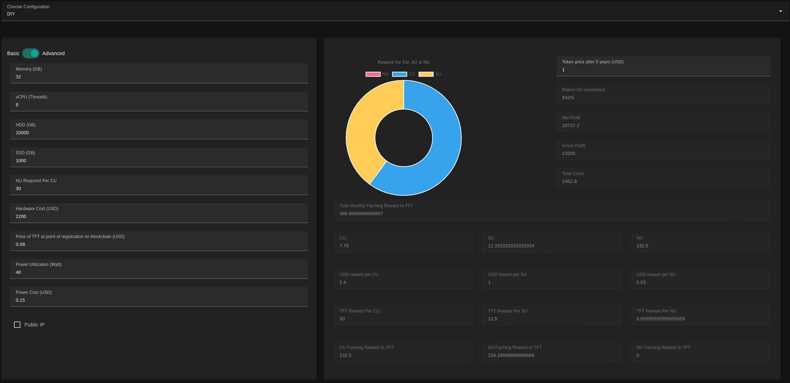
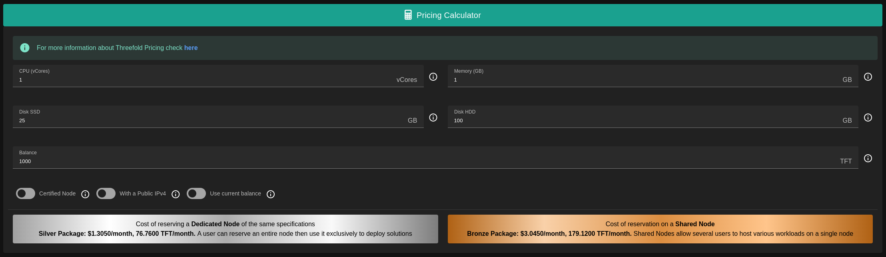

# Calculators

### TF Farming Calculator

A tool provided by ThreeFold that allows users to estimate and calculate potential earnings from farming on the ThreeFold Grid. Farming refers to the process of providing computing resources, such as storage and processing power, to the ThreeFold Grid and earning tokens in return. The tf-farming-calculator takes into account various factors, including the amount of resources contributed, the duration of farming, and the current market conditions, to provide users with an estimate of their potential earnings in terms of ThreeFold Tokens (TFT).

### TF Resource Calculator

A tool provided by ThreeFold that allows users to estimate and calculate potential cost of a deployment on the ThreeFold grid. The resource calculator takes into account various factors, including deployment resources, node certification, currnet balance, and in return it displays an accurate estimate for the deployment in terms of ThreeFold Tokens (TFT) and in USD per month.

