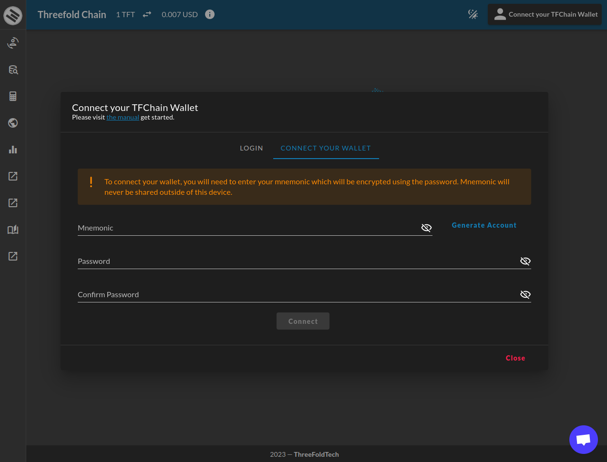
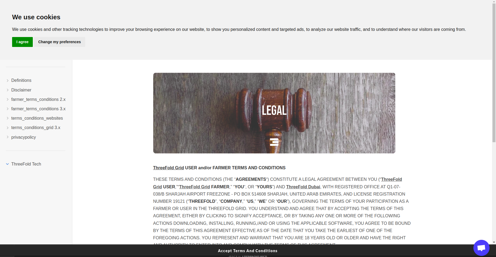
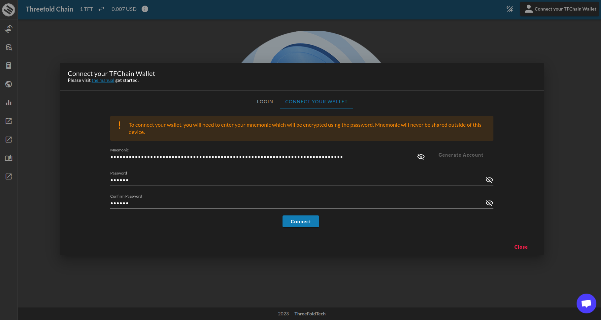
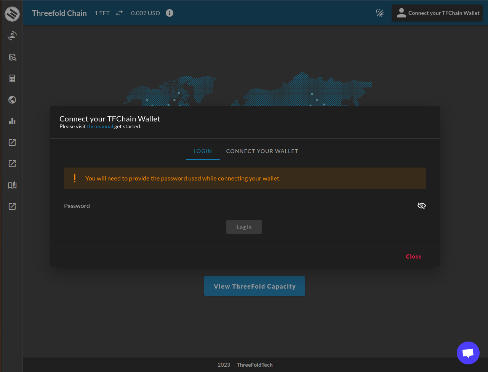
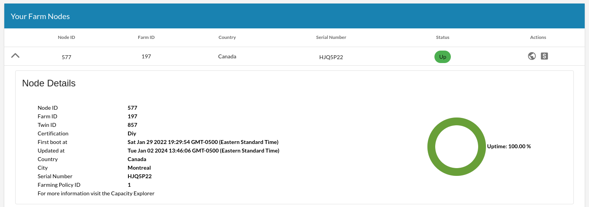

<h1> ThreeFold Dashboard </h2>

<h2> Table of Contents </h2>

- [Introduction](#introduction)
- [TFChain Wallet](#tfchain-wallet)
  - [Introduction](#introduction-1)
  - [Generate Account](#generate-account)
  - [Connect Your Wallet](#connect-your-wallet)
  - [Login](#login)
- [Twin/Farm Management](#twinfarm-management)
  - [Twin Management](#twin-management)
  - [Farms Management](#farms-management)
    - [Nodes Uptime](#nodes-uptime)
- [TFChain DAO](#tfchain-dao)
- [Token Management](#token-management)
  - [TFChain-Stellar Bridge](#tfchain-stellar-bridge)
  - [Transferring TFT to Other TFChain Users](#transferring-tft-to-other-tfchain-users)
- [TFGrid Explorer](#tfgrid-explorer)
  - [Exploring Threefold Nodes](#exploring-threefold-nodes)
  - [Exploring Farms](#exploring-farms)
  - [Grid Statistics](#grid-statistics)
- [Learn More](#learn-more)

***

# Introduction

This section of the ThreeFold Manual introduces you to the **ThreeFold Dashboard**, a powerful tool designed to empower individuals and organizations with seamless control and management over their ThreeFold Grid resources. The ThreeFold Dashboard provides an intuitive web-based interface that allows users to effortlessly deploy, monitor, and scale their workloads on the decentralized and sustainable ThreeFold Grid infrastructure.

The ThreeFold Dashboard is a unified admin interface for everything related to the Threefold Grid. We now give an overview of the different features of the ThreeFold Dashboard.
***

# TFChain Wallet

## Introduction

The TFChain Wallet, seamlessly integrated within the ThreeFold Dashboard, stands as a secure and user-centric gateway to the world of decentralized finance (DeFi) within the ThreeFold ecosystem. As the digital landscape evolves, the TFChain Wallet empowers users with a streamlined and intuitive interface, facilitating effortless management of digital assets and transactions on the TFGrid. 

More than just a repository for tokens, the TFChain Wallet is designed to offer a holistic financial experience. Users can securely store, send, and receive various digital assets while enjoying the benefits of deployable decentralized weblets built on the ThreeFold Grid. 

Throughout this manual, we will explore the intricacies of the TFChain Wallet within the ThreeFold Dashboard, delving into its key features, security measures, and its role in facilitating decentralized financial activities.

## Generate Account

Mnemonics serve as your private keys, acting as your representation on the ThreeFold Grid. You can input an existing mnemonic or click the **Generate Account** button to establish an account and generate a new mnemonic. In the latter case, you will be redirected to our **Terms and Conditions** page, where acceptance is required. Afterward, the mnemonic will be automatically created and filled into the form.

## Connect Your Wallet

After entering your information, you can connect your wallet seamlessly.

## Login

Once you've logged in with the password used while connecting your wallet, you can access all of the ThreeFold Dashboard sections.

# Twin/Farm Management

## Twin Management

The TF Twin management feature of the ThreeFold Dashboard enables users to create, manage, and monitor their individual digital entities known as **Twins**. A Twin can represent a virtual machine (VM) or a container running on the ThreeFold Grid. With the Twin management, users can easily deploy and scale their workloads, allocate resources, and configure networking and storage settings for their Twins.

## Farms Management

The Farms management feature allows users to manage their own infrastructure, referred to as **Farms** on the ThreeFold Grid. Farms consist of servers and storage devices that contribute computing and storage capacity to the grid. Through the Farms management feature, users can add or remove, as well as monitor the health and performance of their farms, all the while efficiently using their resources.

### Nodes Uptime

Farmers can consult the Dashboard to see their 3Nodes' uptime. 

To see the uptime of a given node, on the Dashboard go to the **Farms** section of the **Portal**, then under **Your Farm Nodes** click on the down arrow button situated on the left of the screen. On the right of the screen, you will see an icon with the uptime, as shown below:

The uptime calculation is done as follows:

> ((currentPeriod - downtime) / currentPeriod) * 100

***

# TFChain DAO

The TFChain DAO (i.e. Decentralized Autonomous Organization) feature integrates decentralized governance capabilities into the ThreeFold Dashboard. It enables community members to participate in decision-making processes and to contribute to the evolution of the ThreeFold ecosystem. Through the TFChain DAO, users can propose, vote on, and implement changes to the network protocols, policies, and operations, fostering a collaborative and inclusive environment.

***

# Token Management

The Token management feature allows users to securely manage their ThreeFold Tokens (TFT) directly from the ThreeFold Dashboard. Users can view their token balance, perform transactions, and manage their wallet addresses. This feature provides convenience and accessibility for users to engage in token-related activities, such as buying, selling, or transferring TFT within the ThreeFold ecosystem.

Users can bridge and transfer TFT within the ThreeFold ecosystem. Here's an overview of both procedures.

## TFChain-Stellar Bridge

The TFChain-Stellar Bridge establishes connections between the ThreeFold blockchain (TFChain) and the Stellar blockchain. This bridge enables interoperability and facilitates the exchange or utilization of TFT in a broader ecosystem.

For more information on the TFChain-Stellar Bridge, read [this section](../threefold_token/tft_bridges/tfchain_stellar_bridge.md).

## Transferring TFT to Other TFChain Users

Additionally, users can transfer TFT directly to other TFChain users via the ThreeFold Dashboard, expanding the possibilities for peer-to-peer transactions within the ThreeFold network.

For more information on how to transfer TFT between TFChain accounts, read [this section](./portal/dashboard_portal_ui_tokens.md).
***

# TFGrid Explorer

The TFGrid Explorer feature provides a comprehensive view of the ThreeFold Grid infrastructure. Users can explore and analyze information related to ThreeFold nodes, farms, and grid statistics. It also provides insights into the farms contributing to the grid and their respective performance metrics. By utilizing the TFGrid Explorer, users can access detailed information about individual nodes, including their location, capacity, and availability.

## Exploring Threefold Nodes

## Exploring Farms

## Grid Statistics

# Learn More

To learn more about the TFGrid Explorer, visit [this section](./explorer/explorer_home.md) of the ThreeFold Manual.
