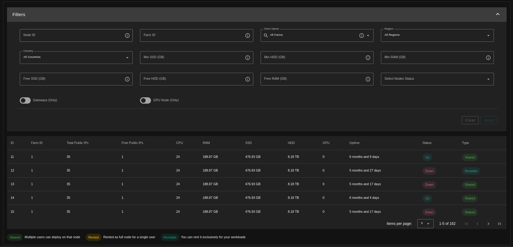
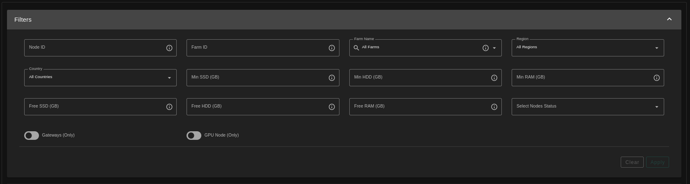
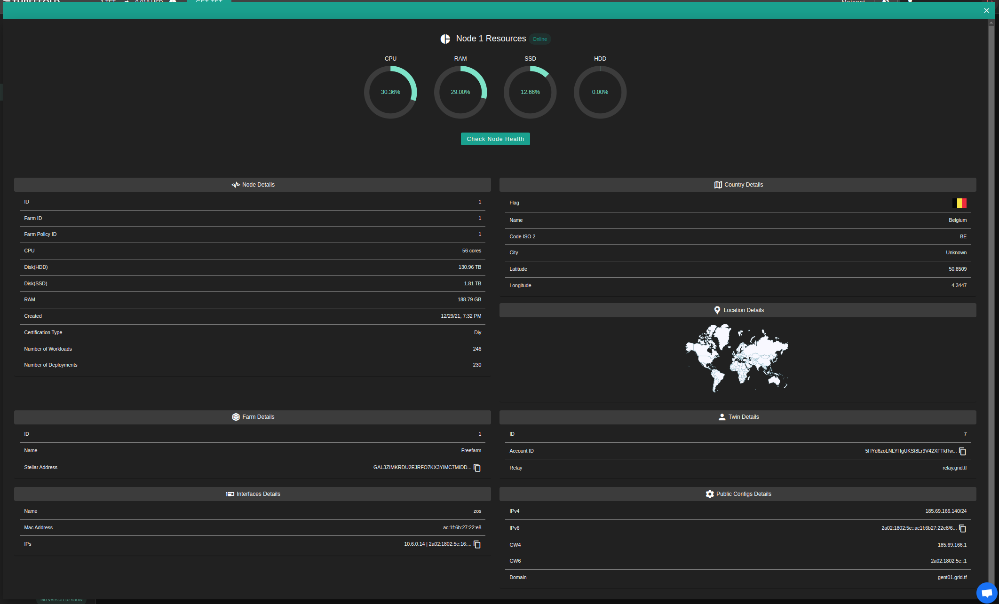
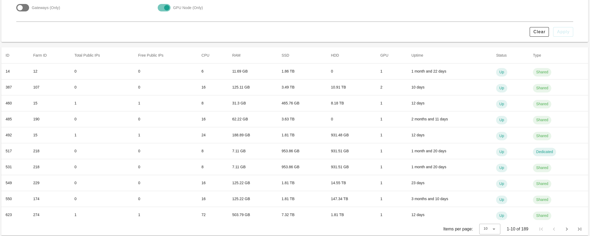

<h1>Node Finder</h1>

<h2>Table of Contents</h2>

- [Nodes](#nodes)
- [GPU Support](#gpu-support)

***

## Nodes

The Node Finder page provides a more detailed view for the nodes available on the ThreeFold grid With detailed information and statistics about any of the available nodes.

You can get a node with the desired specifications using the filters available in the nodes page.

You can see all of the node details by clicking on a node record.

## GPU Support

- A new filter for GPU supported node is now available on the Nodes page.
- GPU count
- Filtering capabilities based on the model / device

On the details pages is shown the card information and its status (`reserved` or `available`) also the ID that’s needed to be used during deployments is easily accessible and has a copy to clipboard button.

Here’s an example of how it looks in case of reserved

The TF Dashboard is where to reserve the nodes the farmer should be able to set the extra fees on the form and the user also should be able to reserve and get the details of the node (cost including the extrafees, GPU informations).
